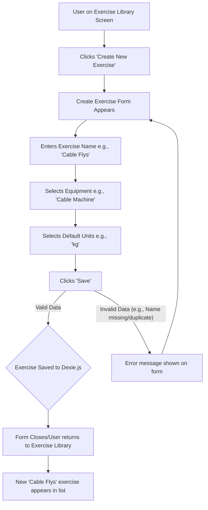

# UI/UX Addon for Story 1.4: Basic Exercise Definition & Management with Data Seeding

**Original Story Reference:** `ai/stories/epic1.1.4.story.md`

## 1. UI/UX Goal for this Story

To allow users to personalize their exercise database by creating, viewing, editing, and deleting custom exercises, and to provide a good out-of-the-box experience with a pre-populated list of common exercises.

## 2. Key Screens/Views Involved in this Story

- **Exercise Library Screen:** Main view for listing and accessing exercises.
  - *(Reference: Conceptual description in `docs/ui-ux-spec.md`)*
- **Create Exercise Form (Page or Modal):** For adding new custom exercises.
- **Edit Exercise Form (Page or Modal):** For modifying existing custom exercises.
- **Confirmation Dialog:** For confirming deletion of exercises.

## 3. Detailed UI Element Descriptions & Interactions for this Story

### 3.1. Exercise Library Screen

- **Layout:**
  - Screen title (e.g., "Exercise Library" or "Exercises").
  - Action button: "Create New Exercise" / "+" icon button.
  - Search input field for filtering the exercise list by name.
  - List area displaying exercises.
- **Exercise List Item:**
  - **Display:** Exercise name. Optionally, a subtle indicator if it's a custom exercise vs. a pre-populated one.
  - **Interaction:** Tapping a custom exercise allows editing or deleting. Tapping a pre-populated exercise might show details (though editing/deleting pre-populated ones is not a feature in this story).
- **Data Seeding:**
  - On first load or if the library is empty, the list will be populated with a comprehensive set of default exercises. This is a background process, but the result is a populated list.
- **Figma Reference:** `{Figma_Frame_URL_for_Exercise_Library_Screen}`

### 3.2. Create/Edit Custom Exercise Form

- **Layout (Can be a full page or a modal dialog):**
  - Form title (e.g., "Create Exercise" or "Edit Exercise").
  - Input fields for exercise properties.
  - Action buttons: "Save", "Cancel".
  - If editing, a "Delete Exercise" button/option.
- **UI Elements & Interactions:**
  - **Exercise Name Input:**
    - **Label:** "Name" or "Exercise Name".
    - **Control:** `shadcn/ui Input` (text type).
    - **Validation:** Required. Must be unique (UI should provide feedback if a duplicate name is entered, based on Zod/service validation).
  - **Equipment Input (Optional):**
    - **Label:** "Equipment".
    - **Control:** `shadcn/ui Select` or `Combobox` with predefined common equipment types (e.g., Barbell, Dumbbell, Machine, Bodyweight, Kettlebell) and option for custom input if necessary.
  - **Default Units Input (Optional):**
    - **Label:** "Default Units".
    - **Control:** `shadcn/ui Select` or `RadioGroup` for "kg" / "lbs".
  - **Save Button:**
    - **Action:** Submits form. Data is validated by Zod schema for `ExerciseDefinition`. On success, saves to Dexie.js and closes form/navigates back to library, which should update. On validation error, displays errors inline.
  - **Cancel Button:** Discards changes and closes form/navigates back.
  - **Delete Exercise Button (Edit mode only):**
    - **Action:** Triggers a Confirmation Dialog.
- **Figma Reference:** `{Figma_Frame_URL_for_Create_Edit_Exercise_Form}`

### 3.3. Confirmation Dialog (for Delete Exercise)

- **Description:** A modal dialog (`shadcn/ui AlertDialog`) to prevent accidental deletion.
- **Content:**
  - Title (e.g., "Delete Exercise?").
  - Message (e.g., "Are you sure you want to delete '[Exercise Name]'? This action cannot be undone.").
  - Buttons: "Confirm Delete" (destructive action style), "Cancel".
- **Figma Reference:** `{Figma_Frame_URL_for_Delete_Confirmation_Dialog}`

## 4. Accessibility Notes for this Story

- **Exercise Library:**
  - Search input needs a label.
  - List items should be navigable via keyboard. If interactive, they should be buttons or links.
- **Create/Edit Form:**
  - All form inputs must have associated labels.
  - Validation errors must be programmatically associated with inputs and announced by screen readers.
  - Focus should be managed when modals/dialogs appear and disappear.
- **Confirmation Dialog:** Buttons must be keyboard accessible, and the dialog should trap focus.

## 5. User Flow Snippet (Create Custom Exercise)

