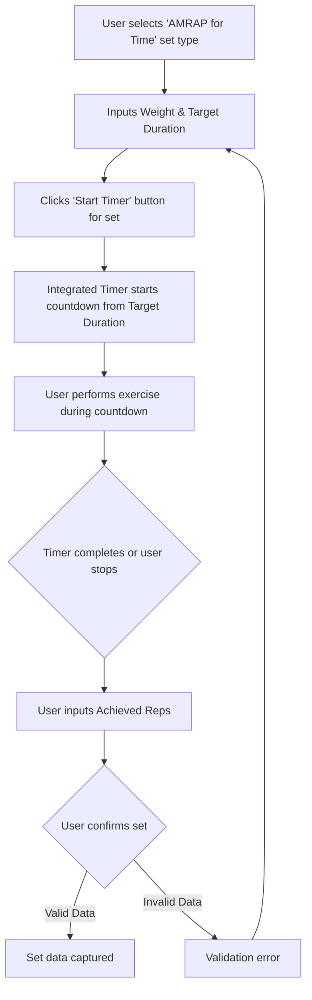

# UI/UX Addon for Story 2.2: Logging AMRAP (As Many Reps As Possible) for Time

**Original Story Reference:** `ai/stories/epic2.2.2.story.md`

## 1. UI/UX Goal for this Story

To enable users to log "AMRAP for Time" sets by providing inputs for weight, target duration, and achieved repetitions, and to integrate this with the Integrated Workout Timer for the timed period.

## 2. Key Screens/Views Involved in this Story

- **Active Workout Logging Screen:** Specifically, the `SetInputRow.tsx` (or equivalent) and its interaction with the `IntegratedWorkoutTimer.tsx` component (from Story 2.6).
  - *(Reference: `docs/ui-ux-spec.md`, `ai/ui-stories/epic1.1.5.story.md`, `ai/ui-stories/epic2.2.6.story.md` for timer details).*

## 3. Detailed UI Element Descriptions & Interactions for this Story

### 3.1. `SetInputRow.tsx` Modifications for "AMRAP for Time"

- **Set Type Selection:**
  - The "Set Type" selector (introduced in 2.1) will include "AMRAP for Time" as an option.
- **Inputs for "AMRAP for Time" Type:**
  - When "AMRAP for Time" is selected:
    - **Weight Input:**
      - **Label:** "Weight".
      - **Control:** `shadcn/ui Input` (numeric).
    - **Target Time Duration Input:**
      - **Label:** "Target Duration".
      - **Control:** `shadcn/ui Input` (e.g., for seconds or MM:SS format) or dedicated time duration picker.
      - **Behavior:** This value will be used to configure the Integrated Workout Timer in countdown mode.
    - **Achieved Repetitions Input:**
      - **Label:** "Reps (Achieved)".
      - **Control:** `shadcn/ui Input` (numeric), enabled after the timed period or for input during/after.
- **Timer Interaction:**
  - **Element:** A "Start Timer" button or similar control becomes visible/active when this set type is chosen and duration is set.
  - **Behavior:**
        1. User inputs Weight and Target Duration.
        2. User clicks "Start Timer".
        3. The `IntegratedWorkoutTimer` (Story 2.6) is invoked in countdown mode with the specified `targetDurationSecs`.
        4. During or after the timer completes, the user inputs the `achieved repetitions`.
- **Data Storage:** Captures `loggedWeightKg`, `targetDurationSecs`, and `loggedReps` for the `AmrapTimeSet` data structure.

### 3.2. User Interaction Flow for Logging AMRAP Time Set

1. User selects "AMRAP for Time" as the set type.
2. User inputs Weight and Target Time Duration.
3. User clicks a "Start Timer" button associated with the set.
4. The Integrated Workout Timer starts counting down from the Target Time Duration.
5. User performs the exercise.
6. When the timer ends (or if stopped manually), the user inputs the Achieved Repetitions.
7. User confirms the set.

- **Figma References:**
  - `{Figma_Frame_URL_for_SetInputRow_AMRAP_Time_Variant}`
  - `{Figma_Frame_URL_for_Time_Duration_Input}`
  - `{Figma_Frame_URL_for_Interaction_with_Integrated_Timer}`

## 4. Accessibility Notes for this Story

- Ensure controls for starting the timer are clearly labeled and keyboard accessible.
- Provide feedback when the timer starts and ends, accessible to users with visual impairments (leveraging timer notifications from Story 2.6).
- All input fields must have associated labels.

## 5. User Flow Snippet (Logging AMRAP for Time)

