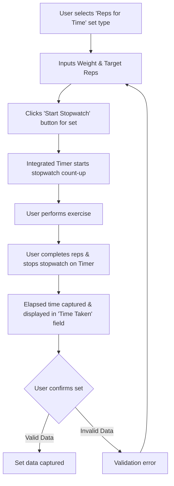

# UI/UX Addon for Story 2.3: Logging Reps for Time

**Original Story Reference:** `ai/stories/epic2.2.3.story.md`

## 1. UI/UX Goal for this Story

To enable users to log "Reps for Time" sets by inputting weight, target repetitions, and using the Integrated Workout Timer in stopwatch mode to record the time taken.

## 2. Key Screens/Views Involved in this Story

- **Active Workout Logging Screen:** Specifically, the `SetInputRow.tsx` (or equivalent) and its interaction with the `IntegratedWorkoutTimer.tsx` component (from Story 2.6).
  - *(Reference: `docs/ui-ux-spec.md`, `ai/ui-stories/epic1.1.5.story.md`, `ai/ui-stories/epic2.2.6.story.md` for timer details).*

## 3. Detailed UI Element Descriptions & Interactions for this Story

### 3.1. `SetInputRow.tsx` Modifications for "Reps for Time"

- **Set Type Selection:**
  - The "Set Type" selector will include "Reps for Time" as an option.
- **Inputs for "Reps for Time" Type:**
  - When "Reps for Time" is selected:
    - **Weight Input:**
      - **Label:** "Weight".
      - **Control:** `shadcn/ui Input` (numeric).
    - **Target Repetitions Input:**
      - **Label:** "Target Reps".
      - **Control:** `shadcn/ui Input` (numeric).
    - **Time Taken Display/Input:**
      - **Label:** "Time Taken".
      - **Control:** This field will likely be populated from the Integrated Workout Timer. It might be a non-editable display field that updates when the timer is stopped, or allow manual entry/override.
      - **Format:** MM:SS.
- **Timer Interaction:**
  - **Element:** A "Start Stopwatch" button or similar control.
  - **Behavior:**
        1. User inputs Weight and Target Repetitions.
        2. User clicks "Start Stopwatch".
        3. The `IntegratedWorkoutTimer` (Story 2.6) is invoked in stopwatch (count-up) mode.
        4. User performs the reps. Upon completion, user stops the stopwatch.
        5. The elapsed time from the stopwatch is captured and displayed/stored as `loggedTimeTakenSecs`.
- **Data Storage:** Captures `loggedWeightKg`, `targetReps`, and `loggedTimeTakenSecs` for the `RepsForTimeSet` data structure.

### 3.2. User Interaction Flow for Logging Reps for Time Set

1. User selects "Reps for Time" as the set type.
2. User inputs Weight and Target Repetitions.
3. User clicks a "Start Stopwatch" button.
4. The Integrated Workout Timer starts counting up.
5. User performs the target repetitions.
6. User clicks a "Stop Stopwatch" button (likely on the timer itself).
7. The elapsed time is captured and displayed in the "Time Taken" field for the set.
8. User confirms the set.

- **Figma References:**
  - `{Figma_Frame_URL_for_SetInputRow_RepsForTime_Variant}`
  - `{Figma_Frame_URL_for_Interaction_with_Stopwatch_Timer}`

## 4. Accessibility Notes for this Story

- "Start Stopwatch" button must be clearly labeled and keyboard accessible.
- The "Time Taken" display should be clear. If it's also an input, it needs a proper label.
- Provide feedback when the stopwatch starts and stops.

## 5. User Flow Snippet (Logging Reps for Time)

