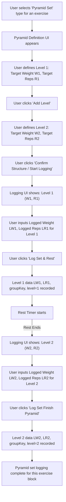

# UI/UX Addon for Story 2.4: Defining and Logging Pyramid Sets

**Original Story Reference:** `ai/stories/epic2.2.4.story.md`

## 1. UI/UX Goal for this Story

To provide an intuitive interface for users to both define the structure of a Pyramid Set (multiple sub-sets with varying weights/reps) and log their performance for each sub-set sequentially, with integrated timer support for rests.

## 2. Key Screens/Views Involved in this Story

- **Active Workout Logging Screen:** The existing `SetInputRow.tsx` might need to be significantly adapted or replaced/augmented by a new component (e.g., `PyramidSetLogger.tsx`) when "Pyramid Set" type is selected.
  - *(Reference: `docs/ui-ux-spec.md`, `ai/ui-stories/epic1.1.5.story.md`)*
- **Pyramid Definition Interface (Modal or Inline Expansion):** A sub-view or section where the user defines the parameters for each leg of the pyramid.

## 3. Detailed UI Element Descriptions & Interactions for this Story

### 3.1. Selecting "Pyramid Set" Type

- The "Set Type" selector (within `SetInputRow.tsx` or similar) will include "Pyramid Set".
- **Behavior:** Selecting "Pyramid Set" transitions the UI to a pyramid definition and logging state.

### 3.2. Pyramid Definition Interface

- **Invocation:** Appears when "Pyramid Set" is selected.
- **Layout:**
  - Allows users to specify the number of sub-sets (or "levels") in the pyramid.
  - For each sub-set/level, inputs for:
    - `Target Weight`
    - `Target Reps`
  - Buttons to "Add Level", "Remove Level".
  - A "Confirm Structure" or "Start Logging Pyramid" button.
- **Example Interaction:**
    1. User selects "Pyramid Set".
    2. UI shows fields for "Level 1: Target Weight, Target Reps".
    3. User clicks "Add Level". UI adds fields for "Level 2: Target Weight, Target Reps".
    4. User defines all levels of the pyramid (e.g., 3 levels: 60kg x 10, 70kg x 8, 80kg x 6).
    5. User clicks "Confirm Structure".

### 3.3. Logging Pyramid Sub-Sets Sequentially

- **Layout:** After defining the structure, the UI presents one sub-set at a time for logging.
  - Displays the current sub-set number (e.g., "Pyramid: Level 1 of 3").
  - Displays the `Target Weight` and `Target Reps` for the current sub-set (from definition).
  - Input fields (pre-filled with targets) for `Logged Weight` and `Logged Reps`.
  - A button like "Log Set & Rest" or "Next Level".
- **Timer Integration:**
  - After logging a sub-set (except the last), the Integrated Workout Timer (Story 2.6) can be automatically started for a pre-defined or user-adjustable rest period.
- **Interaction:**
    1. UI shows "Level 1: Target 60kg x 10". Inputs pre-fill with "60kg", "10reps".
    2. User performs set, adjusts logged values if needed, clicks "Log Set & Rest".
    3. Set 1 data is recorded. Rest timer starts.
    4. After rest, UI shows "Level 2: Target 70kg x 8". Inputs pre-fill.
    5. Process repeats for all levels.
    6. After the last level, the pyramid set is considered complete.

### 3.4. Data Storage

- Each sub-set is stored as an individual `LoggedSet` record (e.g., with `setType: 'pyramid'`).
- All sub-sets belonging to the same pyramid block share a common `groupKey` (UUID).
- Each sub-set has a `level` field indicating its sequence in the pyramid (1, 2, 3, ...).

- **Figma References:**
  - `{Figma_Frame_URL_for_SetType_Pyramid_Selected_State}`
  - `{Figma_Frame_URL_for_Pyramid_Definition_Interface}`
  - `{Figma_Frame_URL_for_Sequential_Pyramid_SubSet_Logging}`

## 4. Accessibility Notes for this Story

- The pyramid definition interface must be keyboard navigable, allowing users to add/remove levels and input targets for each.
- Clear indication of the current sub-set being logged.
- Rest timer interactions must be accessible.

## 5. User Flow Snippet (Defining & Logging a 2-Level Pyramid)

