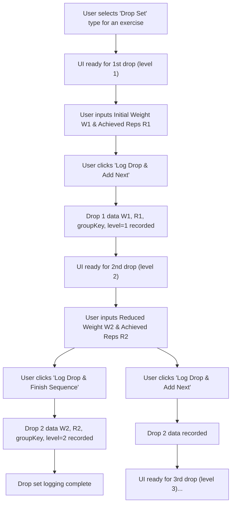

# UI/UX Addon for Story 2.5: Defining and Logging Drop Sets

**Original Story Reference:** `ai/stories/epic2.2.5.story.md`

## 1. UI/UX Goal for this Story

To provide an efficient interface for users to log Drop Sets, allowing them to record an initial set and then quickly log subsequent sub-sets with reduced weight and achieved reps, with minimal delay.

## 2. Key Screens/Views Involved in this Story

- **Active Workout Logging Screen:** The `SetInputRow.tsx` or a new component (e.g., `DropSetLogger.tsx`) will manage the drop set logging flow.
  - *(Reference: `docs/ui-ux-spec.md`, `ai/ui-stories/epic1.1.5.story.md`)*

## 3. Detailed UI Element Descriptions & Interactions for this Story

### 3.1. Selecting "Drop Set" Type

- The "Set Type" selector will include "Drop Set".
- **Behavior:** Selecting "Drop Set" initializes the UI for logging the first sub-set of the drop.

### 3.2. Logging the Initial Drop Set (First Sub-Set)

- **Layout:**
  - Input field for `Initial Weight`.
  - Input field for `Achieved Reps` for this first sub-set.
  - A button: "Log Drop & Add Next" or "Log First Drop".
- **Interaction:** User inputs weight and reps for the first part of the drop set and confirms.

### 3.3. Logging Subsequent Drops

- **Layout & Interaction (Optimized for Speed):**
  - After logging a sub-set, the UI immediately presents fields for the *next* drop:
    - Input field for `New (Reduced) Weight`.
    - Input field for `Achieved Reps` for this new drop.
  - The previous drop's details (weight/reps) might be displayed for reference.
  - Buttons:
    - "Log Drop & Add Another": Records the current drop and prepares for the next one.
    - "Log Drop & Finish Sequence": Records the current drop and ends the drop set sequence.
- **Timer Integration (Optional):**
  - A small, quick-access button to start the Integrated Workout Timer (Story 2.6) for a very brief transition/rest period if the user desires, though typically drop sets have minimal rest. This should not be obtrusive.

### 3.4. Ending the Drop Set Sequence

- User clicks "Log Drop & Finish Sequence" after the final drop, or there might be a separate "End Drop Set" button available throughout the process.

### 3.5. Data Storage

- Each sub-set of the drop is stored as an individual `LoggedSet` record (e.g., with `setType: 'dropSet'`).
- All sub-sets share a common `groupKey` (UUID).
- Each sub-set has a `level` field indicating its sequence (1, 2, 3, ...).

- **Figma References:**
  - `{Figma_Frame_URL_for_SetType_DropSet_Selected_State}`
  - `{Figma_Frame_URL_for_DropSet_Initial_Log_Interface}`
  - `{Figma_Frame_URL_for_DropSet_Subsequent_Drop_Logging_Interface}`

## 4. Accessibility Notes for this Story

- The rapid-entry nature of drop sets needs careful design to ensure it's still controllable via keyboard.
- Clear indication of which drop (sub-set) is currently being logged.
- Buttons for "Log Drop & Add Another" and "Log Drop & Finish Sequence" must be distinct and clearly labeled.

## 5. User Flow Snippet (Logging a 2-Drop Drop Set)

