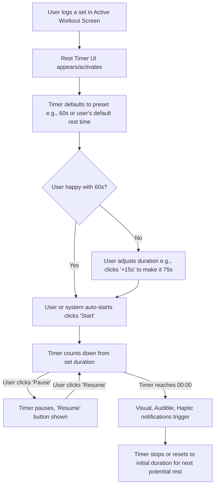

# UI/UX Addon for Story 2.6: Integrated Workout Timer (Countdown & Stopwatch)

**Original Story Reference:** `ai/stories/epic2.2.6.story.md`

## 1. UI/UX Goal for this Story

To design and implement a highly accurate, versatile, and user-friendly integrated timer component that supports countdown and stopwatch modes, providing essential timing functionality for rest periods and various timed set types.

## 2. Key Screens/Views Involved in this Story

- **Integrated Workout Timer Component (`IntegratedWorkoutTimer.tsx`):** This story *is* the UI component.
- **Active Workout Logging Screen:** The timer will be invoked and displayed within this screen, likely as an embedded element or a quickly accessible popover/modal. The mockup `image_3e90df.png` shows it embedded at the bottom.

## 3. Detailed UI Element Descriptions & Interactions for this Story

### 3.1. Timer Display & Layout

- **Location:** Could be a fixed overlay/banner at the bottom of the Active Workout Logging screen (as in `image_3e90df.png`), or a modal/popover triggered by a button. An embedded banner seems more integrated for quick rests.
- **Time Display:**
  - **Format:** Clear MM:SS (minutes:seconds) format.
  - **Visuals:** Large, easily readable digits.
- **Mode Indicator (Optional but Recommended):** A small visual cue or text indicating if it's in "Countdown" or "Stopwatch" mode, especially if the controls differ slightly.

### 3.2. Timer Controls

- **Common Controls:**
  - **Start/Resume Button:** Icon (e.g., Play). Context changes from Start to Resume.
  - **Pause Button:** Icon (e.g., Pause).
  - **Stop/Reset Button:** Icon (e.g., Stop or Reset/Refresh). Behavior might differ slightly:
    - In countdown: Reset to initial duration.
    - In stopwatch: Reset to 00:00.
  - *(Mockup `image_3e90df.png` shows Reset, Play/Pause (center, larger), and another button that might be Stop or options)*
- **Countdown Mode Specific Controls:**
  - **Duration Adjustment:**
    - Buttons for quick adjustments (e.g., "+15s", "-15s", "+30s", "-5s").
    - Direct input field or a picker to set a custom duration if not launched with a pre-defined one (e.g., for manual rest).
  - **Preset Durations:** Buttons for common rest times (e.g., "30s", "60s", "90s", "Default"). The "Default" preset uses the user's configured default rest time from UserSettings.
- **Stopwatch Mode Specific Controls:**
  - Typically simpler: Start, Pause/Resume, Stop/Reset, Lap (Lap is not in V1.0 requirements).

### 3.3. Invocation & Contextual Behavior

- **For Rest Periods (Standard Sets, Pyramid/Drop Sub-Sets):**
  - Timer might appear automatically after logging a set, starting countdown with default/preset duration.
  - Or, a "Start Rest Timer" button appears after logging a set.
- **For AMRAP for Time (Story 2.2):**
  - Timer is configured with `targetDurationSecs` from the set definition. "Start Timer" button specific to the set invokes it.
- **For Reps for Time (Story 2.3):**
  - Timer is set to stopwatch mode. "Start Stopwatch" button specific to the set invokes it.

### 3.4. Notifications (on Countdown Completion)

- **Visual:** Timer display might flash, change color, or show an alert icon.
- **Audible:** A distinct sound cue (e.g., `timer_alarm.mp3`). User should be able to control timer sounds in app settings eventually (though not specified for Story 2.6 itself).
- **Haptic (Vibration):** If platform supports and permissions allow.

### 3.5. Resilience

- UI should reflect timer state accurately after short app backgrounding. If timer had to reset due to PWA limitations, this should be clear (e.g., shows initial state, not a stuck time).

- **Figma References:**
  - `{Figma_Frame_URL_for_Integrated_Timer_Component_General_Layout}`
  - `{Figma_Frame_URL_for_Timer_Countdown_Mode_Controls}`
  - `{Figma_Frame_URL_for_Timer_Stopwatch_Mode_Controls}`
  - `{Figma_Frame_URL_for_Timer_Notifications_Visual}`

## 4. Accessibility Notes for this Story

- All timer controls (buttons) must be keyboard accessible and have clear, accessible names (e.g., `aria-label`).
- Time display should be readable with sufficient contrast.
- Changes in timer state (running, paused, finished) should be announced to assistive technologies if possible, especially countdown completion.
- Audible alerts should be accompanied by visual cues. Users should have control over sound/vibration if they become global settings.

## 5. User Flow Snippet (Using Timer for a 60s Rest)

