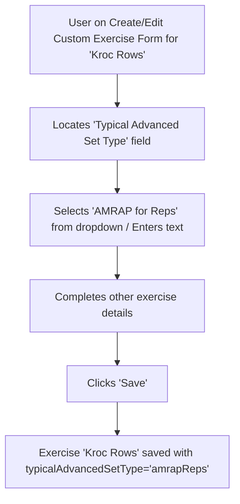

# UI/UX Addon for Story 2.7: Enhanced Custom Exercise Details for Advanced Logging

**Original Story Reference:** `ai/stories/epic2.2.7.story.md`

## 1. UI/UX Goal for this Story

To enhance the custom exercise definition form by allowing users to optionally associate an exercise with a typical advanced set structure, providing a hint for easier selection during workout logging.

## 2. Key Screens/Views Involved in this Story

- **Create/Edit Custom Exercise Form (Page or Modal):** Modifies the existing form from Story 1.4.
  - *(Reference: `ai/ui-stories/epic1.1.4.story.md`)*
- **Active Workout Logging Screen (Minor Optional Change):** Where the hint/suggestion (AC3) might appear.
  - *(Reference: `ai/ui-stories/epic1.1.5.story.md` and other Epic 2 logging stories)*

## 3. Detailed UI Element Descriptions & Interactions for this Story

### 3.1. `ExerciseForm.tsx` (or equivalent) Modifications

- **New Optional Field: "Typical Advanced Set Type"**
  - **Placement:** Add a new field within the "Create/Edit Custom Exercise" form.
  - **Label:** "Typical Advanced Set Type (Optional)" or "Commonly Logged As".
  - **Control:**
    - Option 1 (Structured): `shadcn/ui Select` or `RadioGroup` with predefined options: "None/Standard", "AMRAP for Reps", "AMRAP for Time", "Reps for Time", "Pyramid Set", "Drop Set".
    - Option 2 (Free Text - simpler, as `typicalAdvancedSetType` is `string` in data model): `shadcn/ui Input` (text type).
    - *Recommendation: A `Select` with predefined common types plus an "Other (Specify)" or just relying on the string nature is probably best for flexibility vs. strictness here, given it's a hint.*
  - **Behavior:** The selected/entered value is saved to the `typicalAdvancedSetType` field of the `ExerciseDefinition` in Dexie.js. This field is optional.
- **Figma Reference:** `{Figma_Frame_URL_for_ExerciseForm_With_TypicalAdvancedSetType_Field}`

### 3.2. UI Hint During Workout Logging (Optional V1.0 - AC3)

- **Context:** When a user adds an exercise (that has a `typicalAdvancedSetType` defined) to their active workout.
- **Possible UI Implementations for the Hint:**
  - **Subtle Pre-selection:** The "Set Type" selector in the `SetInputRow.tsx` could default to the `typicalAdvancedSetType` for the first set of this exercise. User can still change it.
  - **Visual Tag/Indicator:** A small, non-intrusive icon or text tag next to the exercise name or near the "Set Type" selector, like "Tip: Try AMRAP".
  - *Focus should be on "subtle" and "slightly easier" – it should not force or overcomplicate the primary logging flow.*
- **Figma Reference:** `{Figma_Frame_URL_for_WorkoutLogging_SetType_Hint_Example}`

## 4. Accessibility Notes for this Story

- The new "Typical Advanced Set Type" field in the exercise form must have a clear label and be keyboard accessible.
- If a UI hint (AC3) is implemented in the logging screen, ensure it doesn't clutter the interface and is discoverable by assistive technologies without being disruptive. If it's a visual tag, it should have an accessible name or be described by `aria-describedby` if it's related to a control.

## 5. User Flow Snippet (Defining Typical Advanced Set Type)

