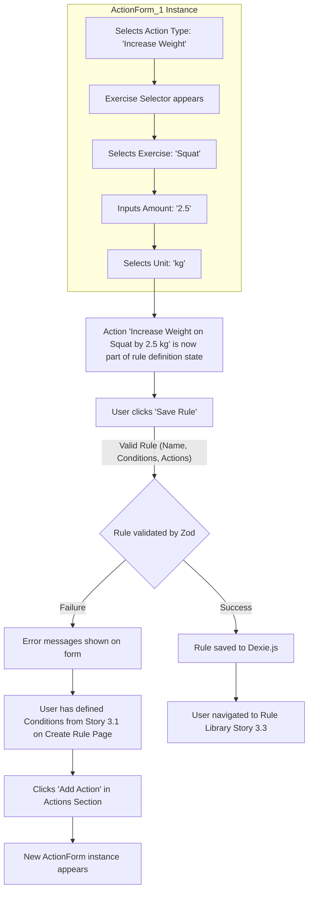

# UI/UX Addon for Story 3.2: Progression Rule Definition - Actions & Finalization

**Original Story Reference:** `ai/stories/3.2.story.md`

## 1. UI/UX Goal for this Story

To allow users to define one or more actions (the "event" in `json-rules-engine`) that should occur if the rule's conditions (from Story 3.1) are met, and then to save the complete progression rule to their library.

## 2. Key Screens/Views Involved in this Story

- **Create/Edit Progression Rule Page (`CreateRulePage.tsx` / `EditRulePage.tsx`):** Continuing from Story 3.1, this page will now include a section for defining actions and a final "Save Rule" button.
- **Rule Action Builder Component (`RuleActionBuilder.tsx`):** A dynamic section for adding and managing a list of actions.
- **Action Form Component (`ActionForm.tsx`):** A sub-component for specifying the parameters of a single action.

## 3. Detailed UI Element Descriptions & Interactions for this Story

### 3.1. Create/Edit Progression Rule Page (Actions Section)

- **Actions Section Header:**
  - **Label:** "Actions" or "THEN..."
- **Rule Action Builder Component (`RuleActionBuilder.tsx`):**
  - **Layout:** A container listing all actions added to the rule.
  - **"Add Action" Button:**
    - **Control:** `shadcn/ui Button`.
    - **Action:** Adds a new instance of `ActionForm.tsx`.
- **"Save Rule" Button:**
  - **Control:** `shadcn/ui Button` (primary).
  - **Behavior:** Enabled when the rule is valid (name, at least one condition, at least one action). On click, validates the entire rule structure (conditions and actions/event) using Zod schemas and persists it to Dexie.js via `ruleService.ts`. Navigates user away (e.g., to Rule Library) on successful save.

### 3.2. Action Form Component (`ActionForm.tsx`)

- **Layout:** A distinct block for defining a single action.
- **Controls for defining an action:**
  - **Action Type Selector:**
    - **Label:** "Action Type".
    - **Control:** `shadcn/ui Select`.
    - **Options (from PRD FRX.1.4 and Story 3.2):**
      - "Increase Weight"
      - "Decrease Weight"
      - "Increase Reps"
      - "Decrease Reps"
      - "Hold Parameters Constant"
      - "Suggest Deload"
  - **Exercise Selector (Contextual):**
    - **Label:** "For Exercise".
    - **Control:** `shadcn/ui Select` or searchable `Combobox` (populated with user's exercises).
    - **Visibility:** Shown for most action types.
  - **Action Parameters (Dynamic based on Action Type):**
    - **For "Increase/Decrease Weight":**
      - Input for `Amount` (`shadcn/ui Input` - number).
      - `Select` for `Unit` ("kg", "lbs", "%"). Default to user's preferred unit or absolute values.
    - **For "Increase/Decrease Reps":**
      - Input for `Amount` (number of reps) (`shadcn/ui Input` - number).
      - (Optional for V1) `Select` for which sets (e.g., "all sets", "last set"). For V1, might apply to all sets by default.
    - **For "Hold Parameters Constant":** No further parameters typically needed beyond the exercise.
    - **For "Suggest Deload":**
      - Input for `Deload Percentage` (e.g., 10%) or a textual description of the deload protocol.
      - This action is a suggestion; the UI in Story 3.6 will handle user confirmation.
  - **Remove Action Button:**
    - **Control:** `shadcn/ui Button` (icon button).
    - **Action:** Removes this action from the rule.

- **Figma References:**
  - `{Figma_Frame_URL_for_CreateRulePage_ActionsSection}`
  - `{Figma_Frame_URL_for_RuleActionBuilder_Component}`
  - `{Figma_Frame_URL_for_ActionForm_Variants_and_Controls}`

## 4. Accessibility Notes for this Story

- All form elements in `ActionForm.tsx` must be keyboard accessible with clear labels.
- Dynamic parameter fields based on action type selection must be handled accessibly (e.g., ensuring focus is managed and new fields are announced).
- "Save Rule" button state (enabled/disabled) should be clear.

## 5. User Flow Snippet (Adding an Action and Saving Rule)

