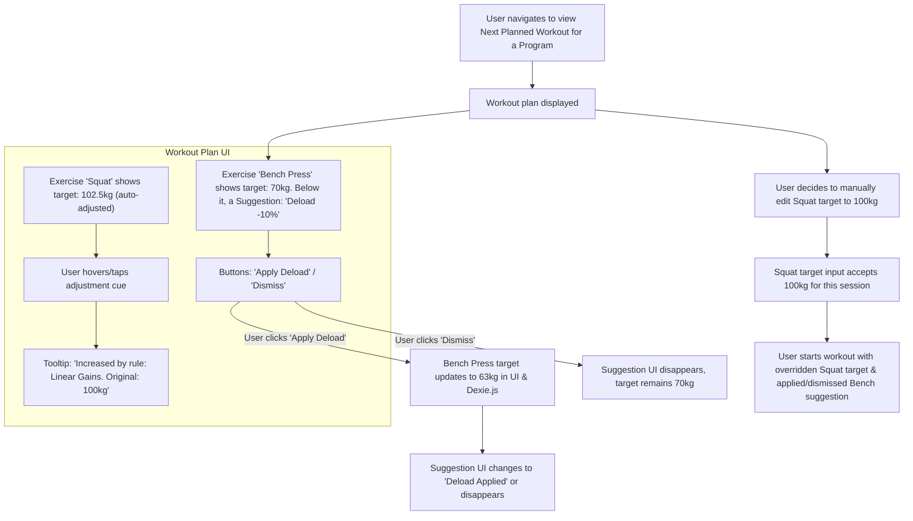

# UI/UX Addon for Story 3.6: User Override & Feedback for Applied Progressions

**Original Story Reference:** `ai/stories/3.6.story.md`

## 1. UI/UX Goal for this Story

To provide users with clear feedback on automated progression adjustments made to their workout plans, explain why these changes occurred, allow them to override these adjustments or apply/dismiss suggestions, and offer a history of applied progressions, ensuring user control and transparency.

## 2. Key Screens/Views Involved in this Story

- **Workout Plan Display / Preview Screen:** (e.g., within a Program view before starting a workout, or the pre-filled Active Workout Logging screen). This is where adjusted parameters and suggestions are shown.
  - *(Leverages and extends UI from Story 1.5 and potentially Epic 4 for program context).*
- **Progression History Page (`ProgressionHistoryPage.tsx`):** A new screen to display the log of applied progressions.
- **Progression Log List Item Component (`ProgressionLogListItem.tsx`):** For displaying individual entries in the history.

## 3. Detailed UI Element Descriptions & Interactions for this Story

### 3.1. Workout Plan Display / Preview Screen (Showing Adjustments & Suggestions)

- **Visual Indication of Adjusted Parameters:**
  - **Target:** When displaying target weight/reps for an exercise/set that has been auto-adjusted by FRX.
  - **UI:**
    - The adjusted value (e.g., "72.5 kg") should be clearly visible.
    - A visual cue (e.g., a small icon like a "sparkle" or "up arrow", a `shadcn/ui Badge`, or slightly different text color/background) to indicate it's an auto-adjusted value.
    - **Tooltip/Popover on Cue:** Hovering/tapping the visual cue reveals a brief explanation: "Automatically adjusted by rule: '[Rule Name]'" or "Original: 70kg". This data comes from `ActiveProgramInstance.progressionAdjustments` and linked `AppliedProgressionLogEntry`.
- **Manual Override of Parameters:**
  - Target parameter fields (weight, reps) should remain editable by the user before starting the workout.
  - If a user edits an auto-adjusted value, the visual cue for "auto-adjusted" might disappear or change to "manual override". The override is used for that session.
- **Displaying & Handling Suggestions (e.g., "Suggest Deload"):**
  - **UI:** If FRX stored a suggestion (e.g., "Suggest Deload: -10% for Squat" in `ActiveProgramInstance.progressionAdjustments`), display this clearly, perhaps as a dismissible banner or note near the relevant exercise.
  - **Actions:**
    - **"Apply Suggestion" Button:**
      - **Behavior:** Clicking this updates the actual target parameters for the workout plan in Dexie.js (e.g., recalculates weight for deload and updates `ActiveProgramInstance`). The suggestion UI is then removed or updated to "Applied".
    - **"Dismiss Suggestion" Button:**
      - **Behavior:** Hides the suggestion for this instance. The original (or otherwise auto-adjusted) parameters remain.
- **Figma References:**
  - `{Figma_Frame_URL_for_WorkoutPlan_AdjustedParameter_Display}`
  - `{Figma_Frame_URL_for_WorkoutPlan_Suggestion_Display_Actions}`

### 3.2. Progression History Page (`ProgressionHistoryPage.tsx`)

- **Layout:**
  - Screen Title (e.g., "Progression History" or "Automated Adjustments Log").
  - List of progression log entries, using `ProgressionLogListItem.tsx`.
  - Data fetched reactively from `AppliedProgressionLog` table using `useLiveQuery`.
- **Filtering (Optional V1.0 Enhancement):** By date range, exercise, or rule name.

### 3.3. Progression Log List Item Component (`ProgressionLogListItem.tsx`)

- **Display:**
  - Date of application.
  - Exercise(s) affected.
  - Rule triggered (Rule Name).
  - Action taken (e.g., "Increased weight to 72.5kg", "Suggested Deload -10% (Applied/Dismissed)").
  - Status (e.g., "Auto-applied", "Suggestion Applied by User", "Suggestion Dismissed").

- **Figma Reference:** `{Figma_Frame_URL_for_ProgressionHistoryPage_And_ListItem}`

## 4. Accessibility Notes for this Story

- Visual cues for adjusted parameters must have accessible text alternatives (e.g., via `aria-describedby` on the parameter input/display, linking to the tooltip content).
- Suggestions and their "Apply"/"Dismiss" actions must be clearly announced and operable via keyboard.
- The Progression History list must be keyboard navigable.

## 5. User Flow Snippet (Viewing Adjusted Plan and Applying a Suggestion)

