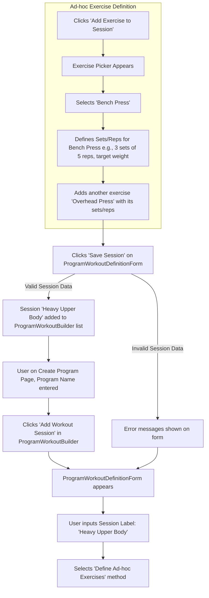

# UI/UX Addon for Story 4.1: Program Definition - Structure & Workout Sequence

**Original Story Reference:** `ai/stories/4.1.story.md`

## 1. UI/UX Goal for this Story

To provide an intuitive and flexible interface for users to create new training programs by defining a name and an ordered sequence of workout sessions. Users should be able to build these sessions using existing templates or by defining exercises ad-hoc, and easily manage the order of these sessions.

## 2. Key Screens/Views Involved in this Story

- **Create Program Page (`CreateProgramPage.tsx`):** The main page for defining a new program's structure.
  - *(This page might also serve as an "Edit Program Page" for inactive programs as per Story 4.3).*
- **Program Workout List/Builder Component (`ProgramWorkoutBuilder.tsx`):** A section within the create program page to display and manage the sequence of workout sessions.
- **Program Workout Definition Form/Modal (`ProgramWorkoutDefinitionForm.tsx`):** A form (possibly modal or an inline expandable section) used when adding/editing a workout session within the program sequence. This form allows selecting a `WorkoutTemplate` or defining `adHocExercises`.

## 3. Detailed UI Element Descriptions & Interactions for this Story

### 3.1. Create Program Page (`CreateProgramPage.tsx`)

- **Program Name Input:**
  - **Label:** "Program Name".
  - **Control:** `shadcn/ui Input` (text type).
  - **Validation:** Required; uniqueness might be handled at service level or via Zod refinement if necessary.
- **Workout Sequence Section Header:**
  - **Label:** "Workout Sequence" or "Workout Days".
- **`ProgramWorkoutBuilder.tsx` Component Area:** Displays the list of added workout sessions and controls for managing them.
- **"Save Program" Button:**
  - **Control:** `shadcn/ui Button` (primary).
  - **Action:** Validates the entire `ProgramDefinition` (name, sequence, workout content) using Zod and saves it to Dexie.js via `programService.ts`.

### 3.2. Program Workout List/Builder Component (`ProgramWorkoutBuilder.tsx`)

- **Layout:** Displays an ordered list of workout sessions defined for the program.
- **"Add Workout Session" Button:**
  - **Control:** `shadcn/ui Button`.
  - **Action:** Opens/displays the `ProgramWorkoutDefinitionForm.tsx` to define a new workout session to be added to the sequence.
- **Workout Session List Item:**
  - **Display:** Shows a summary of the workout session (e.g., "Workout A", "Day 1: Chest & Triceps", or list of main exercises if ad-hoc). Includes its order in the sequence (e.g., "1.", "2.").
  - **Controls per item:**
    - **Edit Button/Icon:** Opens the `ProgramWorkoutDefinitionForm.tsx` populated with this session's data.
    - **Remove Button/Icon:** Removes the session from the sequence (with confirmation).
    - **Reorder Controls:**
      - Option 1: Drag-and-drop handles if a suitable `shadcn/ui` compatible library is used.
      - Option 2: "Move Up" / "Move Down" icon buttons.
    - **Behavior:** Reordering updates the `orderInProgram` for affected `ProgramWorkoutDefinitionEntry` items in the local state.

### 3.3. Program Workout Definition Form/Modal (`ProgramWorkoutDefinitionForm.tsx`)

- **Layout:** A form to define a single workout session within the program.
- **Controls:**
  - **Workout Session Tag/Name (Optional):**
    - **Label:** "Session Label" or "Day Tag" (e.g., "Workout A", "Push Day").
    - **Control:** `shadcn/ui Input` (text type) for `dayTag` field.
  - **Content Definition Method Selector:**
    - **Control:** `shadcn/ui RadioGroup` or `Tabs`.
    - **Options:** "Use Workout Template", "Define Ad-hoc Exercises".
  - **If "Use Workout Template" is selected:**
    - **Template Selector:**
      - **Control:** `shadcn/ui Select` or searchable `Combobox` listing existing `WorkoutTemplate` names (fetched from Dexie.js).
      - **Display:** Shows selected template name.
  - **If "Define Ad-hoc Exercises" is selected:**
    - **Ad-hoc Exercise Builder UI:**
      - A sub-component that allows adding multiple exercises.
      - For each exercise:
        - Select exercise definition (from Exercise Library).
        - Define sets, reps, weight, and advanced set types (reusing or adapting components from workout logging UI - Epics 1 & 2, e.g., simplified `SetInputRow` for planning targets).
      - "Add Exercise to Session" button within this builder.
- **"Save Session" / "Add to Program" Button:** Adds/updates the defined workout session in the `ProgramWorkoutBuilder`'s list.
- **"Cancel" Button:** Discards changes to this session.

- **Figma References:**
  - `{Figma_Frame_URL_for_CreateProgramPage_Layout}`
  - `{Figma_Frame_URL_for_ProgramWorkoutBuilder_Component}`
  - `{Figma_Frame_URL_for_ProgramWorkoutDefinitionForm_TemplateMode}`
  - `{Figma_Frame_URL_for_ProgramWorkoutDefinitionForm_AdHocMode}`
  - `{Figma_Frame_URL_for_WorkoutSession_Reordering_Interaction}`

## 4. Accessibility Notes for this Story

- All form inputs for program name and workout session definition must have clear, associated labels.
- The dynamic list of workout sessions in `ProgramWorkoutBuilder.tsx` must be keyboard navigable. Reordering functionality (drag-and-drop or buttons) must be fully keyboard accessible.
- If modals are used for `ProgramWorkoutDefinitionForm.tsx`, they must manage focus correctly.
- Clear visual feedback for Zod validation errors on the form.

## 5. User Flow Snippet (Adding an Ad-hoc Workout Session to a Program)

