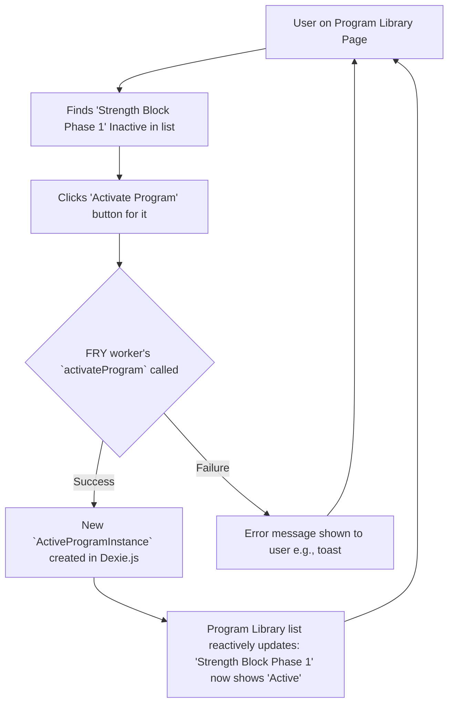

# UI/UX Addon for Story 4.3: Program Activation & Management (Multiple Programs)

**Original Story Reference:** `ai/stories/4.3.story.md`

## 1. UI/UX Goal for this Story

To provide users with a "Program Library" where they can view all their defined programs, activate/deactivate them for tracking, edit inactive programs, and delete programs they no longer need, supporting the management of multiple concurrent training routines.

## 2. Key Screens/Views Involved in this Story

- **Program Library Page (`ProgramLibraryPage.tsx`):** Main screen for listing and managing all `ProgramDefinition`s.
- **Program List Item Component (`ProgramListItem.tsx`):** Represents a single program in the library list.
- **Edit Program Page (`EditProgramPage.tsx`):** Reuses UI from Stories 4.1 & 4.2 for modifying an *inactive* program definition.
- **Confirmation Dialog (`AlertDialog`):** For confirming deletion of a program.

## 3. Detailed UI Element Descriptions & Interactions for this Story

### 3.1. Program Library Page (`ProgramLibraryPage.tsx`)

- **Layout:**
  - Screen Title (e.g., "My Training Programs" or "Program Library").
  - "Create New Program" Button: Navigates to `CreateProgramPage.tsx` (from Story 4.1).
  - List of programs, where each is an instance of `ProgramListItem.tsx`.
  - The list should reactively update based on `ProgramDefinition`s and their active status (derived from `ActiveProgramInstance`s) using `dexie-react-hooks` `useLiveQuery`.
- **Filtering/Tabs (Optional V1.0 Enhancement):** "All Programs", "Active Programs", "Inactive Programs".

### 3.2. Program List Item Component (`ProgramListItem.tsx`)

- **Display:**
  - Program Name.
  - Status Indicator: "Active" or "Inactive" (e.g., a `shadcn/ui Badge`).
  - (Optional) Brief summary: e.g., target frequency, number of workouts in sequence.
- **Controls/Actions per Item:**
  - **Primary Action Button (Contextual):**
    - If Inactive: "Activate Program" button.
      - **Action:** Calls FRY worker's `activateProgram` method via Comlink, which creates an `ActiveProgramInstance`. UI updates reactively.
    - If Active: "Deactivate Program" button.
      - **Action:** Calls FRY worker's `deactivateProgram` method via Comlink, which updates the `ActiveProgramInstance` status. UI updates reactively.
  - **Context Menu / Action Buttons (e.g., "..." icon button):**
    - "View Details": Navigates to a read-only view of the program definition (and its active state if applicable).
    - "Edit Definition":
      - **Visibility:** Enabled only for *inactive* programs.
      - **Action:** Navigates to `EditProgramPage.tsx` (UI from 4.1/4.2) populated with the program's data.
    - "Delete Program":
      - **Visibility:** Preferably enabled only for *inactive* programs, or with strong warnings if active instances exist (V1.0 strategy: prevent deletion if active, or orphan instances).
      - **Action:** Triggers a Confirmation Dialog.

### 3.3. Confirmation Dialog (for Delete Program)

- **Description:** `shadcn/ui AlertDialog`.
- **Content:** Title ("Delete Program?"), Message ("Are you sure you want to delete program '[Program Name]'? This action cannot be undone. Active progress might be affected if not handled."), "Confirm Delete", "Cancel".

- **Figma References:**
  - `{Figma_Frame_URL_for_ProgramLibraryPage}`
  - `{Figma_Frame_URL_for_ProgramListItem_Active_Inactive_States}`
  - `{Figma_Frame_URL_for_ProgramItem_Actions_Menu}`
  - `{Figma_Frame_URL_for_DeleteProgram_Confirmation_Dialog}`

## 4. Accessibility Notes for this Story

- Program list must be keyboard navigable. Each `ProgramListItem` and its controls must be accessible.
- Status indicators (Active/Inactive) should be clear and have accessible text alternatives if purely visual.
- Confirmation dialogs must manage focus correctly.

## 5. User Flow Snippet (Activating an Inactive Program)

