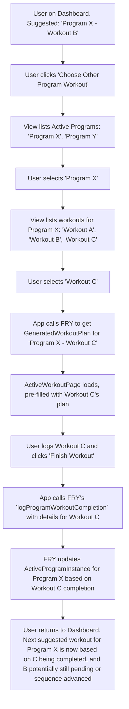

# UI/UX Addon for Story 4.7: User Override of Program Schedule / Workout Selection

**Original Story Reference:** `ai/stories/epic4.4.7.story.md`

## 1. UI/UX Goal for this Story

To provide users with the flexibility to select and perform any workout from any of their active programs, or an ad-hoc workout, regardless of the system's primary suggestion from the adaptive schedule, ensuring the UI supports this choice clearly.

## 2. Key Screens/Views Involved in this Story

- **Dashboard / "Today's Focus" Component (`TodayFocus.tsx` or similar):** While it shows the primary suggested workout, it must also provide clear pathways to choose a different workout.
- **Program Library Page (`ProgramLibraryPage.tsx`) or Program Detail Page (`ProgramDetailPage.tsx`):** These views should allow a user to select and start *any* workout session listed within a program definition, not just the "next" one according to `currentWorkoutOrderInProgram`.
- **Workout Type Selection (Intermediate step, possibly):** A screen or modal where users can choose between "Start Suggested Program Workout", "Choose Other Program Workout", or "Start Ad-hoc Workout".

## 3. Detailed UI Element Descriptions & Interactions for this Story

### 3.1. Enhancements to Workout Initiation Points

- **Dashboard / "Today's Focus":**
  - **Primary Button:** "Start [Suggested Workout Name]" (e.g., "Start Workout B").
  - **Secondary Options/Buttons:**
    - "Choose Other Program Workout" / "Select from Program".
      - **Action:** Navigates to a view where they can see all active programs, select one, then select a specific workout session from that program's sequence to start.
    - "Start Ad-hoc Workout" (links to existing flow from Epic 1 for starting empty or from template).
- **Program Library Page / Program Detail Page:**
  - When viewing the list of workouts within a program definition (e.g., Workout A, B, C):
    - Each workout session item should have a "Start This Workout" or "Log This Workout" button/option, regardless of whether it's the "next" in sequence.
    - **Action:** Clicking this would fetch the `GeneratedWorkoutPlan` for that *specific* workout session from FRY and proceed to the `ActiveWorkoutPage.tsx`.

### 3.2. Selecting a Specific (Potentially Out-of-Sequence) Program Workout

- **Interface:** Could be a drill-down:
    1. User clicks "Choose Other Program Workout".
    2. View lists active programs (e.g., "Strength Block", "Conditioning Plan").
    3. User selects an active program.
    4. View lists all workout sessions within that program's sequence (e.g., "Workout A", "Workout B", "Workout C").
    5. User selects the desired workout session (e.g., "Workout C").
    6. System fetches plan for "Workout C" from FRY and navigates to `ActiveWorkoutPage.tsx`.
- The FRY worker method called would need to be able_to generate a plan for a *specific, identified* workout within a program, not just the one at `currentWorkoutOrderInProgram`. For example `getSpecificWorkoutPlan(activeProgramInstanceId, workoutOrderInProgramToLog)`.

### 3.3. Logging Ad-hoc Workouts

- The path to "Start Ad-hoc Workout" (from dashboard or main navigation) remains as established in Epic 1.
- Crucially, completing an ad-hoc workout *must not* trigger any calls to FRY worker methods related to program state updates (`logProgramWorkoutCompletion`).

- **Figma References:**
  - `{Figma_Frame_URL_for_Dashboard_TodayFocus_With_OverrideOptions}`
  - `{Figma_Frame_URL_for_ProgramWorkout_Selection_OutOfSequence}`
  - `{Figma_Frame_URL_for_ActiveProgram_List_ForWorkoutSelection}`

## 4. Accessibility Notes for this Story

- All options for choosing different workout types (suggested, other program, ad-hoc) must be clearly labeled and keyboard accessible.
- If using drill-down navigation to select a specific program workout, ensure clear back navigation and context for the user.

## 5. User Flow Snippet (User Chooses Out-of-Sequence Program Workout)

