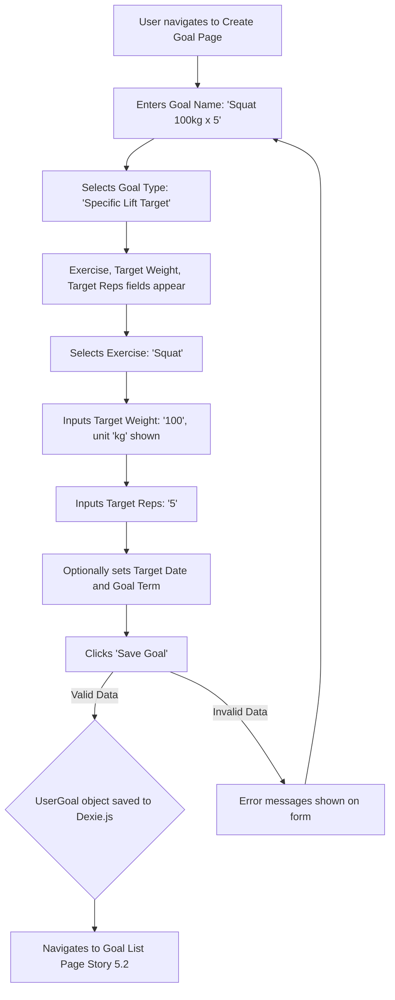

# UI/UX Addon for Story 5.1: Goal Definition - Creating Various Goal Types

**Original Story Reference:** `ai/stories/epic5.5.1.story.md`

## 1. UI/UX Goal for this Story

To provide users with a clear and flexible interface to define various types of training goals (Specific Lift, Program Completion, Bodyweight), including optional details like target dates and goal terms, and to introduce a simple way to log bodyweight.

## 2. Key Screens/Views Involved in this Story

- **Create Goal Page (`CreateGoalPage.tsx`):** The main page for defining a new goal.
- **Goal Form Component (`GoalForm.tsx`):** A dynamic form within the `CreateGoalPage` that adapts to the selected goal type.
- **Bodyweight Logging UI (`BodyweightLogForm.tsx` or section):** A simple form or section for users to log their bodyweight, which is a prerequisite for setting bodyweight goals. This might be part of the settings, a quick log feature, or integrated near goal creation.

## 3. Detailed UI Element Descriptions & Interactions for this Story

### 3.1. Create Goal Page (`CreateGoalPage.tsx`)

- **Layout:**
  - Screen Title (e.g., "Create New Goal").
  - Hosts the `GoalForm.tsx` component.
  - "Save Goal" and "Cancel" buttons.
- **"Save Goal" Button:**
  - **Action:** Validates the entire `UserGoal` object via Zod schema and saves it to Dexie.js using `goalService.ts`. Navigates to goal list on success.

### 3.2. Goal Form Component (`GoalForm.tsx`)

- **Goal Name/Description Input:**
  - **Label:** "Goal Name" or "Description".
  - **Control:** `shadcn/ui Input` (text type).
  - **Validation:** Required.
- **Goal Type Selector:**
  - **Label:** "Goal Type".
  - **Control:** `shadcn/ui Select` or `RadioGroup`.
  - **Options:** "Specific Lift Target", "Program Completion", "Bodyweight Target".
  - **Behavior:** Selection dynamically changes the available fields below.
- **Dynamic Fields based on Goal Type:**
  - **For "Specific Lift Target":**
    - **Exercise Selector:** Label "Exercise", `shadcn/ui Select` or `Combobox` (populated from user's `ExerciseDefinition` list).
    - **Target Weight Input:** Label "Target Weight", `shadcn/ui Input` (number), with unit (kg/lbs) based on user preference.
    - **Target Reps Input:** Label "Target Reps", `shadcn/ui Input` (number, integer).
  - **For "Program Completion":**
    - **Program Selector:** Label "Program", `shadcn/ui Select` or `Combobox` (populated from user's `ProgramDefinition` list).
  - **For "Bodyweight Target":**
    - **Target Bodyweight Input:** Label "Target Bodyweight", `shadcn/ui Input` (number), with unit (kg/lbs).
    - *(Prerequisite: Bodyweight logging UI must be accessible for user to have current bodyweight data).*
- **Optional Target Date Input:**
  - **Label:** "Target Date (Optional)".
  - **Control:** `shadcn/ui DatePicker` component.
- **Goal Term Classifier (Short-term/Long-term):**
  - **Label:** "Goal Term".
  - **Control:** `shadcn/ui Select` or `RadioGroup` with options "Short-term", "Long-term".
  - **Behavior:** Saved as a simple tag or property on the `UserGoal`.

### 3.3. Bodyweight Logging UI (`BodyweightLogForm.tsx` or section)

- **Layout:** A simple form, could be a small section in settings/dashboard, or a modal.
- **Controls:**
  - **Date Input:** Label "Date", `shadcn/ui DatePicker`, defaults to today.
  - **Weight Input:** Label "Bodyweight", `shadcn/ui Input` (number), with unit (kg/lbs).
  - **"Save Bodyweight" Button.**
- **Behavior:** Saves a `UserBodyweightLog` entry to Dexie.js via `goalService.ts`.

- **Figma References:**
  - `{Figma_Frame_URL_for_CreateGoalPage_Layout}`
  - `{Figma_Frame_URL_for_GoalForm_DynamicStates_LiftTarget}`
  - `{Figma_Frame_URL_for_GoalForm_ProgramCompletion}`
  - `{Figma_Frame_URL_for_GoalForm_BodyweightTarget}`
  - `{Figma_Frame_URL_for_GoalForm_OptionalFields_TargetDate_Term}`
  - `{Figma_Frame_URL_for_BodyweightLogForm}`

## 4. Accessibility Notes for this Story

- All form elements in `GoalForm.tsx` and `BodyweightLogForm.tsx` must have clear, associated labels.
- Dynamic changes in `GoalForm.tsx` based on goal type selection should manage focus appropriately and be announced to assistive technologies if necessary.
- Date pickers must be keyboard accessible.
- Validation error messages must be clearly linked to their respective inputs.

## 5. User Flow Snippet (Creating a Specific Lift Target Goal)

