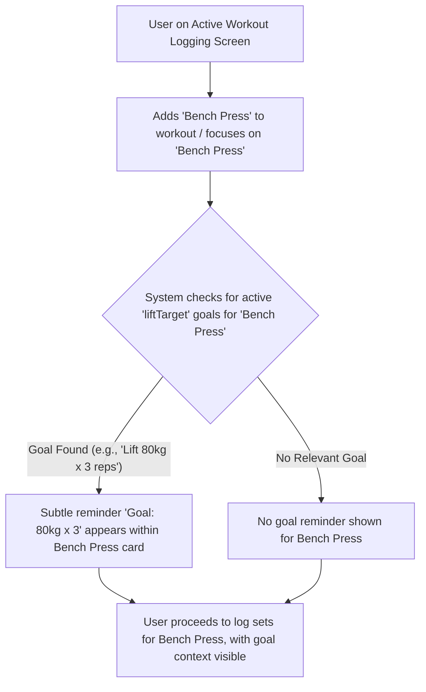

# UI/UX Addon for Story 5.5: In-Workout Goal Visibility (Motivational Context)

**Original Story Reference:** `ai/stories/epic5.5.5.story.md`

## 1. UI/UX Goal for this Story

To subtly display relevant "Specific Lift Target" goal information directly within the active workout logging screen when the user is performing the targeted exercise, providing motivation and context without cluttering the interface.

## 2. Key Screens/Views Involved in this Story

- **Active Workout Logging Screen (`ActiveWorkoutPage.tsx`):** Specifically, the area where an individual exercise is displayed for logging (e.g., within an `ExerciseLogCard.tsx`).
  - *(Reference: `ai/ui-stories/epic1.1.5.story.md` and Epic 2 UI stories for base logging UI).*

## 3. Detailed UI Element Descriptions & Interactions for this Story

### 3.1. `ExerciseLogCard.tsx` (or equivalent) Modifications

- **Goal Reminder Display Area:**
  - **Placement:** A non-intrusive area within the card for the currently active exercise, e.g., below the exercise name or near the set input area.
  - **Visibility:** Only appears if there's an active "Specific Lift Target" goal for the current exercise being logged.
- **Content of the Reminder:**
  - **Text:** Concise summary of the goal. Example: "Active Goal: Lift 100kg x 5 reps" or "Target: 100kg x 5".
  - **Visuals:** Could be plain text, or a small `shadcn/ui Badge` with a "goal" icon. Should be subtle to avoid distraction.
- **Behavior:**
  - When an exercise is added to the workout or becomes the active focus for logging:
        1. System queries Dexie.js (via `goalService.ts` or `useLiveQuery`) for active `UserGoal`s of type 'liftTarget' matching the current `exerciseDefinitionId`.
        2. If a relevant goal is found, the reminder UI is displayed with its target details.
        3. If no such goal, or if the goal is already 'achieved', this UI remains hidden.
- **No Interaction:** The reminder is purely informational; tapping it might do nothing or perhaps navigate to the goal's detail view if that's deemed useful and simple to implement.

- **Figma References:**
  - `{Figma_Frame_URL_for_ExerciseLogCard_With_InWorkoutGoalReminder}`
  - `{Figma_Frame_URL_for_GoalReminder_Badge_Style}`

## 4. Accessibility Notes for this Story

- The goal reminder text must be readable with sufficient contrast.
- If it's not interactive, ensure it doesn't confuse users by appearing like a button.
- Screen readers should announce this contextual information when the exercise section becomes active or when the reminder appears, perhaps using an `aria-live` region or by associating it with the exercise name via `aria-describedby`.

## 5. User Flow Snippet (Seeing In-Workout Goal Reminder)

