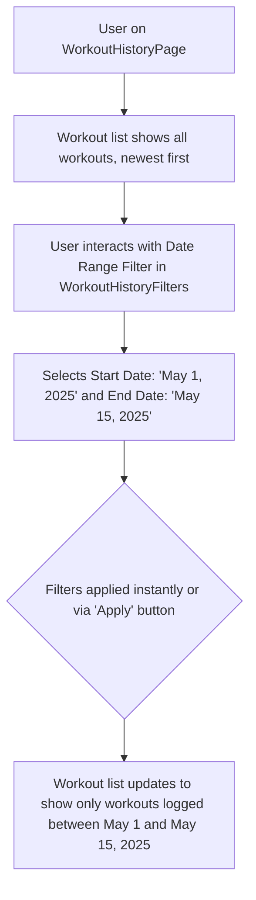

# UI/UX Addon for Story 6.3: Workout Log/History View - List & Filtering

**Original Story Reference:** `ai/stories/epic6.6.3.story.md`

## 1. UI/UX Goal for this Story

To provide users with a dedicated screen to view a chronological list of their past workout sessions, with effective filtering (by date range, program) and search (by exercise name) capabilities for easy retrieval of specific workout logs.

## 2. Key Screens/Views Involved in this Story

- **Workout History Page (`WorkoutHistoryPage.tsx`):** The main screen for this feature.
- **Workout History List Item Component (`WorkoutHistoryListItem.tsx`):** Renders summary info for each workout in the list.
- **Workout History Filters Component (`WorkoutHistoryFilters.tsx`):** Contains controls for date range, program filter, and exercise search.

## 3. Detailed UI Element Descriptions & Interactions for this Story

### 3.1. `WorkoutHistoryPage.tsx` Layout

- **Screen Title:** "Workout History" or "My Logs".
- **Filters Area:** Hosts the `WorkoutHistoryFilters.tsx` component, likely at the top of the screen.
- **Workout List Area:** Displays a scrollable list of `WorkoutHistoryListItem.tsx` components.
- **Data:** Fetched reactively using `useLiveQuery` from `WorkoutLog` table, sorted by `startTime` descending by default.
- **Empty State:** If no workouts logged yet, or if filters yield no results, display an appropriate message (e.g., "No workouts found for these filters." or "Log your first workout to see it here!").

### 3.2. `WorkoutHistoryFilters.tsx` Component

- **Layout:** A row or section containing filter controls. Could be collapsible to save space.
- **Controls:**
  - **Date Range Filter:**
    - **Label:** "Date Range".
    - **Control:** `shadcn/ui DatePicker` with range selection capability, or two separate DatePickers for "Start Date" and "End Date". Presets like "Last 7 days", "Last 30 days" could be useful.
  - **Program Filter:**
    - **Label:** "Program".
    - **Control:** `shadcn/ui Select` or `Combobox` populated with names of `ProgramDefinition`s that the user has workouts for (requires fetching distinct `programDefinitionId`s from logs and then their names). Option for "All Programs" / "Ad-hoc only".
  - **Exercise Name Search:**
    - **Label:** "Search by Exercise".
    - **Control:** `shadcn/ui Input` (text type) with a search icon.
    - **Behavior:** As user types, the workout list below dynamically updates. Search logic involves querying `LoggedSet`s for matching `exerciseDefinitionId` (via exercise name) and then filtering `WorkoutLog`s.
- **"Apply Filters" / "Clear Filters" Buttons (Optional):** Depending on whether filters apply instantly or on submit. Instant filtering is generally preferred for better UX if performance allows.

### 3.3. `WorkoutHistoryListItem.tsx` Component

- **Display (Summary Info):**
  - **Date:** `WorkoutLog.startTime` formatted clearly (e.g., "May 30, 2025" or "Mon, May 30").
  - **Workout Name/Title:** `WorkoutLog.name` (if user named it) or a generated title (e.g., "Morning Workout", or if from a program, "[Program Name] - [Day Tag]").
  - **Program Indicator:** If `WorkoutLog.programDefinitionId` exists, display the program name (requires mapping ID to name).
  - **Key Exercises (Optional):** Names of 1-2 primary exercises performed in that workout.
  - **Duration (Optional):** `WorkoutLog.durationMs` formatted (e.g., "45 min").
- **Interaction:**
  - Tapping the list item navigates to the `DetailedWorkoutViewPage.tsx` for that `WorkoutLog` (Story 6.4).

- **Figma References:**
  - `{Figma_Frame_URL_for_WorkoutHistoryPage_Layout}`
  - `{Figma_Frame_URL_for_WorkoutHistoryFilters_Component}`
  - `{Figma_Frame_URL_for_WorkoutHistoryListItem_Style}`
  - `{Figma_Frame_URL_for_WorkoutHistory_EmptyState}`

## 4. Accessibility Notes for this Story

- All filter controls (date pickers, selects, search input) must be keyboard accessible and have clear labels.
- The workout list must be navigable via keyboard, with each item clearly identifying itself and being actionable (for navigation to detail view).
- Search results and filter changes should be announced to assistive technologies if the list updates dynamically without a page reload.
- Ensure sufficient contrast for list item text and filter controls.

## 5. User Flow Snippet (Filtering Workout History by Date Range)

