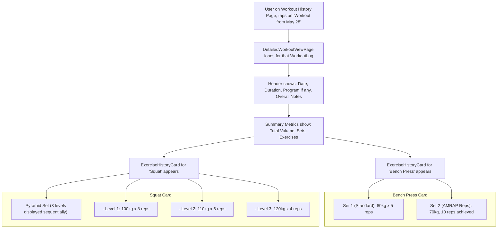

# UI/UX Addon for Story 6.4: Workout Log/History View - Detailed Workout Display

**Original Story Reference:** `ai/stories/epic6.6.4.story.md`

## 1. UI/UX Goal for this Story

To provide users with a comprehensive and accurate detailed view of a selected past workout session, ensuring all exercises, sets (including all advanced set types from Epic 2), and associated data (weights, reps, times, notes) are clearly presented for thorough review.

## 2. Key Screens/Views Involved in this Story

- **Detailed Workout View Page (`DetailedWorkoutViewPage.tsx`):** The main screen for displaying the full details of a single `WorkoutLog`.
- **Exercise History Card Component (`ExerciseHistoryCard.tsx`):** Displays all logged sets and details for a single exercise within the workout.
- **Set History Display Component (`SetHistoryDisplay.tsx`):** A versatile component capable of rendering different `LoggedSet` types accurately.

## 3. Detailed UI Element Descriptions & Interactions for this Story

### 3.1. `DetailedWorkoutViewPage.tsx` Layout

- **Screen Title:** Could be the `WorkoutLog.name`, or "Workout Details - [Date]".
- **Header Information:**
  - Date & Time of workout (`WorkoutLog.startTime`).
  - Total Duration (`WorkoutLog.durationMs`, formatted).
  - Program Name (if `WorkoutLog.programDefinitionId` is present).
  - Overall Workout Notes (if `WorkoutLog.notes` exists).
- **Summary Metrics Section:**
  - Total Volume (calculated: sum of weight*reps for all standard/comparable sets).
  - Total Sets / Exercises performed.
- **Exercise List Area:** A list of `ExerciseHistoryCard.tsx` components, one for each exercise performed.
- **Actions (Optional):** "Repeat Workout", "Share Workout" (future), "Delete Workout Log" (with confirmation).

### 3.2. `ExerciseHistoryCard.tsx` Component

- **Layout:** A `shadcn/ui Card` or similar container for each exercise.
- **Header:** Exercise Name.
- **Exercise Notes:** Display `LoggedSet.exerciseNotes` if present (notes might be per exercise instance in workout rather than per set in `docs/data-models.md` - check this detail. PRD FR3.5 allows notes on "individual sets, exercises, or overall workout". Assuming for now `ExerciseLogCard` might show an overall note for that exercise in *this* workout).
- **Set List Area:** Displays a list of `SetHistoryDisplay.tsx` components for all sets logged for this exercise, in order.

### 3.3. `SetHistoryDisplay.tsx` Component (Dynamic Rendering)

- **Input:** A single `LoggedSet` object.
- **Behavior:** Conditionally renders details based on `LoggedSet.setType`.
- **Common Display for all types:**
  - Set Number (e.g., "Set 1", or `level` for Pyramid/Drop).
  - `LoggedSet.notes` (if any).
- **Specific Display by `setType`:**
  - **`standard`:**
    - Logged Weight & Unit (e.g., "70 kg").
    - Logged Reps (e.g., "8 reps").
  - **`amrapReps`:**
    - Label: "AMRAP (Reps)".
    - Logged Weight & Unit.
    - Achieved Reps (e.g., "12 reps achieved").
  - **`amrapTime`:**
    - Label: "AMRAP (Time)".
    - Logged Weight & Unit.
    - Target Duration (e.g., "for 60s").
    - Achieved Reps.
  - **`repsForTime`:**
    - Label: "Reps for Time".
    - Logged Weight & Unit.
    - Target Reps.
    - Time Taken (e.g., "Completed in 45s").
  - **`pyramid` (grouped by `groupKey`, ordered by `level`):**
    - Main Label: "Pyramid Set".
    - Each sub-set (level) displayed with: Level number, Logged Weight, Logged Reps.
  - **`dropSet` (grouped by `groupKey`, ordered by `level`):**
    - Main Label: "Drop Set".
    - Each sub-set (drop) displayed with: Drop number, Logged Weight, Logged Reps.
- **Visuals:** Clear, readable text. Distinct visual treatment or tags for advanced set types.

- **Figma References:**
  - `{Figma_Frame_URL_for_DetailedWorkoutViewPage_Layout}`
  - `{Figma_Frame_URL_for_ExerciseHistoryCard_Component}`
  - `{Figma_Frame_URL_for_SetHistoryDisplay_StandardSet}`
  - `{Figma_Frame_URL_for_SetHistoryDisplay_AmrapRepsSet}`
  - `{Figma_Frame_URL_for_SetHistoryDisplay_AmrapTimeSet}`
  - `{Figma_Frame_URL_for_SetHistoryDisplay_RepsForTimeSet}`
  - `{Figma_Frame_URL_for_SetHistoryDisplay_PyramidSet_Grouped}`
  - `{Figma_Frame_URL_for_SetHistoryDisplay_DropSet_Grouped}`

## 4. Accessibility Notes for this Story

- Clear heading structure for workout summary and each exercise.
- All textual information must meet color contrast requirements.
- Advanced set types should have their type clearly announced if a screen reader user navigates set by set. For example, "AMRAP Reps set: 70kg, 12 reps achieved."
- If Pyramid/Drop sets are visually grouped, ensure this grouping is logical for assistive technologies.

## 5. User Flow Snippet (Viewing a Workout with Mixed Set Types)

