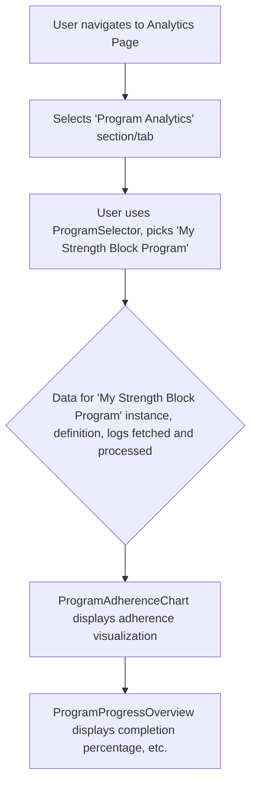

# UI/UX Addon for Story 6.6: Analytics - Program Analytics Display

**Original Story Reference:** `ai/stories/epic6.6.6.story.md`

## 1. UI/UX Goal for this Story

To provide users with analytical insights into their engagement with training programs, including adherence visualizations and overall progress overview, helping them assess their consistency and progress within structured plans.

## 2. Key Screens/Views Involved in this Story

- **Analytics Page (`AnalyticsPage.tsx`):** Add a new section for "Program Analytics".
- **Program Selector Component (`ProgramSelector.tsx`):** Allows user to choose which active or past program to analyze.
- **Program Adherence Chart Component (`ProgramAdherenceChart.tsx`):** Visualizes planned vs. completed workouts using Recharts.
- **Program Progress Overview Component (`ProgramProgressOverview.tsx`):** Displays summary metrics like percentage completion.

## 3. Detailed UI Element Descriptions & Interactions for this Story

### 3.1. `AnalyticsPage.tsx` (Program Analytics Section)

- **Layout:**
  - Section Title: "Program Analytics" or similar.
  - `ProgramSelector.tsx` component.
  - Display area for `ProgramAdherenceChart.tsx` and `ProgramProgressOverview.tsx` for the selected program.

### 3.2. `ProgramSelector.tsx` Component

- **Label:** "Select Program to Analyze".
- **Control:** `shadcn/ui Select` or `Combobox` populated with user's `ProgramDefinition` names (both active and completed `ActiveProgramInstance`s).
- **Behavior:** On selection, triggers data fetch/re-calculation for the chosen program's analytics.

### 3.3. `ProgramAdherenceChart.tsx` Component

- **Library:** Implemented using **Recharts**.
- **Display:**
  - Visualizes adherence, e.g.:
    - A bar chart showing weeks/months on X-axis, with bars for "Planned Workouts" and "Completed Workouts".
    - A calendar-like view highlighting completed, missed, or future planned workout days (more complex, bar chart might be V1.0).
  - Title: "Adherence for [Program Name]".
  - Clearly labeled axes and legend.
- **Data Source:** Compares `ActiveProgramInstance.completedWorkoutHistory` against `ProgramDefinition.workoutSequence` and projected schedule (from FRY logic/Story 4.5 if available, or simply sequence completion).

### 3.4. `ProgramProgressOverview.tsx` Component

- **Display:** Textual summary and potentially simple visual indicators.
  - For active programs:
    - "Progress: [X]% complete" (e.g., based on workouts completed vs. total in cycle/program).
    - "Current Stage: Workout [Y] of [Z]" or "Week [A] of [B]".
    - "Workouts Remaining (this cycle): [N]".
  - For completed programs: "Completed on [Date]".
- **Data Source:** `ActiveProgramInstance` state (e.g., `currentWorkoutOrderInProgram`, `status`, `completedWorkoutHistory.length`) and `ProgramDefinition` (total workouts in sequence).

- **Figma References:**
  - `{Figma_Frame_URL_for_AnalyticsPage_ProgramAnalytics_Section}`
  - `{Figma_Frame_URL_for_ProgramSelector_Analytics}`
  - `{Figma_Frame_URL_for_ProgramAdherenceChart_Style}`
  - `{Figma_Frame_URL_for_ProgramProgressOverview_Display}`

## 4. Accessibility Notes for this Story

- `ProgramSelector.tsx` must be accessible.
- `ProgramAdherenceChart.tsx`: Adhere to chart accessibility guidelines (as in Story 6.5). Provide data summaries if chart is complex.
- `ProgramProgressOverview.tsx`: Ensure textual information is clear and well-structured.

## 5. User Flow Snippet (Viewing Program Adherence)

