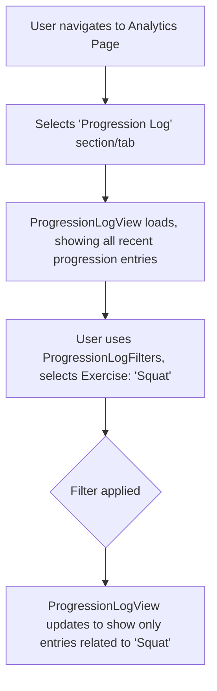

# UI/UX Addon for Story 6.8: Analytics - Progression Engine Insights Display

**Original Story Reference:** `ai/stories/epic6.6.8.story.md`

## 1. UI/UX Goal for this Story

To provide users with transparency into the Progression Engine's (FRX) operations by offering a clear, filterable log of all automated progressions that have been applied to their training.

## 2. Key Screens/Views Involved in this Story

- **Analytics Page (`AnalyticsPage.tsx`):** Add a new section for "Progression Insights" or "Progression Log".
- **Progression Log View Component (`ProgressionLogView.tsx`):** Main component to display and filter the log.
- **Progression Log Item Component (`ProgressionLogItem.tsx`):** Renders a single entry from the `AppliedProgressionLog`.
- **Progression Log Filters Component (`ProgressionLogFilters.tsx`):** Allows filtering by exercise or program.

## 3. Detailed UI Element Descriptions & Interactions for this Story

### 3.1. `AnalyticsPage.tsx` (Progression Insights Section)

- **Layout:**
  - Section Title: "Progression Log" or "Automated Adjustments".
  - Hosts the `ProgressionLogView.tsx` component.

### 3.2. `ProgressionLogView.tsx` Component

- **Layout:**
  - `ProgressionLogFilters.tsx` component at the top.
  - A list of `ProgressionLogItem.tsx` components.
- **Data:** Fetched reactively from `AppliedProgressionLog` table in Dexie.js using `useLiveQuery`.

### 3.3. `ProgressionLogFilters.tsx` Component

- **Controls:**
  - **Exercise Filter:**
    - **Label:** "Filter by Exercise".
    - **Control:** `shadcn/ui Select` or `Combobox` populated with exercises for which progression entries exist. "All Exercises" option.
  - **Program Filter (More Complex - May require joining `programInstanceId` to `ProgramDefinition` name):**
    - **Label:** "Filter by Program".
    - **Control:** `shadcn/ui Select` populated with program names for which entries exist. "All Programs" option.
  - (Optional) Date Range Filter.
- **Behavior:** Selecting filters updates the list of `ProgressionLogItem.tsx` displayed.

### 3.4. `ProgressionLogItem.tsx` Component

- **Display per entry from `AppliedProgressionLogEntry`:**
  - **Date:** `timestamp` of application, formatted.
  - **Rule Name:** `ruleName`.
  - **Affected Exercise:** Name of the `ExerciseDefinition` (requires mapping `exerciseDefinitionId`).
  - **Program Context (Optional):** Name of the `ProgramDefinition` if `programInstanceId` is present and mapped.
  - **Change Description:** `changeDescription` (human-readable summary of the action, e.g., "+2.5kg to Bench Press target", "Suggested Deload for Squat").
  - **Status (Optional):** e.g., "Applied", "Suggestion Accepted by User", "Suggestion Dismissed" (if this level of detail is logged in `AppliedProgressionLogEntry.status`).

- **Figma References:**
  - `{Figma_Frame_URL_for_AnalyticsPage_ProgressionLog_Section}`
  - `{Figma_Frame_URL_for_ProgressionLogFilters_Component}`
  - `{Figma_Frame_URL_for_ProgressionLogItem_Style}`

## 4. Accessibility Notes for this Story

- Filter controls must be accessible.
- The log list must be keyboard navigable.
- Each log item's content should be clearly structured and readable.

## 5. User Flow Snippet (Viewing and Filtering Progression Log)

