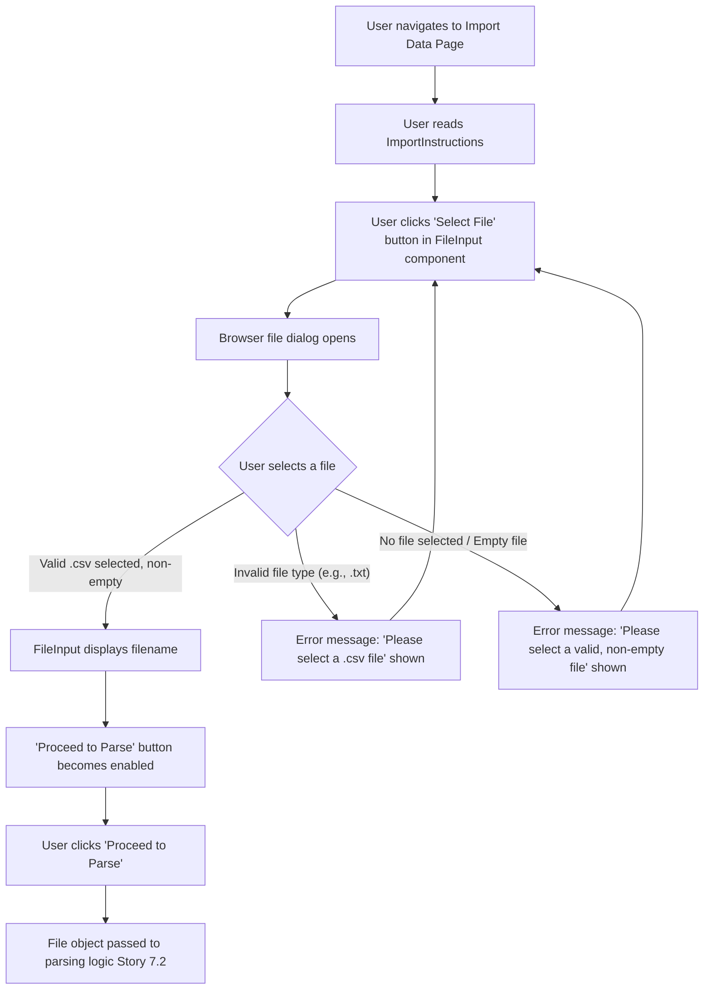

# UI/UX Addon for Story 7.1: StrongLifts Data Import - UI & File Handling

**Original Story Reference:** `ai/stories/epic7.7.1.story.md`

## 1. UI/UX Goal for this Story

To provide a clear, accessible, and user-friendly interface for users to initiate the StrongLifts data import process, including understanding how to obtain their export file, selecting the file from their device, and receiving immediate feedback on basic file validity.

## 2. Key Screens/Views Involved in this Story

- **Import Data Page (`ImportDataPage.tsx` or `StrongLiftsImportPage.tsx`):** The main page for this feature, likely accessible from App Settings or an onboarding flow.
- **Import Instructions Component (`ImportInstructions.tsx`):** A section within the import page providing guidance.
- **File Input Component (`FileInput.tsx`):** A reusable component for file selection.

## 3. Detailed UI Element Descriptions & Interactions for this Story

### 3.1. `ImportDataPage.tsx` Layout

- **Screen Title:** "Import Data" or "Import from StrongLifts".
- **Instructions Section:** Hosts the `ImportInstructions.tsx` component.
- **File Selection Section:** Hosts the `FileInput.tsx` component and a button to proceed (e.g., "Parse File" or "Next").
- **Feedback Area:** A space to display messages related to file validation (e.g., "Please select a CSV file," "File is empty") or subsequent processing steps (from Story 7.3).

### 3.2. `ImportInstructions.tsx` Component

- **Content:** Clear, step-by-step text and potentially illustrative (placeholder) images guiding the user on how to:
    1. Open their StrongLifts app.
    2. Navigate to the export feature.
    3. Select the correct export options (e.g., CSV format, all data).
    4. Save/transfer the file to their current device.
- **Visuals:** Well-formatted text, possibly using `shadcn/ui Card` or `Alert` for emphasis.

### 3.3. `FileInput.tsx` Component

- **Label:** "Select StrongLifts Export File (.csv)".
- **Control:** A styled HTML file input (`<input type="file" accept=".csv">`). Could be a `shadcn/ui Button` that triggers the hidden file input.
- **Display:** Shows the name of the selected file, or "No file chosen."
- **Validation (Client-side, on file selection):**
  - Checks if a file is selected.
  - Checks file extension is `.csv`.
  - Checks if file is non-empty (basic `File.size > 0` check).
  - (Optional) Checks for a reasonable maximum file size (e.g., < 10-20MB) to give early feedback.
- **Error Feedback:** If validation fails, display a clear error message near the file input (e.g., using a `shadcn/ui AlertDescription` style).

### 3.4. "Proceed to Parse" Button

- **Label:** "Next" or "Import Workout Data".
- **State:** Disabled until a file is selected and passes basic client-side validation.
- **Action:** Passes the selected `File` object to the parsing logic defined in Story 7.2.

- **Figma References:**
  - `{Figma_Frame_URL_for_ImportDataPage_Layout}`
  - `{Figma_Frame_URL_for_ImportInstructions_Component}`
  - `{Figma_Frame_URL_for_FileInput_Component_States_Errors}`

## 4. Accessibility Notes for this Story

- File input must be keyboard accessible and clearly labeled.
- Instructions should be easy to read and understand.
- Error messages for file validation must be associated with the file input and announced by assistive technologies.

## 5. User Flow Snippet (File Selection and Basic Validation)

