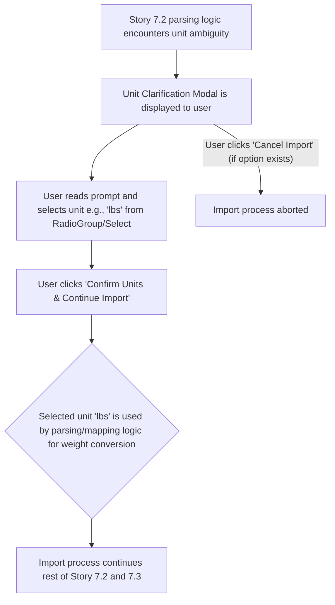

# UI/UX Addon for Story 7.2: StrongLifts Data Import - Parsing & Mapping Logic (Unit Ambiguity Prompt)

**Original Story Reference:** `ai/stories/epic7.7.2.story.md`

## 1. UI/UX Goal for this Story

To handle potential ambiguity in weight units during the StrongLifts data import process by prompting the user for clarification if the units cannot be reliably determined from the file or conflict with user settings, ensuring data accuracy.

## 2. Key Screens/Views Involved in this Story

- **Import Data Page (`ImportDataPage.tsx` or `StrongLiftsImportPage.tsx`):** The page where the import process is managed. This is where the prompt would appear if needed.
- **Unit Clarification Prompt/Modal:** A modal dialog to ask the user about the units in the imported file.

## 3. Detailed UI Element Descriptions & Interactions for this Story

### 3.1. Unit Clarification Prompt/Modal

- **Trigger:** This UI appears during the parsing & mapping phase (Story 7.2) if the system detects ambiguity regarding weight units in the StrongLifts CSV file (e.g., no unit information in file, or detected unit conflicts with user's default StrongLog unit).
- **Layout:** A modal dialog (`shadcn/ui Dialog` or `AlertDialog`).
- **Content:**
  - **Title:** "Confirm Weight Units" or "Action Required: Weight Units".
  - **Message:** Explanatory text, e.g., "We couldn't automatically determine the weight units (kg or lbs) for the workouts in your imported file. Please specify the units used in the StrongLifts export." or "Your StrongLog default is [kg/lbs], but the file seems to use [lbs/kg]. Please confirm the units in the file."
  - **Unit Selector:**
    - **Label:** "Units in imported file:".
    - **Control:** `shadcn/ui RadioGroup` or `Select` with options "Kilograms (kg)" and "Pounds (lbs)".
- **Actions:**
  - **"Confirm Units & Continue Import" Button:** User selects the correct unit, and the import process (mapping and validation from Story 7.2) proceeds using this information.
  - **"Cancel Import" Button (Optional):** Allows the user to abort the import if unsure.

- **Figma References:**
  - `{Figma_Frame_URL_for_UnitClarification_Prompt_Modal}`

## 4. Accessibility Notes for this Story

- The modal dialog must be fully accessible: trap focus, keyboard navigable, clear labels for controls, and properly announced by screen readers.
- The purpose of the prompt and the required action must be very clear.

## 5. User Flow Snippet (Handling Unit Ambiguity)

