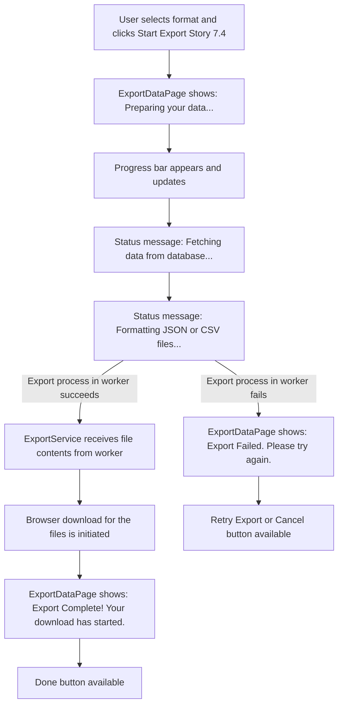

# UI/UX Addon for Story 7.5: Comprehensive V1.0 Data Export - Data Aggregation & File Generation (Feedback UI)

**Original Story Reference:** `ai/stories/epic7.7.5.story.md`

## 1. UI/UX Goal for this Story

To provide clear user feedback during the data export process (which runs in a web worker) and to facilitate the actual file download(s) once the data aggregation and file generation are complete.

## 2. Key Screens/Views Involved in this Story

- **Export Data Page (`ExportDataPage.tsx`):** (From Story 7.4) This page will display progress feedback during export and success/error messages upon completion.

## 3. Detailed UI Element Descriptions & Interactions for this Story

### 3.1. `ExportDataPage.tsx` - Export Process Feedback

- **Trigger:** After user clicks "Start Export" (from Story 7.4 UI).
- **In-Progress Feedback Area:**
  - **Element:** A dedicated section on the page that updates based on feedback from the `exportService.ts` (which communicates with the worker).
  - **Content during processing:**
    - `shadcn/ui Progress` bar (may be indeterminate if precise progress is hard to track from worker, or determinate if worker can send progress updates).
    - Textual status messages:
      - "Preparing your data for export..."
      - "Fetching workout logs..." (if worker sends granular updates)
      - "Formatting files..."
      - "Please wait, this may take a few moments for large histories."
  - **Cancel Export Button (Optional V1.0):** A button to attempt to abort the export process. Worker cancellation can be complex.
- **Completion Feedback:**
  - **On Success:**
    - Message: "Your data export is ready!" or "Export complete!".
    - Download initiation: The browser download for the JSON file or multiple CSV files (as a zip, or individual downloads) is automatically triggered by `exportService.ts`.
    - (Optional) Brief summary: "Exported [X] workouts, [Y] exercises..." if easily available from worker.
    - Button: "Done" or "Back to Settings".
  - **On Error:**
    - Message: "Data export failed. Please try again."
    - (Optional) Brief error reason if available from worker.
    - Button: "Retry Export" or "Cancel".

- **Figma References:**
  - `{Figma_Frame_URL_for_ExportDataPage_InProgressFeedback_Exporting}`
  - `{Figma_Frame_URL_for_ExportDataPage_ExportSuccess_DownloadReady}`
  - `{Figma_Frame_URL_for_ExportDataPage_ExportError}`

## 4. Accessibility Notes for this Story

- Progress bar and status messages should be accessible (as in UI Story for 7.3).
- Ensure users are clearly informed when the download is initiated or if any action is required from them to save the file(s).
- Error messages must be clear and understandable.

## 5. User Flow Snippet (User Experiencing Data Export Process)

