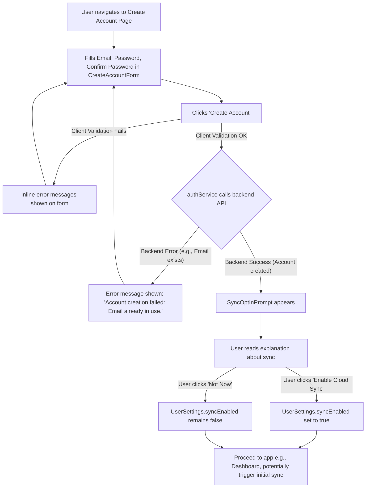

# UI/UX Addon for Story 7.6: Optional Cloud Sync - Account Creation & Opt-In for Sync

**Original Story Reference:** `ai/stories/epic7.7.6.story.md`

## 1. UI/UX Goal for this Story

To provide a clear, secure, and user-friendly interface for users to optionally create an account (email/password for V1.0) and to make an informed, explicit decision to opt-into cloud synchronization, understanding its benefits and what data will be synced.

## 2. Key Screens/Views Involved in this Story

- **Create Account Page (`CreateAccountPage.tsx`):** Page containing the account creation form.
- **Create Account Form Component (`CreateAccountForm.tsx`):** The actual form for email/password input.
- **Sync Opt-In Prompt Component (`SyncOptInPrompt.tsx`):** A modal or distinct section displayed after successful account creation to ask for sync consent.
- **Settings Page (`SettingsPage.tsx`):** Likely entry point to "Create Account" if user is anonymous.

## 3. Detailed UI Element Descriptions & Interactions for this Story

### 3.1. Entry Point to Account Creation

- **Location:** e.g., In `SettingsPage.tsx`, if user is anonymous, an option "Create Account for Cloud Sync & Backup".
- Or, a global "Login/Sign Up" button if a more prominent auth path is desired.

### 3.2. `CreateAccountPage.tsx` & `CreateAccountForm.tsx`

- **Page Title:** "Create Your StrongLog Account".
- **Form Fields:**
  - **Email Input:**
    - **Label:** "Email".
    - **Control:** `shadcn/ui Input` (type="email").
    - **Validation (Client-side Zod):** Required, valid email format.
  - **Password Input:**
    - **Label:** "Password".
    - **Control:** `shadcn/ui Input` (type="password").
    - **Validation (Client-side Zod):** Required, minimum length (e.g., 8 characters), complexity rules (e.g., uppercase, number, symbol - if defined for V1.0). Show password strength indicator if desired.
  - **Confirm Password Input:**
    - **Label:** "Confirm Password".
    - **Control:** `shadcn/ui Input` (type="password").
    - **Validation (Client-side Zod):** Must match password field.
- **"Create Account" Button:**
  - **Control:** `shadcn/ui Button` (primary).
  - **Action:** Performs client-side Zod validation. If valid, calls `authService.ts` to submit to backend API. Displays loading state. On backend error (e.g., email exists), shows error message. On success, proceeds to Sync Opt-In.
- **Error Display Area:** For showing validation errors or backend errors.
- **Link to Login:** "Already have an account? Log In".

### 3.3. `SyncOptInPrompt.tsx` Component

- **Display:** Appears after successful account creation (e.g., as a modal dialog or a new section on the page).
- **Content:**
  - **Title:** "Enable Cloud Sync?".
  - **Explanatory Text:**
    - "Cloud sync allows you to back up your StrongLog data securely and (in the future) access it across multiple devices."
    - "This includes: all workout logs, custom exercises, progression rules, programs, goals, and settings."
    - "Sync is optional. Your data remains private on this device if you choose not to enable it."
  - **Options:**
    - **"Enable Cloud Sync" Button (`shadcn/ui Button` - primary):** Sets `UserSettings.syncEnabled = true` and proceeds (e.g., to dashboard or triggers initial sync - Story 7.7).
    - **"Not Now" / "Maybe Later" Button (`shadcn/ui Button` - secondary/link):** Keeps `UserSettings.syncEnabled = false` and proceeds.
- **Default State:** Sync is disabled by default.

- **Figma References:**
  - `{Figma_Frame_URL_for_CreateAccountPage_Form}`
  - `{Figma_Frame_URL_for_Password_Strength_Complexity_Hint_Optional}`
  - `{Figma_Frame_URL_for_SyncOptIn_Prompt_Modal}`

## 4. Accessibility Notes for this Story

- All form fields must have clear, associated labels.
- Client-side validation errors must be programmatically linked to inputs and announced.
- Password inputs should allow visibility toggle (common `shadcn/ui` pattern).
- The Sync Opt-In prompt, if a modal, must manage focus correctly. Buttons must be clear.

## 5. User Flow Snippet (Account Creation and Sync Opt-In)

