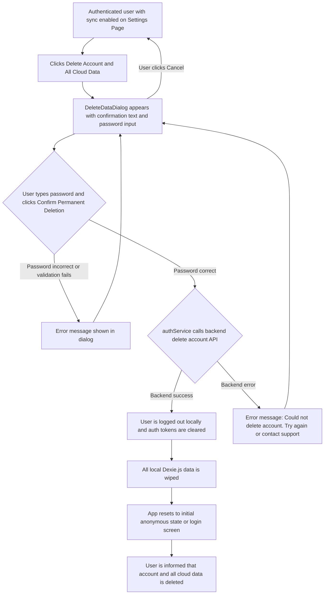

# UI/UX Addon for Story 7.8: User Data Deletion (Local & Cloud)

**Original Story Reference:** `ai/stories/epic7.7.8.story.md`

## 1. UI/UX Goal for this Story

To provide users with clear, secure, and unambiguous options to delete their data, distinguishing between local-only data deletion and complete account/cloud data deletion, with appropriate confirmations to prevent accidental data loss.

## 2. Key Screens/Views Involved in this Story

- **Settings Page (`SettingsPage.tsx`) or a dedicated `DataManagementPage.tsx`:** This page will host the buttons/options for data deletion.
- **Delete Data Confirmation Dialog (`DeleteDataDialog.tsx`):** A reusable `shadcn/ui AlertDialog` component to confirm user's intent before deletion.

## 3. Detailed UI Element Descriptions & Interactions for this Story

### 3.1. Data Deletion Options in Settings

- **Placement:** Typically in a "Data Management" or "Account" subsection of the `SettingsPage.tsx`.
- **Options (visibility depends on user auth state):**
  - **For Anonymous Users OR Authenticated Users wanting local-only deletion:**
    - **Button Label:** "Delete All Local Data" or "Clear Data on This Device".
    - **Control:** `shadcn/ui Button` (potentially with a destructive visual cue, e.g., red text or outline).
    - **Action:** Opens `DeleteDataDialog.tsx` with a specific message for local deletion.
  - **For Authenticated Users (who have opted into sync):**
    - **Button Label:** "Delete Account and All Cloud Data".
    - **Control:** `shadcn/ui Button` (strong destructive visual cue).
    - **Action:** Opens `DeleteDataDialog.tsx` with a specific, severe warning message for account and cloud data deletion.

### 3.2. `DeleteDataDialog.tsx` Component (Reusable Confirmation Dialog)

- **Type:** `shadcn/ui AlertDialog`.
- **Dynamic Content based on Deletion Type:**
  - **For Local Data Deletion:**
    - **Title:** "Delete Local Data?"
    - **Message:** "Are you sure you want to delete all your StrongLog data stored *on this device*? This includes all workouts, custom exercises, rules, programs, and goals. If you have cloud sync enabled, your data in the cloud will *not* be affected. This action cannot be undone for local data."
    - **Confirmation Input (Optional, for extra safety):** User might need to type "DELETE" or their email to confirm. For V1.0, buttons might be enough.
    - **Buttons:** "Confirm Delete Local Data" (destructive style), "Cancel".
  - **For Account & Cloud Data Deletion:**
    - **Title:** "Delete Account & ALL Cloud Data?"
    - **Message:** "Are you absolutely sure? This will permanently delete your StrongLog account and *all* your associated data from our servers, including all workouts, exercises, rules, programs, and goals. Data on this device will also be cleared. This action cannot be undone and your data will be irretrievable."
    - **Confirmation Input (Recommended):** e.g., type password or "DELETE MY ACCOUNT".
    - **Buttons:** "Confirm Permanent Deletion" (strong destructive style), "Cancel".
- **Behavior on Confirmation:**
  - **Local Delete:** Triggers client-side logic to wipe Dexie.js data. App should reset to a fresh state.
  - **Cloud Delete:** Triggers `authService.ts` to call the backend API. On success, client logs out, clears local auth tokens, and then wipes local Dexie.js data. App resets.

- **Figma References:**
  - `{Figma_Frame_URL_for_Settings_DataDeletion_Options}`
  - `{Figma_Frame_URL_for_DeleteDataDialog_LocalDelete_Variant}`
  - `{Figma_Frame_URL_for_DeleteDataDialog_CloudAccountDelete_Variant}`

## 4. Accessibility Notes for this Story

- Deletion buttons must clearly indicate their destructive nature (e.g., styling, accessible labels).
- Confirmation dialogs (`AlertDialog`) must be fully accessible: trap focus, clear messaging, keyboard navigable buttons.
- Warnings about permanent data loss must be very prominent and understandable.

## 5. User Flow Snippet (Authenticated User Deleting Account & Cloud Data)

