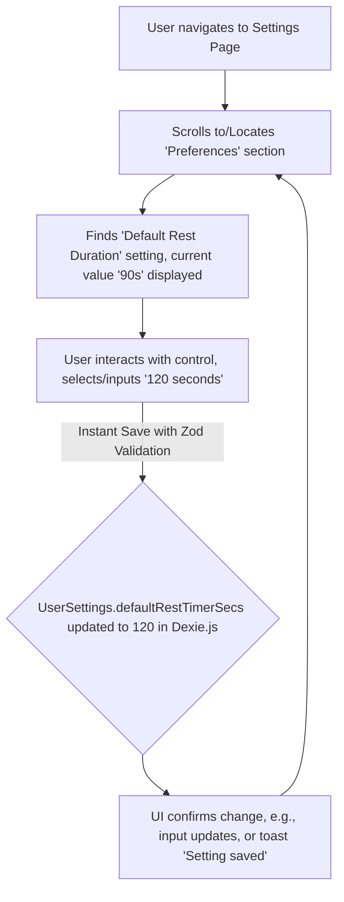

# UI/UX Addon for Story 8.1: User Settings Implementation

**Original Story Reference:** `ai/stories/epic8.8.1.story.md`

## 1. UI/UX Goal for this Story

To design a consolidated and user-friendly "Settings" screen that allows users to easily configure application preferences (units, theme, default rest timer), manage their optional sync account and preferences, and access data management functionalities.

## 2. Key Screens/Views Involved in this Story

- **Settings Page (`SettingsPage.tsx`):** The main container screen for all settings options.
  - *(Reference: General `docs/ui-ux-spec.md` for its place in IA, and `ai/ui-stories/epic1.1.3.story.md` for initial conception).*
- **Individual Setting Components:**
  - `UnitPreferenceSetting.tsx`
  - `ThemeSetting.tsx`
  - `SyncAccountManagementSetting.tsx`
  - `DataManagementLinks.tsx`
  - `DefaultRestTimerSetting.tsx`

## 3. Detailed UI Element Descriptions & Interactions for this Story

### 3.1. `SettingsPage.tsx` Layout

- **Screen Title:** "Settings".
- **Structure:** Organized into logical sections using headings or `shadcn/ui Card` components for different categories of settings (e.g., "Preferences", "Account", "Data").
- **Accessibility:** Accessible from main application navigation (e.g., bottom tab bar as per `docs/ui-ux-spec.md` and initial mockups).

### 3.2. `UnitPreferenceSetting.tsx` Component

- **Label:** "Preferred Weight Units".
- **Control:** `shadcn/ui RadioGroup` or `Select` component.
- **Options:** "Kilograms (kg)", "Pounds (lbs)".
- **Behavior:**
  - Reflects current setting from `UserSettings`.
  - Selection updates `UserSettings.preferredWeightUnit` in Dexie.js (via `userSettingsService.ts` and Zustand store `userSettingsStore.ts`).
  - Changes should be reflected app-wide where units are displayed or input.

### 3.3. `ThemeSetting.tsx` Component

- **Label:** "App Theme" or "Appearance".
- **Control:** `shadcn/ui RadioGroup` or `Select`.
- **Options:** "Light", "Dark", "System Default".
- **Behavior:**
  - Reflects current setting from `UserSettings`.
  - Selection updates `UserSettings.theme` and applies the theme globally (e.g., by toggling class on `<html>` element). Persists across sessions.

### 3.4. `SyncAccountManagementSetting.tsx` Component

- **Conditional Display based on Authentication State:**
  - **If Not Authenticated:**
    - Text: "Back up your data and access it anywhere by creating an account."
    - Button: "`Create Account`" (navigates to `CreateAccountPage.tsx` from Story 7.6).
    - Button/Link: "`Log In`" (navigates to a future Login Page - not explicitly in Epic 7.6 but implied for account management).
  - **If Authenticated:**
    - Display User Info: "Logged in as: [user.email]".
    - **Sync Preference Toggle:**
      - Label: "Enable Cloud Sync".
      - Control: `shadcn/ui Switch`.
      - Behavior: Toggles `UserSettings.syncEnabled`. If toggled on, may initiate a sync cycle (Story 7.7).
    - **Sync Status Display (integrates UI from Story 7.7):**
      - Text: "Sync Status: [Up to date / Syncing... / Last synced: ... / Error]"
      - (Optional) "Sync Now" button if manual sync is supported.
    - **Logout Button:**
      - Control: `shadcn/ui Button` (secondary or destructive style).
      - Action: Logs the user out, clears local auth tokens, potentially prompts confirmation.

### 3.5. `DataManagementLinks.tsx` Component

- **Layout:** A list of clearly labeled buttons or navigation links.
- **Links/Actions:**
  - "Import StrongLifts Data" (navigates to `ImportDataPage.tsx` from Story 7.1).
  - "Export All Data" (navigates to `ExportDataPage.tsx` from Story 7.4).
  - "Delete Data" (navigates to or reveals options for local/cloud data deletion from Story 7.8).

### 3.6. `DefaultRestTimerSetting.tsx` Component

- **Label:** "Default Rest Duration".
- **Control:** `shadcn/ui Input` (number, for seconds) or a `Select` with common presets (e.g., "30s", "60s", "90s", "2 min", "Custom"). If "Custom", an input field appears.
- **Display:** Shows current value (e.g., "90 seconds").
- **Behavior:**
  - Saves value to `UserSettings.defaultRestTimerSecs` in Dexie.js.
  - This value is used as the default by the Integrated Workout Timer (Story 2.6).
- **Validation:** Input must be a reasonable positive number (e.g., 0 to 600 seconds).

### 3.7. General

- All settings changes are validated using the `UserSettings` Zod schema before persistence.
- Consider a single "Save Settings" button if changes are not applied instantly, or apply instantly with clear feedback. Instant application is generally preferred for settings like theme/units.

- **Figma References:**
  - `{Figma_Frame_URL_for_SettingsPage_OverallLayout_Sections}`
  - `{Figma_Frame_URL_for_UnitPreference_Control}`
  - `{Figma_Frame_URL_for_ThemeSetting_Control}`
  - `{Figma_Frame_URL_for_SyncAccountManagement_NotAuthenticated_State}`
  - `{Figma_Frame_URL_for_SyncAccountManagement_Authenticated_State_SyncToggle_Status}`
  - `{Figma_Frame_URL_for_DataManagementLinks_Section}`
  - `{Figma_Frame_URL_for_DefaultRestTimer_Control}`

## 4. Accessibility Notes for this Story

- The Settings page must be clearly structured with headings for each section.
- All interactive controls (RadioGroups, Selects, Switches, Buttons, Inputs) must be fully keyboard accessible and have clear, associated labels.
- States of controls (e.g., selected theme, unit, sync toggle on/off) must be programmatically determinable.
- Links to other pages must be clearly identifiable as links.

## 5. User Flow Snippet (Changing Default Rest Timer)

