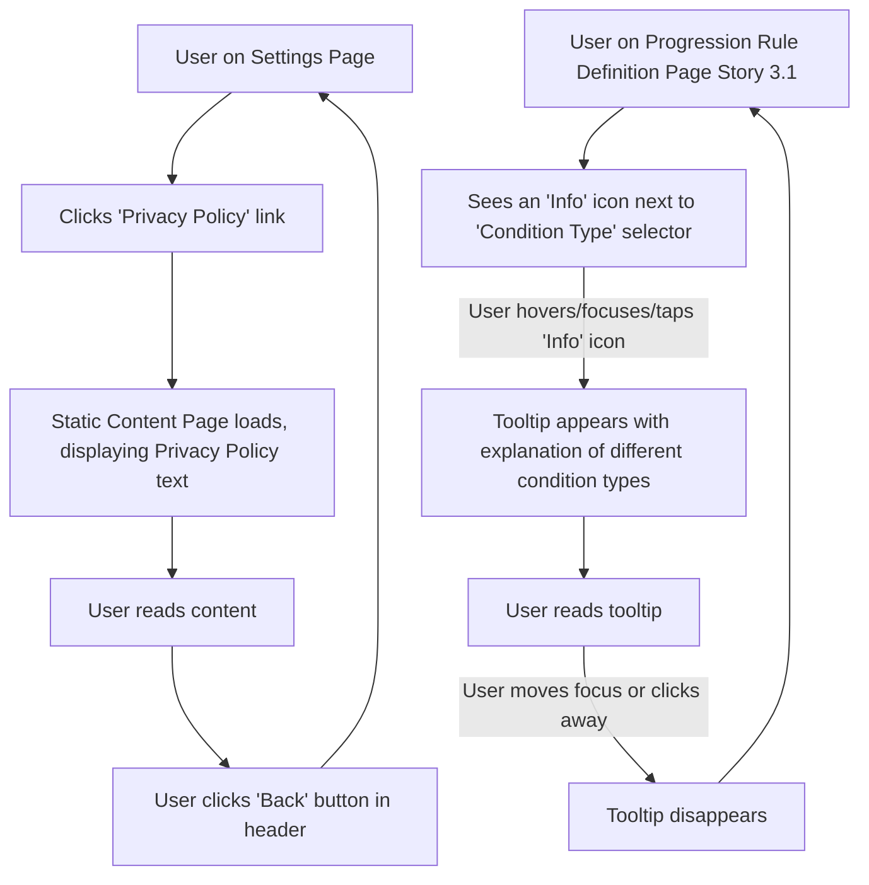

# UI/UX Addon for Story 8.5: Creation of Basic User-Facing Documentation (with GDPR focus)

**Original Story Reference:** `ai/stories/epic8.8.5.story.md`

## 1. UI/UX Goal for this Story

To provide users with easy access to essential documentation (Privacy Policy, Terms of Service) and basic in-app help (FAQs or tooltips for complex features), ensuring transparency, compliance, and better usability.

## 2. Key Screens/Views Involved in this Story

- **Settings Page (`SettingsPage.tsx`):** Will contain links to the Privacy Policy, Terms of Service, and potentially an FAQ/Help section.
  - *(Reference: `ai/ui-stories/epic8.8.1.story.md`)*
- **Static Content Display Page/View:** A generic view used to render the content of the Privacy Policy and Terms of Service. Could also host FAQ content if not using tooltips exclusively.
  - *(This might be a reusable component that takes HTML or Markdown content as a prop).*
- **Complex Feature Screens (e.g., Rule Definition, Program Creation):** These screens will be enhanced with contextual help tooltips.
- **FAQ Page (`FaqPage.tsx`) (Optional):** If a dedicated FAQ section is implemented.

## 3. Detailed UI Element Descriptions & Interactions for this Story

### 3.1. Links in `SettingsPage.tsx`

- **Layout:** Add a new section in Settings, e.g., "About" or "Legal & Help".
- **Elements:** List items or `shadcn/ui Button`s with link styling.
  - "Privacy Policy": Navigates to the static content view displaying the privacy policy.
  - "Terms of Service": Navigates to the static content view displaying the ToS.
  - "Help / FAQ" (Optional): Navigates to `FaqPage.tsx` or expands a help section.

### 3.2. Static Content Display Page/View

- **Layout:**
  - Clear Title (e.g., "Privacy Policy").
  - Scrollable content area for the document text.
  - Standard header with a "Back" button to return to Settings.
- **Content:** The drafted Privacy Policy or Terms of Service text, formatted for readability (headings, paragraphs, lists).
  - Content can be hardcoded, loaded from local Markdown/HTML files, or fetched if hosted externally (though local is better for PWA offline).
- **Styling:** Use app's standard typography and spacing for good readability.

### 3.3. In-App Help Tooltips (`TooltipExplanation.tsx`)

- **Component:** A reusable `shadcn/ui Tooltip` wrapper or custom tooltip component.
- **Placement:** Integrated next to complex UI elements or section headers in screens like:
  - Progression Rule Definition (Story 3.1, 3.2): Explaining condition types, action parameters.
  - Program Definition (Story 4.1, 4.2): Explaining workout sequences, frequency settings, rule scoping.
- **Trigger:** Typically an "info" icon (`ⓘ`) that reveals the tooltip on hover/focus/tap.
- **Content:** Concise, context-specific explanations or tips.

### 3.4. FAQ Page (`FaqPage.tsx`) (Optional)

- **Layout:**
  - Title: "Frequently Asked Questions".
  - List of questions, each expandable to show the answer (e.g., using `shadcn/ui Accordion`).
  - (Optional) Search bar for FAQs.
- **Content:** Drafted Q&A pairs for common user queries.

- **Figma References:**
  - `{Figma_Frame_URL_for_SettingsPage_LegalHelp_Links_Section}`
  - `{Figma_Frame_URL_for_StaticContent_DisplayPage_Template_PrivacyPolicy_ToS}`
  - `{Figma_Frame_URL_for_ContextualHelp_Tooltip_Style_Example}`
  - `{Figma_Frame_URL_for_FAQ_Page_Layout_Optional}`

## 4. Accessibility Notes for this Story

- Static content (Privacy Policy, ToS, FAQ) must be well-structured with headings for easy navigation by screen readers. Text must have good contrast and be resizable.
- Tooltips must be accessible:
  - Trigger icon button needs an accessible name (e.g., "More information about [feature]").
  - Tooltip content should be readable by screen readers when shown.
  - Ensure tooltips can be dismissed easily (e.g., Escape key, focus away).
- If an FAQ Accordion is used, it must follow accessibility patterns for accordions (proper ARIA attributes for state and controls).

## 5. User Flow Snippet (User Accessing Privacy Policy & Using a Tooltip)

