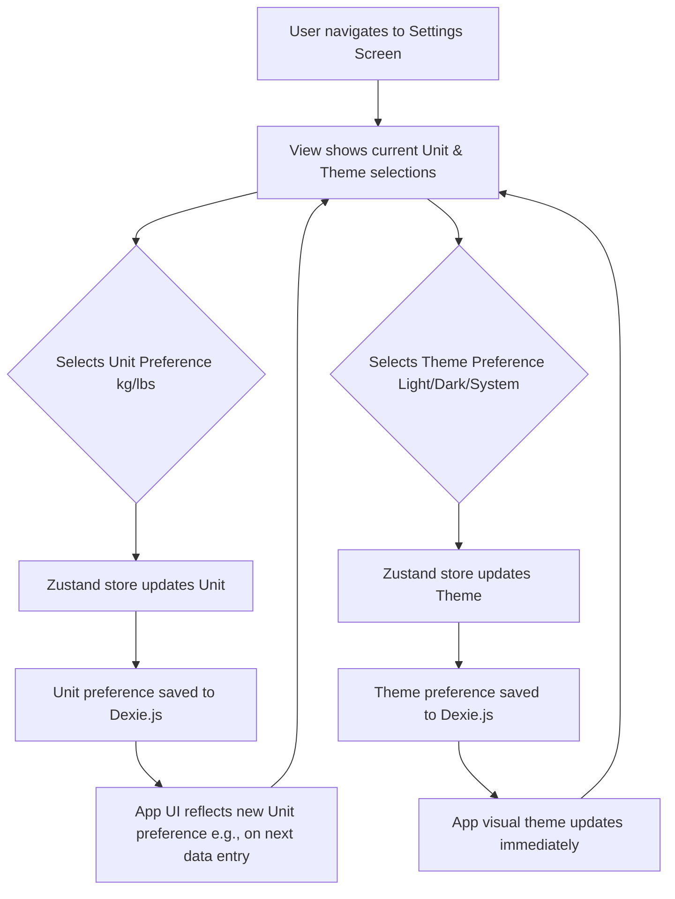

# UI/UX Addon for Story 1.3: Anonymous User Access & Basic Settings with UI Foundation

**Original Story Reference:** `ai/stories/epic1.1.3.story.md`

## 1. UI/UX Goal for this Story

To provide a seamless first-time user experience by allowing immediate, anonymous access to core features, and to establish the foundational UI settings (units, theme) and overall application layout and styling.

## 2. Key Screens/Views Involved in this Story

- **Application Shell / Main Layout:** (As established in Story 1.1, now with theme application)
  - _(Reference: General `docs/ui-ux-spec.md` and `ai/ui-stories/epic1.1.1.story.md`)_
- **Settings Screen:** The primary UI for this story.
  - _(Reference: Conceptual description in `docs/ui-ux-spec.md`)_

## 3. Detailed UI Element Descriptions & Interactions for this Story

### 3.1. Application Shell & Core Layout Components

- **`PageWrapper` Component:**
  - **Description:** A reusable layout component that provides consistent padding, max-width, and structure for all main content views.
  - **Visuals:** Adheres to Tailwind CSS theme for background and spacing.
- **`Navbar` / Header Component (Basic):**
  - **Description:** A simple header, potentially part of `PageWrapper` or a separate global component. Displays the current view's title and may contain a back button or access to global actions (like navigating to Settings, though primary navigation might be via a bottom tab bar).
  - **Visuals:** Styled with Tailwind CSS, consistent height and typography.
- **Theme Application:**
  - The selected theme (Light/Dark/System) dynamically alters the application's color scheme by adding/removing a class (e.g., `dark`) on the `<html>` or `<body>` element, leveraging Tailwind's dark mode variants.
- **Figma Reference:** (partially implemented, only light mode) [{Figma_Frame_URL_for_App_Shell_Light_Dark_Modes}](https://www.figma.com/design/Ad7ocwQr55WKhhNse7I9v2/Stronglog?node-id=68-90&t=3I74hCS5ZW9EbDP1-4)
- Error boundry [{Figma_Frame_URL_Error_boundry}](https://www.figma.com/design/Ad7ocwQr55WKhhNse7I9v2/Stronglog?node-id=68-305&t=3I74hCS5ZW9EbDP1-4)

### 3.2. Settings Screen

- **Overall Layout:**
  - Clear "Settings" title at the top.
  - Vertically stacked list of setting options.
- **UI Elements & Interactions:**
  - **Preferred Units (kg/lbs) Selection:**
    - **Label:** "Preferred Units" or "Weight Units".
    - **Control:** `shadcn/ui RadioGroup` or `Select` component to choose between "kg" and "lbs". Default to 'kg'.
    - **Behavior:** Selection updates the Zustand store, which persists to Dexie.js (`userSettings` table). This preference should be globally accessible for data display and input formatting throughout the app.
  - **Theme Selection (Light/Dark/System):**
    - **Label:** "Theme" or "Appearance".
    - **Control:** `shadcn/ui RadioGroup` or `Select` component for "Light", "Dark", "System". Default to 'System'.
    - **Behavior:** Selection updates the Zustand store, triggering the theme change and persisting the preference to Dexie.js.
- **Anonymous Access:**
  - This screen is accessible without login. No account-specific settings are shown at this stage.
- **Figma Reference:** (partially implemented) [`{Figma_Frame_URL_for_Settings_Screen_Epic1}`](https://www.figma.com/design/Ad7ocwQr55WKhhNse7I9v2/Stronglog?node-id=68-52&t=3I74hCS5ZW9EbDP1-4)

## 4. Accessibility Notes for this Story

- **Settings Screen:**
  - All form controls (`RadioGroup`, `Select`) must be fully keyboard accessible.
  - Labels must be correctly associated with their controls.
  - Ensure sufficient contrast for labels and control states in both light and dark themes.
- **Theme Switching:** Announce theme changes to assistive technologies if possible, or ensure focus remains managed during theme transitions.

## 5. User Flow Snippet (Settings Interaction)

