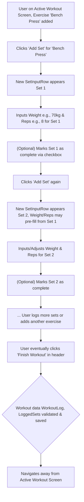

# UI/UX Addon for Story 1.5: Standard Workout Logging (Sets, Reps, Weight)

**Original Story Reference:** `ai/stories/epic1.1.5.story.md`

## 1. UI/UX Goal for this Story

To provide an intuitive and efficient interface for users to log their standard workout sessions, including selecting exercises and recording sets with weight and reps, forming the core activity of the app.

## 2. Key Screens/Views Involved in this Story

- **Active Workout Logging Screen:** The primary interface for this story.
  - _(Reference: Conceptual description in `docs/ui-ux-spec.md` and initial mockup `image_3e90df.png`)_
- **Exercise Picker/Selector (Modal or Page):** Used when adding exercises to the current workout.
  - _(Leverages the Exercise Library functionality/data from Story 1.4)_

## 3. Detailed UI Element Descriptions & Interactions for this Story

### 3.1. Active Workout Logging Screen

- **Overall Layout:**
  - Header: Workout Title (e.g., "New Workout" or "Workout A" if from a program later), Back navigation, "Finish Workout" button.
  - Main content area: List of added exercises, each with its logged sets.
  - Action: Button/mechanism to "Add Exercise" to the current session.
  - (Future: Timer UI at the bottom, as seen in mockups, to be detailed in Epic 2 UI stories).
- **Starting a New Workout:**
  - User action (e.g., tapping a "Start New Workout" button on a Dashboard or "WORKOUTS" tab) navigates to a fresh Active Workout Logging screen.
  - Workout automatically gets a start timestamp.
- **Adding an Exercise to Workout:**
  - User clicks an "Add Exercise" button.
  - An Exercise Picker (modal or full screen, leveraging Exercise Library from Story 1.4) appears, allowing search and selection of an exercise.
  - Selected exercise is added as a new card/section to the Active Workout Logging screen.
- **Exercise Log Card (for each added exercise):**
  - **Header:** Exercise Name. Optionally, icons for quick history view or exercise-specific options.
  - **Set List Area:** Displays rows for logged sets and an interface to add new sets.
  - **"Add Set" Button:** Adds a new `SetInputRow` for the current exercise.
- **`SetInputRow` (for Standard Sets):**
  - **Display/Inputs:**
    - Set number (e.g., "Set 1", "Set 2").
    - `shadcn/ui Input` for `Weight` (numeric). Unit (kg/lbs from user settings) displayed.
    - `shadcn/ui Input` for `Reps` (numeric).
    - Checkbox or similar to mark set as completed.
  - **Interaction:**
    - Inputs should be easy to use, possibly with steppers or quick +/- buttons for small adjustments.
    - On adding a new set, `Weight` and `Reps` fields may pre-fill from the values of the previously logged set for that exercise to speed up entry.
    - Data for weight/reps validated by Zod schema for `LoggedSet` (StandardSet variant) on input or before saving.
    - "..." (kebab menu) per set for actions like "Delete Set", "Edit Set (if already 'committed')", "Add Note" (notes are FR3.5).
- **"Finish Workout" Button:**
  - **Action:** Marks the workout session as completed. Captures end timestamp.
  - Triggers saving of the entire `WorkoutLog` (with its exercises and `LoggedSet`s) to Dexie.js after Zod validation.
  - Navigates away from the active logging screen (e.g., to a workout summary or back to dashboard/history).
- **Figma References:**
  - `{Figma_Frame_URL_for_Active_Workout_Screen_Standard_Sets}`
  - `{Figma_Frame_URL_for_Exercise_Picker_Modal}`
  - `{Figma_Frame_URL_for_Set_Input_Row_States}`

## 4. Accessibility Notes for this Story

- **Active Workout Logging Screen:**
  - Clear heading structure for workout title and exercise names.
  - All inputs (weight, reps) must have associated labels (can be visually hidden if design is compact, but available to assistive tech).
  - "Add Set", "Add Exercise", "Finish Workout", and "..." menu buttons must be keyboard accessible and have clear accessible names.
  - Ensure a logical tab order through exercises and sets.
- **Exercise Picker:** If a modal, it must manage focus correctly (trap focus, return focus on close). List items must be selectable via keyboard.

## 5. User Flow Snippet (Logging one exercise with multiple sets)

