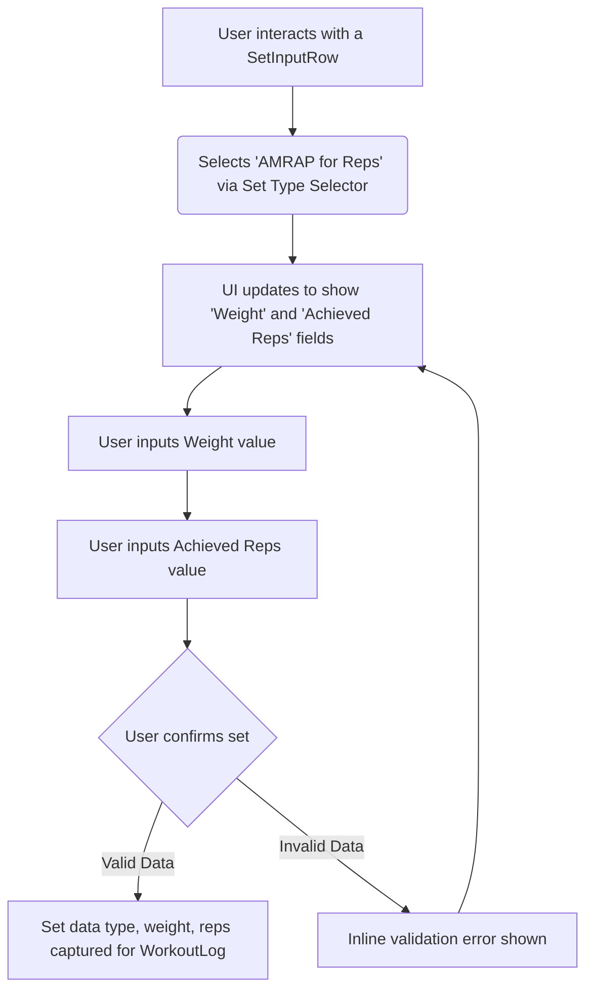

# UI/UX Addon for Story 2.1: Logging AMRAP (As Many Reps As Possible) for Reps

**Original Story Reference:** `ai/stories/epic2.2.1.story.md`

## 1. UI/UX Goal for this Story

To extend the workout logging interface to allow users to easily designate a set as "AMRAP for Reps" and record the weight used and maximum repetitions achieved, ensuring accurate tracking of effort-based sets.

## 2. Key Screens/Views Involved in this Story

- **Active Workout Logging Screen:** Specifically, the component responsible for rendering individual set inputs (e.g., `SetInputRow.tsx` or equivalent).
  - _(Reference: `docs/ui-ux-spec.md` for general screen layout, `ai/ui-stories/epic1.1.5.story.md` for standard set logging UI)._

## 3. Detailed UI Element Descriptions & Interactions for this Story

### 3.1. `SetInputRow.tsx` (or equivalent set logging component) Modifications

- **Set Type Selection:**
  - **Element:** A `shadcn/ui Select` or `RadioGroup` component within each set row to choose the set type.
  - **Options:** "Standard", "AMRAP for Reps" (new), and future advanced types.
  - **Behavior:** Selecting "AMRAP for Reps" will dynamically adjust the input fields available for that set.
  - **Default:** New sets might default to "Standard" or the type of the previous set for that exercise.
- **Inputs for "AMRAP for Reps" Type:**
  - When "AMRAP for Reps" is selected:
    - **Weight Input:**
      - **Label:** "Weight".
      - **Control:** `shadcn/ui Input` (numeric), same as for standard sets. Displays user's preferred unit (kg/lbs).
      - **Validation:** Must be a positive number.
    - **Achieved Repetitions Input:**
      - **Label:** "Reps (Achieved)" or "AMRAP Reps".
      - **Control:** `shadcn/ui Input` (numeric).
      - **Validation:** Must be a positive integer.
    - (Standard "Target Reps" input would be hidden or disabled for this set type if it was previously visible for "Standard" sets).
- **Data Storage:** The UI will capture `loggedWeightKg` and `loggedReps` for the `AmrapRepsSet` data structure.
- **Visual Distinction:** AMRAP sets might have a slightly different visual cue or tag in the list of sets for an exercise to differentiate them from standard sets after logging.

### 3.2. User Interaction Flow for Logging AMRAP Reps Set

1. User is on the "Active Workout Logging Screen" for a specific exercise.
2. User adds a new set or selects an existing set to modify.
3. User selects "AMRAP for Reps" from the "Set Type" selector for that set.
4. The input fields change to "Weight" and "Achieved Reps".
5. User inputs the weight used (e.g., 100 kg).
6. User inputs the maximum number of repetitions achieved (e.g., 12 reps).
7. User confirms the set (e.g., by moving to the next set, finishing the workout, or a specific "log set" action). Data is validated and stored.

- **Figma References:**
  - `{Figma_Frame_URL_for_SetInputRow_AMRAP_Reps_Variant}`
  - `{Figma_Frame_URL_for_SetType_Selector_Dropdown}`

## 4. Accessibility Notes for this Story

- Ensure the "Set Type" selector is keyboard accessible and its state is clear to assistive technologies.
- Labels for "Weight" and "Achieved Reps" must be correctly associated with their respective input fields.
- Provide clear visual feedback for input validation (e.g., if non-numeric data is entered).

## 5. User Flow Snippet (Selecting and Logging AMRAP Reps)

