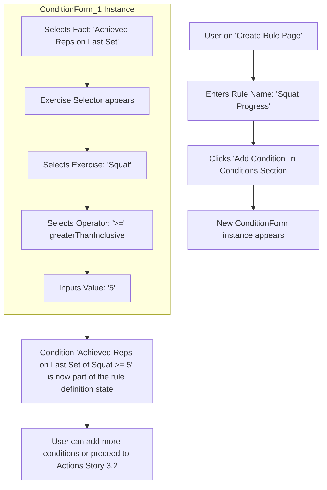

# UI/UX Addon for Story 3.1: Progression Rule Definition - Conditions

**Original Story Reference:** `ai/stories/epic3.3.1.story.md`

## 1. UI/UX Goal for this Story

To provide a clear and intuitive interface for users to begin defining a new progression rule by giving it a name and then constructing one or more conditions based on their workout performance, ensuring accuracy and flexibility in how rules are triggered.

## 2. Key Screens/Views Involved in this Story

- **Create/Edit Progression Rule Page (`CreateRulePage.tsx` / `EditRulePage.tsx`):** The main page for defining a rule. This story focuses on the initial parts: rule naming and condition building.
  - _(Reference: General `docs/ui-ux-spec.md` for UI principles)._
- **Rule Condition Builder Component (`RuleConditionBuilder.tsx`):** A dynamic section within the rule creation page for adding and managing a list of conditions.
- **Condition Form Component (`ConditionForm.tsx`):** A sub-component, likely repeated for each condition, allowing users to specify the parameters of a single condition.

## 3. Detailed UI Element Descriptions & Interactions for this Story

### 3.1. Create/Edit Progression Rule Page (Initial Setup)

- **Rule Name Input:**
  - **Label:** "Rule Name".
  - **Control:** `shadcn/ui Input` (text type).
  - **Validation:** Required. Should ideally be unique, though enforcement might be at a higher level or on save.
- **Conditions Section Header:**
  - **Label:** "Conditions" or "IF..."
  - **Logic Operator (Initial for V1.0):** Display "ALL of the following are true (AND logic)" as the default way multiple conditions are combined. (Future: UI to select AND/OR - `all`/`any` in `json-rules-engine`).

### 3.2. Rule Condition Builder Component (`RuleConditionBuilder.tsx`)

- **Layout:** A container that lists all conditions added to the rule.
- **"Add Condition" Button:**
  - **Control:** `shadcn/ui Button`.
  - **Action:** Adds a new instance of the `ConditionForm.tsx` to the list, allowing the user to define another condition.
- **List of Conditions:** Each condition defined by the user is displayed (likely using `ConditionForm.tsx` instances).

### 3.3. Condition Form Component (`ConditionForm.tsx`)

- **Layout:** A distinct block or card for defining a single condition, with controls arranged logically.
- **Controls for defining a condition:**
  - **Condition Type/Fact Selector:**
    - **Label:** "When..." or "Fact".
    - **Control:** `shadcn/ui Select`.
    - **Options (derived from supported conditions & facts in Story 3.1):**
      - "Exercise Performance (Last Workout)" (leading to `fact_lastWorkoutExercisePerformance` properties)
        - "All Target Sets Completed" (Path: `allTargetSetsCompleted`, Operator: `equal`, Value: `true/false`)
        - "Min Reps on Target Sets" (Path: `minRepsAchievedOnTargetSets`, Operator: e.g., `>=`, Value: `number`)
        - "Achieved Reps on Last Set" (Path: `lastSet.achievedReps`, Operator: e.g., `>=`, Value: `number`)
      - "Exercise Historical Stats" (leading to `fact_exerciseHistoricalStats` properties)
        - "Consecutive Progressions" (Path: `consecutiveProgressions`, Operator: e.g., `>=`, Value: `number`)
        - "Consecutive Failures to Meet Target" (Path: `consecutiveFailuresToMeetTarget`, Operator: e.g., `>=`, Value: `number`)
  - **Exercise Selector (Contextual):**
    - **Label:** "For Exercise".
    - **Control:** `shadcn/ui Select` or searchable `Combobox`, populated with the user's exercises from Dexie.js.
    - **Visibility:** Shown if the selected Fact/Condition Type requires an exercise context.
  - **Operator Selector:**
    - **Label:** "Is".
    - **Control:** `shadcn/ui Select`.
    - **Options (contextual based on Fact/Path):** `equal`, `notEqual`, `greaterThan`, `greaterThanInclusive`, `lessThan`, `lessThanInclusive`, `in`, `notIn`, `contains`, `doesNotContain` (as appropriate for `json-rules-engine` and the data type of the fact). Example for "All Target Sets Completed": Operator `equal`, Value `true`.
  - **Value Input:**
    - **Label:** "Value" or specific (e.g., "Number of Reps").
    - **Control:** `shadcn/ui Input` (type changes based on operator/fact: number, text, boolean via `Switch` or `Select`).
    - **Validation:** Input type should match expected value type. Zod validation applied to the condition structure.
  - **Remove Condition Button:**
    - **Control:** `shadcn/ui Button` (icon button, e.g., 'X' or 'Trash').
    - **Action:** Removes this specific condition from the rule definition.
- **State Management:** The UI needs to manage an array of condition objects. Each change in a `ConditionForm` updates the corresponding object in this array.

- **Figma References:**
  - `{Figma_Frame_URL_for_CreateRulePage_ConditionsSection}`
  - `{Figma_Frame_URL_for_RuleConditionBuilder_Component}`
  - `{Figma_Frame_URL_for_ConditionForm_States_and_Controls}`

## 4. Accessibility Notes for this Story

- All form elements (inputs, selects, buttons) within the `ConditionForm` must be fully keyboard accessible and have associated labels.
- The dynamic addition and removal of condition forms must manage focus appropriately.
- Clear visual hierarchy should guide the user through configuring complex conditions.
- Validation error messages must be clearly associated with their respective fields and be accessible to screen readers.

## 5. User Flow Snippet (Adding a Single Condition)

