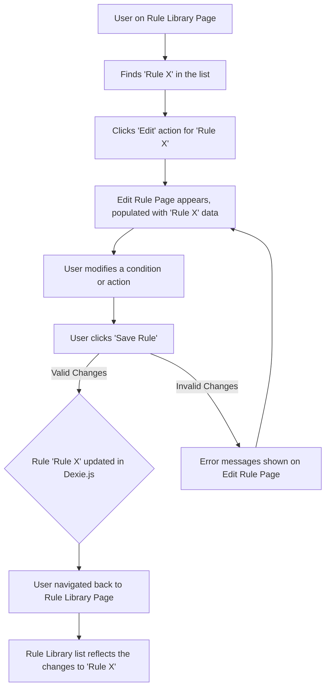

# UI/UX Addon for Story 3.3: Progression Rule Management (Rule Library)

**Original Story Reference:** `ai/stories/3.3.story.md`

## 1. UI/UX Goal for this Story

To provide users with a centralized "Rule Library" where they can view, manage (edit, delete, clone), and toggle the active status of their created progression rules, enabling them to refine and control their automated training logic.

## 2. Key Screens/Views Involved in this Story

- **Rule Library Page (`RuleLibraryPage.tsx`):** The main screen for listing all progression rules.
- **Rule List Item Component (`RuleListItem.tsx`):** Represents a single rule in the library list.
- **View Rule Page (`ViewRulePage.tsx`):** Displays details of a selected rule (could be integrated with Edit Rule Page).
- **Edit Rule Page (`EditRulePage.tsx`):** Reuses the UI from Stories 3.1 & 3.2 for modifying an existing rule.
- **Confirmation Dialog (`AlertDialog`):** For confirming deletion of a rule.

## 3. Detailed UI Element Descriptions & Interactions for this Story

### 3.1. Rule Library Page (`RuleLibraryPage.tsx`)

- **Layout:**
  - Screen Title (e.g., "Progression Rules" or "Rule Library").
  - "Create New Rule" Button: Navigates to the `CreateRulePage.tsx`.
  - List of rules, where each rule is an instance of `RuleListItem.tsx`.
  - The list should be reactive, updating automatically if rules are added/changed (via `dexie-react-hooks` `useLiveQuery`).
- **Filtering/Sorting (Optional V1.0 Enhancement):**
  - Consider basic filtering by status (Active/Inactive) or searching by rule name if the list becomes long.

### 3.2. Rule List Item Component (`RuleListItem.tsx`)

- **Display:**
  - Rule Name.
  - Brief summary of condition/action (e.g., "IF Squat reps > 5 THEN +2.5kg") - this might be complex to generate dynamically, an alternative is just the name and status.
  - Status Indicator: "Active" / "Inactive".
- **Controls/Actions per Item:**
  - **Toggle Active Status:**
    - **Control:** `shadcn/ui Switch` component.
    - **Action:** Toggles the `isActive` field of the `ProgressionRule` in Dexie.js.
  - **Context Menu / Action Buttons (e.g., "..." icon button opening a dropdown):**
    - "View": Navigates to `ViewRulePage.tsx` (or `EditRulePage.tsx` in read-only mode).
    - "Edit": Navigates to `EditRulePage.tsx` populated with the rule's data.
    - "Clone": Creates a duplicate of the rule (e.g., named "[Original Name] (Copy)"), saves it, and potentially navigates to edit the new copy.
    - "Delete": Triggers a Confirmation Dialog.

### 3.3. View Rule Page (`ViewRulePage.tsx`)

- **Layout:** Read-only display of a rule's name, conditions, and actions.
- Could be the same component as `CreateRulePage.tsx` but with all fields disabled and "Save" button hidden/replaced by "Edit" and "Close" buttons.

### 3.4. Confirmation Dialog (for Delete Rule)

- **Description:** `shadcn/ui AlertDialog`.
- **Content:** Title ("Delete Rule?"), Message ("Are you sure you want to delete rule '[Rule Name]'?"), "Confirm Delete", "Cancel" buttons.

- **Figma References:**
  - `{Figma_Frame_URL_for_RuleLibraryPage}`
  - `{Figma_Frame_URL_for_RuleListItem_States_and_Actions_Menu}`
  - `{Figma_Frame_URL_for_ViewRulePage_ReadOnly}`
  - `{Figma_Frame_URL_for_DeleteRule_Confirmation_Dialog}`

## 4. Accessibility Notes for this Story

- The list of rules must be keyboard navigable. Each `RuleListItem` and its interactive controls (switch, action menu) must be accessible.
- The `Switch` for active/inactive status must clearly convey its state.
- Action menus (if using dropdowns) must be accessible.
- Confirmation dialogs must trap focus and manage it correctly.

## 5. User Flow Snippet (Editing a Rule from Library)

