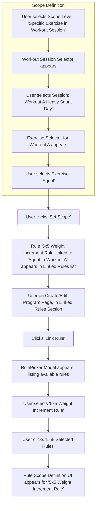

# UI/UX Addon for Story 4.2: Program Definition - Frequency & Progression Rules

**Original Story Reference:** `ai/stories/epic4.4.2.story.md`

## 1. UI/UX Goal for this Story

To enhance the program definition interface by allowing users to specify a target training frequency for their program and to link existing progression rules (from Epic 3) to the program as a whole, specific workout sessions, or specific exercises within those sessions.

## 2. Key Screens/Views Involved in this Story

- **Create Program Page / Edit Program Page (`CreateProgramPage.tsx`):** Extended from Story 4.1 to include sections for frequency and rule linking.
- **Program Settings Form/Section (`ProgramSettingsForm.tsx`):** A dedicated part of the program creation page for these settings.
- **Rule Picker Component (`RulePicker.tsx`):** A reusable modal or popover for Browse and selecting progression rules.

## 3. Detailed UI Element Descriptions & Interactions for this Story

### 3.1. `ProgramSettingsForm.tsx` (or section within `CreateProgramPage.tsx`)

- **Target Frequency Input:**
  - **Label:** "Target Frequency".
  - **Controls:**
    - `shadcn/ui Select` for `type`: Options "Workouts per Week", "Every X Days".
    - `shadcn/ui Input` (number) for `value` (e.g., if "Workouts per Week" selected, input 3; if "Every X Days" selected, input 2 for "Every 2 Days").
  - **Validation:** Value must be a positive integer.
- **Linked Progression Rules Section:**
  - **Header:** "Linked Progression Rules".
  - **"Link Rule" Button:**
    - **Control:** `shadcn/ui Button`.
    - **Action:** Opens the `RulePicker.tsx` modal.
  - **List of Linked Rules:**
    - Displays currently linked rules.
    - Each item shows:
      - Rule Name.
      - Scope of application (e.g., "Entire Program", "Workout: Day A", "Exercise: Bench Press in Day A").
      - "Edit Scope" button/icon.
      - "Unlink Rule" button/icon.

### 3.2. Rule Picker Component (`RulePicker.tsx`)

- **Layout:** A modal or popover dialog.
- **Content:**
  - Title: "Select Progression Rule(s)".
  - Search/Filter input for rule names.
  - List of available Progression Rules (fetched from `progressionRules` table in Dexie.js). Each rule item might show its name and a brief description/summary.
  - Mechanism to select one or more rules (e.g., checkboxes).
- **Actions:** "Done" / "Link Selected Rules", "Cancel".

### 3.3. Rule Scope Definition Interface

- **Context:** Appears after selecting a rule from the `RulePicker` or when clicking "Edit Scope" for an already linked rule.
- **Controls:**
  - **Scope Level Selector:** `shadcn/ui Select` or `RadioGroup`. Options:
    - "Entire Program".
    - "Specific Workout Session".
    - "Specific Exercise in Workout Session".
  - **Conditional Selectors (based on Scope Level):**
    - If "Specific Workout Session": A `Select` to choose the workout session from the program's defined sequence (e.g., "Workout A", "Workout B").
    - If "Specific Exercise in Workout Session":
      - A `Select` for the workout session.
      - A `Select` (dynamically populated based on chosen session) for the exercise within that session.
- **Action:** "Set Scope" or "Save Scope".

- **Figma References:**
  - `{Figma_Frame_URL_for_ProgramDefinition_FrequencySettings}`
  - `{Figma_Frame_URL_for_ProgramDefinition_LinkedRulesSection}`
  - `{Figma_Frame_URL_for_RulePicker_Modal}`
  - `{Figma_Frame_URL_for_RuleScopeDefinition_Interface}`

## 4. Accessibility Notes for this Story

- The Rule Picker and Scope Definition interfaces, especially if they are modals, must manage focus correctly.
- All interactive elements (selects, buttons, list items in picker) must be keyboard accessible.
- Clear labeling for all settings and options.
- The hierarchy of rule scoping (program -> workout -> exercise) should be conveyed clearly.

## 5. User Flow Snippet (Linking a Rule to a Specific Exercise in Program)

