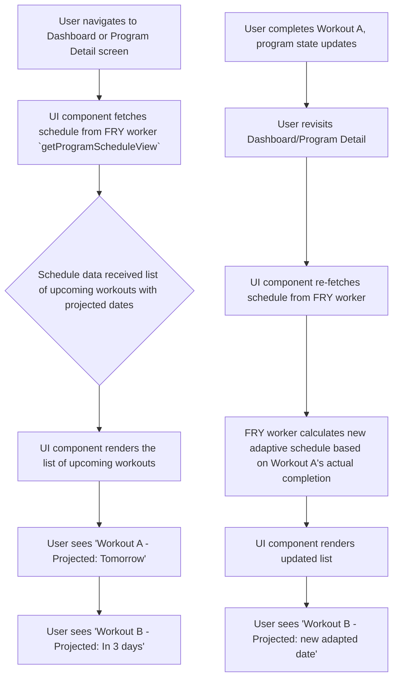

# UI/UX Addon for Story 4.5: Adaptive Scheduling Logic & Display

**Original Story Reference:** `ai/stories/4.5.story.md`

## 1. UI/UX Goal for this Story

To provide users with a clear and adaptive view of their upcoming projected workout schedule for active programs, allowing them to see how their actual training rhythm influences future suggested dates.

## 2. Key Screens/Views Involved in this Story

- **UI Component for Displaying Program Schedule (e.g., `UpcomingProgramWorkouts.tsx` or `ProgramScheduleView.tsx`):** This component will display the schedule.
  - **Placement:** Could be part of the main Dashboard (Epic 6), within a dedicated "Program Details" page for an active program, or both.
- _(Core scheduling logic is in FRY worker; this story focuses on the UI consuming that logic's output)._

## 3. Detailed UI Element Descriptions & Interactions for this Story

### 3.1. Program Schedule Display Component

- **Layout:**
  - Typically a list or series of cards representing the next few upcoming workouts (e.g., next 1-3 as per AC3).
  - Could have a title like "Upcoming Workouts" or "[Program Name] Schedule".
- **Information Displayed per Upcoming Workout Item (`ProgramScheduleItem`):**
  - **Workout Identifier:** Name or tag of the workout session (e.g., "Workout A", "Leg Day", or `dayTag` from `ProgramWorkoutDefinitionEntry`).
  - **Projected Date:** The adaptively calculated date for this workout (e.g., "Mon, June 2", "Tomorrow", "In 2 days").
  - **Visual Cue for Adaptability:** A small note or icon indicating dates are "projected" or "subject to change based on your activity" could be useful to manage expectations.
- **"View Full Schedule" / "Go to Program" Link (Optional):** If displaying a summary, a link to a more detailed program view or full calendar might be provided.
- **Data Source:** Fetches an array of `ProgramScheduleItem` (or similar structure) from the FRY worker's `getProgramScheduleView` method via Comlink.
- **Reactivity:** The displayed schedule should update when the underlying program state changes (e.g., after a workout is logged and `lastCompletedWorkoutDate` is updated). This could be triggered by re-fetching from FRY worker when relevant views become active or data changes.

- **Figma References:**
  - `{Figma_Frame_URL_for_UpcomingWorkouts_ScheduleDisplay_Component_Dashboard}`
  - `{Figma_Frame_URL_for_ProgramDetail_ScheduleView_Component}`
  - `{Figma_Frame_URL_for_Single_UpcomingWorkoutItem_Display}`

## 4. Accessibility Notes for this Story

- Projected dates and workout names must be clearly readable.
  - Use unambiguous date formatting.
- If the schedule is a list, it should be navigable by keyboard.
- Any visual cues for adaptability should have accessible text descriptions if not inherently clear.

## 5. User Flow Snippet (Viewing Adaptive Schedule)

