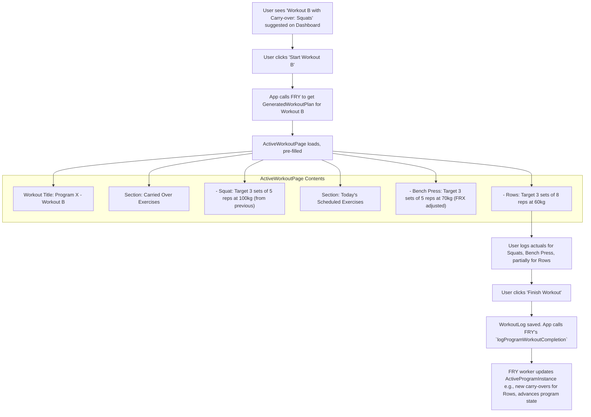

# UI/UX Addon for Story 4.6: Executing & Logging Program Workouts (Including Partial Completion with FRY Logic)

**Original Story Reference:** `ai/stories/4.6.story.md`

## 1. UI/UX Goal for this Story

To ensure a seamless transition from a FRY-generated workout plan (including FRX adjustments and any carry-over exercises) into the active workout logging interface, and to clearly present any specific elements of this planned workout to the user.

## 2. Key Screens/Views Involved in this Story

- **UI for Selecting/Starting a Program Workout:** (e.g., From Dashboard's "Today's Focus", Program Library, or a Program Detail screen). This UI will trigger the fetching of the `GeneratedWorkoutPlan` from FRY.
- **Active Workout Logging Screen (`ActiveWorkoutPage.tsx`):** Modified to be pre-filled with the `GeneratedWorkoutPlan`.
  - _(Reference: `ai/ui-stories/epic1.1.5.story.md` and Epic 2 UI stories for base logging UI)._

## 3. Detailed UI Element Descriptions & Interactions for this Story

### 3.1. Initiating a Program Workout

- **User Action:** User clicks a "Start Program Workout" button associated with a workout suggested by FRY (e.g., from "Today's Focus" on Dashboard, or a specific workout in a program view).
- **System Action:**
  1. Application logic calls FRY worker's `getNextWorkoutPlan` (or similar method to get a specific plan) for the selected `activeProgramInstanceId`.
  2. FRY worker returns a `GeneratedWorkoutPlan` object.
  3. Navigate to `ActiveWorkoutPage.tsx`, passing this `GeneratedWorkoutPlan` as props/state.

### 3.2. `ActiveWorkoutPage.tsx` (Pre-filled for Program Workout)

- **Workout Title:** Displays the program name and the specific workout session name/tag (e.g., "Strength Block - Workout A: Heavy Upper").
- **Exercise List & Targets:**
  - The list of exercises is pre-populated based on the `GeneratedWorkoutPlan`.
  - For each exercise, target parameters (weight, reps, sets, set type like AMRAP details) are pre-filled in the input fields of `SetInputRow.tsx` (or specialized set components) based on the plan.
    - These targets already include any FRX adjustments applied by FRY in Story 4.4.
    - Visual cues for FRX-adjusted parameters should be present (as defined in UI Story for 3.6).
- **Display of Carry-Over Exercises:**
  - If the `GeneratedWorkoutPlan` includes `carriedOverExercises` (from a previous partially completed session), these exercises must be clearly distinguished in the UI.
  - **Visual Cue:** Could be a different background color for the exercise card, an icon (e.g., "redo" or "carry-over" icon), or a specific section labelled "Carried Over from Last Session".
  - Their target parameters are also pre-filled.
- **Logging Interaction:**
  - User logs their actual performance against these pre-filled targets as usual.
  - They can still modify exercises, add/remove sets if the base logging UI allows (though for program adherence, sticking to the plan is ideal).
- **Finishing Workout:**

  - When "Finish Workout" is clicked, the saved `WorkoutLog` is created.
  - Application logic then calls FRY worker's `logProgramWorkoutCompletion` method, passing `activeProgramInstanceId` and `workoutLogId` (and potentially the original `GeneratedWorkoutPlan` for comparison if FRY needs it for carry-over logic).

- **Figma References:**
  - `{Figma_Frame_URL_for_ActiveWorkoutPage_ProgramMode_Prefilled}`
  - `{Figma_Frame_URL_for_Displaying_FRX_Adjusted_Targets_InLog}`
  - `{Figma_Frame_URL_for_Displaying_CarryOver_Exercises_InLog}`

## 4. Accessibility Notes for this Story

- Pre-filled target values should be clearly announced by screen readers when inputs are focused.
- Visual cues for adjusted targets or carry-over exercises must have accessible text descriptions (e.g., using `aria-describedby` or visually hidden text).

## 5. User Flow Snippet (Starting and Logging a Program Workout with Carry-Over)

