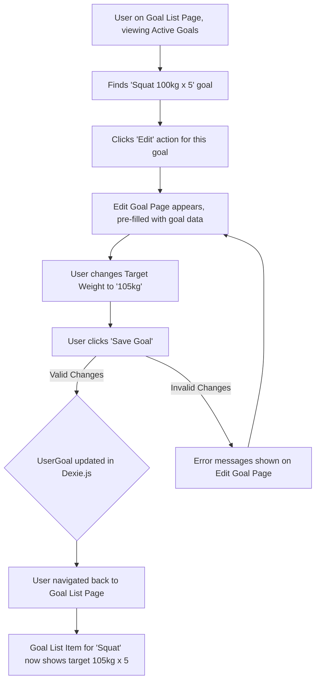

# UI/UX Addon for Story 5.2: Goal Management (View, Edit, Delete Active Goals)

**Original Story Reference:** `ai/stories/epic5.5.2.story.md`

## 1. UI/UX Goal for this Story

To provide users with a clear overview of their active goals and the ability to manage them effectively by viewing details, editing parameters, manually marking them as achieved, or deleting/archiving them.

## 2. Key Screens/Views Involved in this Story

- **Goal List Page (`GoalListPage.tsx`):** Main screen for listing all active (and later, achieved/archived) goals.
- **Goal List Item Component (`GoalListItem.tsx`):** Represents a single goal in the list.
- **Edit Goal Page (`EditGoalPage.tsx`):** Reuses/extends the `CreateGoalPage.tsx` or `GoalForm.tsx` from Story 5.1 for modifying an existing goal.
- **View Goal Page/Details (`ViewGoalPage.tsx` or inline expansion):** Displays full details of a selected goal, including progress (progress display itself is more Story 5.4).
- **Confirmation Dialog (`AlertDialog`):** For confirming delete/archive actions.

## 3. Detailed UI Element Descriptions & Interactions for this Story

### 3.1. Goal List Page (`GoalListPage.tsx`)

- **Layout:**
  - Screen Title (e.g., "My Goals").
  - "Create New Goal" Button: Navigates to `CreateGoalPage.tsx` (Story 5.1).
  - Tabs or Filters (for V1.0, primarily "Active Goals"; Story 5.6 adds "Achieved Goals"): "Active", "Achieved", "Archived".
  - List of goals, using `GoalListItem.tsx` for each.
  - Data fetched reactively from `userGoals` table using `dexie-react-hooks` `useLiveQuery`.
- **Empty State:** If no active goals, display a message like "You have no active goals. Create one to get started!" with a prominent "Create New Goal" button.

### 3.2. Goal List Item Component (`GoalListItem.tsx`) for Active Goals

- **Display:**
  - Goal Name/Description.
  - Goal Target summary (e.g., "Lift: Squat 100kg x 5", "Complete: My Program", "Bodyweight: 70kg").
  - Current Progress indicator (visual like a `ProgressBar.tsx` or text "X / Y kg", "X% done". Progress calculation is Story 5.3, display is Story 5.4, but this item prepares for it).
  - Target Date (if set).
- **Controls/Actions per Item (e.g., via "..." context menu or inline buttons):**
  - **"View Details":** Navigates to/expands to `ViewGoalPage.tsx` content.
  - **"Edit":** Navigates to `EditGoalPage.tsx` populated with this goal's data.
  - **"Mark as Achieved":**
    - **Action:** Updates the goal's `status` to 'achieved' and sets `achievedDate` in Dexie.js via `goalService.ts`. The item might then move to an "Achieved" list/filter (Story 5.6).
  - **"Delete" / "Archive":**
    - **Action:** Triggers a Confirmation Dialog. On confirm, updates status to 'archived' or deletes record via `goalService.ts`.

### 3.3. Edit Goal Page (`EditGoalPage.tsx`)

- **Functionality:** Reuses the `GoalForm.tsx` from Story 5.1, pre-filled with the data of the goal being edited.
- **Save Action:** Validates changes via Zod and updates the existing `UserGoal` record in Dexie.js.

### 3.4. Confirmation Dialog (for Delete/Archive Goal)

- **Description:** `shadcn/ui AlertDialog`.
- **Content:** Title ("Delete Goal?"), Message ("Are you sure you want to delete goal '[Goal Name]'?"), "Confirm Delete", "Cancel".

- **Figma References:**
  - `{Figma_Frame_URL_for_GoalListPage_ActiveTab}`
  - `{Figma_Frame_URL_for_GoalListItem_ActiveState_WithProgressPlaceholder}`
  - `{Figma_Frame_URL_for_GoalListItem_ActionsMenu}`
  - `{Figma_Frame_URL_for_EditGoalPage_Populated}`
  - `{Figma_Frame_URL_for_DeleteGoal_Confirmation_Dialog}`

## 4. Accessibility Notes for this Story

- Goal list must be keyboard navigable. Interactive elements on `GoalListItem` (context menu, buttons) must be accessible.
- Progress indicators (even placeholders before Story 5.4) should have accessible text if purely visual.
- Confirmation dialogs need to manage focus correctly.

## 5. User Flow Snippet (Editing an Active Goal)

