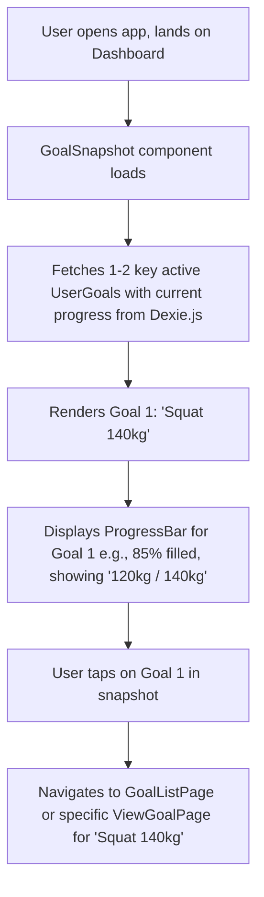

# UI/UX Addon for Story 5.4: Goal Visualization (Dashboard & Dedicated Goals Section)

**Original Story Reference:** `ai/stories/epic5.5.4.story.md`

## 1. UI/UX Goal for this Story

To provide users with clear, concise, and motivating visual representations of their active goals and progress, both on the main dashboard for quick glances and within the dedicated goals section for more detail.

## 2. Key Screens/Views Involved in this Story

- **Dashboard:** A section of the dashboard will host the `GoalSnapshot.tsx` component.
  - _(Reference: PRD FR6.1.2 for Dashboard Snapshot requirement)._
- **Goal List Page (`GoalListPage.tsx`):** Enhanced from Story 5.2 to more prominently display visual progress.
- **Goal List Item Component (`GoalListItem.tsx`):** Enhanced to include visual progress elements.
- **Goal Detail View (`ViewGoalPage.tsx` or expanded `GoalListItem`):** May include a mini-chart for specific goal types.

## 3. Detailed UI Element Descriptions & Interactions for this Story

### 3.1. `GoalSnapshot.tsx` (for Dashboard)

- **Layout:** A compact component designed to display 1-2 key active goals.
- **Content per Goal:**
  - Goal Name/Description.
  - Visual Progress Indicator:
    - **Control:** `shadcn/ui Progress` component or a custom `ProgressBar.tsx`.
    - **Data:** Calculated based on `UserGoal.currentValue` and target values (e.g., `targetWeightKg`, `targetReps`, `targetProgramDefinition.totalWorkouts`, `targetBodyweightKg`).
  - Textual Progress (e.g., "120kg / 140kg", "5 of 12 Workouts", "72kg / 70kg").
- **Interaction:** Tapping the snapshot or a specific goal within it should navigate to the full `GoalListPage.tsx` or the specific `ViewGoalPage.tsx`.
- **Data:** Fetches a limited number of high-priority or most recent active goals with their progress data from `UserGoal` records (updated by Story 5.3 logic) using `useLiveQuery`.

### 3.2. `GoalListItem.tsx` (Enhanced for Progress Visualization)

- **Layout:** In addition to name/target summary (from Story 5.2), now prominently features:
  - **Visual Progress Indicator:** `shadcn/ui Progress` or custom `ProgressBar.tsx`.
  - **Textual Progress:** Clearly displayed (e.g., "Progress: 60%").
- **Behavior:** Progress elements update reactively as `UserGoal.currentValue` changes in Dexie.js.

### 3.3. `ProgressBar.tsx` (Reusable Component)

- **Props:** `currentValue`, `targetValue` (or `percentage`).
- **Visuals:** A simple bar that fills based on progress. Styled according to app theme. Should allow for clear color distinction between filled and unfilled portions, ensuring good contrast.
- **Accessibility:** `aria-valuenow`, `aria-valuemin`, `aria-valuemax` attributes should be set.

### 3.4. Mini-Chart for Lift Target Goals (Optional Enhancement)

- **Context:** Displayed within the `ViewGoalPage.tsx` or an expanded `GoalListItem` for "Specific Lift Target" goals.
- **Control:** Simple line chart using **Recharts**, showing the trend of `UserGoal.currentValue` (e.g., best e1RM for that lift) over time towards the `targetWeightKg`.
  - Requires historical `currentValue` snapshots or calculation from `LoggedSet` history.
- **Focus:** Keep it simple and clear for V1.0.

- **Figma References:**
  - `{Figma_Frame_URL_for_Dashboard_GoalSnapshot_Component}`
  - `{Figma_Frame_URL_for_GoalListItem_With_ProgressBar}`
  - `{Figma_Frame_URL_for_ProgressBar_Component_Styles}`
  - `{Figma_Frame_URL_for_GoalDetail_MiniLiftChart_Optional}`

## 4. Accessibility Notes for this Story

- Progress bars must be accessible, conveying their state and values to screen readers (e.g., using `aria` attributes).
- Any charts must be understandable with assistive technologies (e.g., providing data tables as alternatives or ensuring Recharts are configured for accessibility).
- Textual representations of progress should always accompany visual ones.
- Ensure sufficient contrast for progress bar colors and chart elements.

## 5. User Flow Snippet (Viewing Goal Progress on Dashboard)

