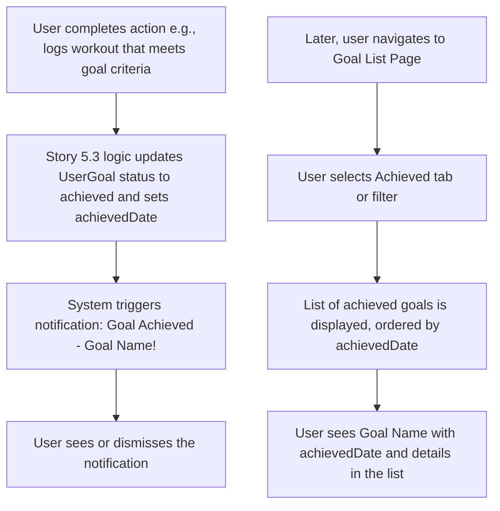

# UI/UX Addon for Story 5.6: Goal Achievement Notification & History

**Original Story Reference:** `ai/stories/epic5.5.6.story.md`

## 1. UI/UX Goal for this Story

To provide users with positive reinforcement by notifying them in-app when they achieve a goal, and to offer a way to view their history of accomplished goals, celebrating their successes.

## 2. Key Screens/Views Involved in this Story

- **In-App Notification System (e.g., Toasts):** To display goal achievement messages.
  - _(Leverages a global notification component like `shadcn/ui Toast` or a custom `Notifier.tsx`)._
- **Goal List Page (`GoalListPage.tsx`):** Extended from Story 5.2 to include a section, tab, or filter for "Achieved Goals".
- **Achieved Goal List Item Component (`AchievedGoalListItem.tsx`):** For displaying individual achieved goals in the history list.

## 3. Detailed UI Element Descriptions & Interactions for this Story

### 3.1. Goal Achievement Notification

- **Trigger:** When the system (FRZ logic in Story 5.3) detects a `UserGoal`'s conditions have been met and updates its status to 'achieved'.
- **UI Element:** An in-app notification.
  - **Type:** `shadcn/ui Toast` is suitable (non-modal, dismissible).
  - **Content:**
    - Title: "Goal Achieved!" or "Congratulations!".
    - Message: "[Goal Name] completed!" (e.g., "Squat 100kg x 5 reps achieved!").
    - Icon: A celebratory icon (e.g., star, trophy).
  - **Behavior:** Appears briefly and can be dismissed by the user or auto-dismisses. Tapping it could navigate to the achieved goals list or the specific goal details.
- **Figma Reference:** `{Figma_Frame_URL_for_GoalAchievement_Toast_Notification}`

### 3.2. Goal List Page (`GoalListPage.tsx`) - Achieved Goals Section/Tab

- **Layout:**
  - Add a new tab, filter option, or distinct section labelled "Achieved" or "Completed Goals" on the main `GoalListPage.tsx`.
  - When selected, this view lists all goals with `status: 'achieved'`.
- **Data:** Fetches `UserGoal` records where `status` is 'achieved' using `useLiveQuery`, ordered by `achievedDate` (most recent first).

### 3.3. Achieved Goal List Item Component (`AchievedGoalListItem.tsx`)

- **Display:**
  - Goal Name/Description.
  - Summary of what was achieved (e.g., "Lifted: Squat 100kg x 5 reps").
  - `achievedDate`: Clearly displayed (e.g., "Achieved on: May 30, 2025").
  - A visual indicator of achievement (e.g., a trophy icon, a distinct completed style).
- **Interaction:** Typically less interactive than active goals. Tapping might show more details about the goal definition at the time of achievement. No "Edit" or "Mark Achieved" options. "Archive" might still be relevant if users want to hide it from the primary achieved list.

- **Figma References:**
  - `{Figma_Frame_URL_for_GoalListPage_AchievedTab}`
  - `{Figma_Frame_URL_for_AchievedGoalListItem_Style}`

## 4. Accessibility Notes for this Story

- Toast notifications for goal achievement must be accessible to screen readers (`aria-live="polite"` or `assertive` depending on desired immediacy). Ensure they don't auto-dismiss too quickly for users needing more time.
- The "Achieved Goals" section/tab must be clearly identifiable and navigable.
- Achieved goal list items should clearly convey their "achieved" status.

## 5. User Flow Snippet (User Achieves a Goal & Views History)

