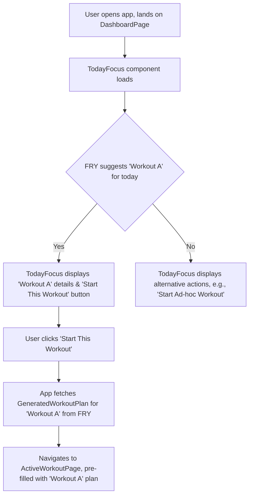

# UI/UX Addon for Story 6.1: Primary Dashboard - "Today's Focus" & Quick Actions Implementation

**Original Story Reference:** `ai/stories/epic6.6.1.story.md`

## 1. UI/UX Goal for this Story

To design the primary action-oriented section of the dashboard ("Today's Focus") that intelligently suggests the user's next workout and provides clear quick action buttons, enabling users to immediately understand what to do or navigate to key tasks.

## 2. Key Screens/Views Involved in this Story

- **Dashboard Page (`DashboardPage.tsx`):** The main container for all dashboard sections. This story focuses on a key part of it.
  - _(Reference: General `docs/ui-ux-spec.md` for overall app structure)._
- **"Today's Focus" Component (`TodayFocus.tsx`):** Displays the suggested workout or alternative actions.
- **"Quick Actions" Component (`QuickActions.tsx`):** Displays a set of common action buttons.

## 3. Detailed UI Element Descriptions & Interactions for this Story

### 3.1. `DashboardPage.tsx` Layout for these Sections

- The "Today's Focus" section should be prominently displayed, likely at the top or a very visible area of the dashboard.
- The "Quick Actions" section could be placed below "Today's Focus" or in another easily accessible part of the dashboard.

### 3.2. "Today's Focus" Component (`TodayFocus.tsx`)

- **Content (Dynamic based on FRY engine output and user state):**
  - **If a Program Workout is Suggested by FRY:**
    - **Header/Title:** e.g., "Today's Focus" or "Next Up: [Program Name]".
    - **Workout Details Display:**
      - Name/Tag of the suggested workout (e.g., "Workout A: Heavy Upper Body").
      - Projected Date (e.g., "Today", "Tomorrow", or specific date from FRY's `getProgramScheduleView`).
      - (Optional) Brief summary like main exercises or duration.
    - **Primary Action Button:** "`Start This Workout`" (`shadcn/ui Button`).
      - **Action:** Fetches the `GeneratedWorkoutPlan` from FRY for this suggested workout and navigates to `ActiveWorkoutPage.tsx` pre-filled with this plan (as per Story 4.6).
  - **If No Specific Program Workout is Immediately Projected:**
    - **Header/Title:** e.g., "What's Next?" or "Ready to Train?".
    - **Intelligent Alternative Actions (displayed as buttons or prominent links):**
      - "Start next in [Most Recent/Relevant Program X]" (if applicable).
      - "Repeat Last Workout" (fetches last `WorkoutLog` to pre-fill a new one).
      - "Explore Programs" (navigates to Program Library - Story 4.3).
      - "Start Ad-hoc Workout" (see below).
  - **Common Secondary Options (always available or contextually shown):**
    - **Button/Link:** "`Choose Other Program Workout`".
      - **Action:** Navigates to a program selection flow (as defined in Story 4.7 UI) allowing user to pick any workout from their active programs.
    - **Button/Link:** "`Start Ad-hoc Workout`".
      - **Action:** Navigates to workout template selection (Story 1.4/1.5 context) or an empty `ActiveWorkoutPage.tsx`.
- **Visuals:** Could be a `shadcn/ui Card` to group this information attractively.

### 3.3. "Quick Actions" Component (`QuickActions.tsx`)

- **Layout:** A series of `shadcn/ui Button` components, possibly styled as secondary actions or large tap targets.
- **Actions:**

  - **Button:** "`Start Empty Workout`"
    - **Action:** Navigates to `ActiveWorkoutPage.tsx` with no pre-filled exercises.
  - **Button:** "`Browse Programs/Templates`"
    - **Action:** Navigates to Program Library (Story 4.3) or Workout Template Library (if distinct).
  - **Button:** "`View Full Analytics`"
    - **Action:** Navigates to `AnalyticsPage.tsx` (main container for Stories 6.5-6.8).

- **Figma References:**
  - `{Figma_Frame_URL_for_DashboardPage_Layout_Showing_TodayFocus_QuickActions}`
  - `{Figma_Frame_URL_for_TodayFocus_SuggestedWorkout_State}`
  - `{Figma_Frame_URL_for_TodayFocus_AlternativeActions_State}`
  - `{Figma_Frame_URL_for_QuickActions_Button_Styles}`

## 4. Accessibility Notes for this Story

- The "Today's Focus" section must have a clear heading structure.
- All buttons ("Start This Workout", "Choose Other", "Start Ad-hoc", Quick Actions) must have clear, descriptive labels and be keyboard accessible.
- If workout details are summarized, ensure all key information is accessible.
- Dynamic content changes (e.g., switching between suggested workout and alternative actions) should be managed in a way that's clear to assistive technologies (e.g., using `aria-live` regions if appropriate).

## 5. User Flow Snippet (User Starts Suggested Program Workout from Dashboard)

