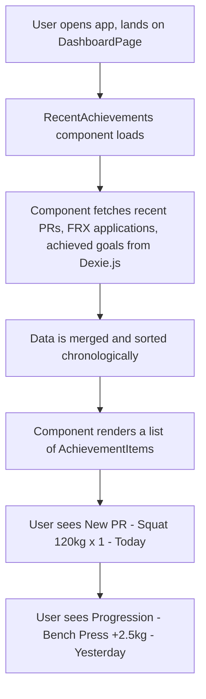

# UI/UX Addon for Story 6.2: Primary Dashboard - Goal Snapshot & Recent Achievements Implementation

**Original Story Reference:** `ai/stories/epic6.6.2.story.md`

## 1. UI/UX Goal for this Story

To enhance the dashboard with motivational and informational sections that provide users a quick snapshot of their key goal progress and a feed of recent training achievements or milestones.

## 2. Key Screens/Views Involved in this Story

- **Dashboard Page (`DashboardPage.tsx`):** This story adds new sections/components to it.
- **Dashboard Goal Snapshot Component (`DashboardGoalSnapshot.tsx`):** Displays progress for 1-2 key goals.
  - _(This might reuse or adapt the `GoalSnapshot.tsx` from Story 5.4)._
- **Recent Achievements Component (`RecentAchievements.tsx`):** Displays a feed of recent notable events.
- **Achievement Item Component (`AchievementItem.tsx`):** A sub-component for rendering individual items in the recent achievements feed.

## 3. Detailed UI Element Descriptions & Interactions for this Story

### 3.1. `DashboardPage.tsx` Layout for these Sections

- **Goal Snapshot:** Could be placed below "Today's Focus" or in a sidebar/secondary column if the dashboard layout allows. It should be easily scannable.
- **Recent Achievements:** Could be a scrollable feed section, perhaps below the Goal Snapshot or other primary dashboard items.

### 3.2. Dashboard Goal Snapshot Component (`DashboardGoalSnapshot.tsx`)

- **Layout:** A compact `shadcn/ui Card` or similar container.
- **Content (for 1-2 key active goals):**
  - **Goal Identifier:** Goal Name/Description (e.g., "Squat 1RM Target").
  - **Visual Progress Indicator:** `shadcn/ui Progress` bar or similar.
  - **Textual Progress:** e.g., "120kg / 140kg" or "85%".
  - **Data Source:** `UserGoal` records from Dexie.js (via `useLiveQuery`), filtered for active status and sorted by relevance (e.g., nearest target date, highest priority if user can set, or most recently updated `currentValue`).
- **Interaction:**
  - Tapping the component or a "View All Goals" link within it navigates to the full `GoalListPage.tsx` (from Epic 5).

### 3.3. Recent Achievements Component (`RecentAchievements.tsx`)

- **Layout:** A list or feed, potentially within a `shadcn/ui Card`.
- **Title:** "Recent Activity" or "Achievements".
- **Content:** A list of `AchievementItem.tsx` components, showing a limited number of recent events (e.g., last 3-5).
- **Data Source:** Combined and sorted feed from:
  - New Personal Records (PRs) from `LoggedSet` data (requires logic to identify a new PR).
  - Significant progression milestones from `AppliedProgressionLogEntry` (e.g., "Weight increased for Squat by FRX Rule: Linear Gains").
  - Newly achieved `UserGoal`s (where `status` changed to 'achieved').
  - All fetched reactively using `useLiveQuery`.

### 3.4. Achievement Item Component (`AchievementItem.tsx`)

- **Display:**
  - **Icon:** Relevant to the achievement type (e.g., trophy for PR/Goal, chart-up for progression).
  - **Textual Description:** Clear, concise message, e.g.:
    - "New PR: Bench Press 80kg x 5 reps!"
    - "Progression: Deadlift weight increased by 2.5kg."
    - "Goal Achieved: Run 5km!"
  - **Timestamp:** e.g., "Today", "Yesterday", or date.
- **Interaction (Optional):** Tapping an item might navigate to the relevant context (e.g., the workout log for a PR, the goal detail for an achieved goal).

- **Figma References:**
  - `{Figma_Frame_URL_for_Dashboard_GoalSnapshot_Section}`
  - `{Figma_Frame_URL_for_Dashboard_RecentAchievements_Feed}`
  - `{Figma_Frame_URL_for_AchievementItem_Variations_PR_Progression_Goal}`

## 4. Accessibility Notes for this Story

- **Goal Snapshot:** Progress bars must be accessible as per Story 5.4 notes. Textual progress should be available.
- **Recent Achievements:**
  - If it's a feed that auto-updates, consider `aria-live` regions appropriately.
  - Each achievement item should be clearly readable. Icons need accessible text alternatives.
  - If items are interactive (navigable), they must be focusable and operable via keyboard.

## 5. User Flow Snippet (Viewing Recent Achievements on Dashboard)

