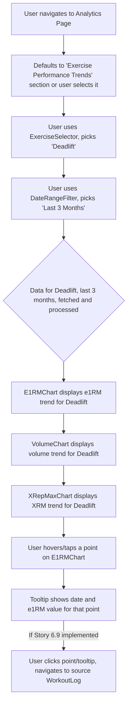

# UI/UX Addon for Story 6.5: Analytics - Exercise Performance Trend Charts

**Original Story Reference:** `ai/stories/epic6.6.5.story.md`

## 1. UI/UX Goal for this Story

To provide users with a dedicated analytics section where they can select an exercise and view clear, informative charts (e1RM, Volume, X-Rep Max trends) over time, allowing them to visually track their performance progression.

## 2. Key Screens/Views Involved in this Story

- **Analytics Page (`AnalyticsPage.tsx`):** Main container for various analytics views. This story adds the exercise performance trend section.
- **Exercise Selector Component (`ExerciseSelector.tsx`):** Allows user to choose which exercise's trends to view.
- **Date Range Filter Component (`DateRangeFilter.tsx`):** Allows user to filter chart data by time period.
- **Chart Components (using Recharts):**
  - `E1RMChart.tsx`
  - `VolumeChart.tsx`
  - `XRepMaxChart.tsx`

## 3. Detailed UI Element Descriptions & Interactions for this Story

### 3.1. `AnalyticsPage.tsx` (Exercise Performance Section)

- **Layout:**
  - Section Title: "Exercise Performance Trends" or similar.
  - `ExerciseSelector.tsx` component.
  - `DateRangeFilter.tsx` component.
  - Display area for the selected charts (e.g., `E1RMChart`, `VolumeChart`, `XRepMaxChart` shown sequentially or in tabs/sections).
- **Interaction:** Selecting an exercise and/or date range updates the data displayed in all relevant charts.

### 3.2. `ExerciseSelector.tsx` Component

- **Label:** "Select Exercise".
- **Control:** `shadcn/ui Select` or searchable `Combobox` populated with user's `ExerciseDefinition` list.
- **Behavior:** On selection, triggers data fetch/re-calculation for the chosen exercise's charts.

### 3.3. `DateRangeFilter.tsx` Component

- **Label:** "Date Range".
- **Control:** `shadcn/ui Select` with preset options ("Last Month", "Last 3 Months", "Last Year", "All Time") or a `DatePicker` with range selection.
- **Behavior:** On selection, updates the time period for chart data.

### 3.4. Chart Components (`E1RMChart.tsx`, `VolumeChart.tsx`, `XRepMaxChart.tsx`)

- **Library:** Implemented using **Recharts**.
- **Common Features:**
  - Clear Title indicating the metric and exercise (e.g., "Squat - e1RM Trend").
  - Axes clearly labeled (e.g., Date on X-axis, e1RM/Volume/Weight on Y-axis).
  - Tooltips on hover/tap of data points showing exact date and value.
  - Responsive design to be readable on mobile.
  - Interactive (as per Story 6.9) to allow drill-down from data points.
- **Specific Chart Content:**

  - **e1RM Chart:** Line chart showing calculated e1RM (Epley formula) over time for each workout where the selected exercise was performed with relevant sets.
  - **Volume Chart:** Bar or Line chart showing total volume (sum of weight\*reps per exercise per workout session) over time.
  - **X-Rep Max Chart:** Line chart showing the best weight lifted for a specific rep count (e.g., user can select to see 3RM, 5RM, or 10RM trend) over time. UI needed to select which XRM to view if multiple are supported.

- **Figma References:**
  - `{Figma_Frame_URL_for_AnalyticsPage_ExerciseTrends_Section}`
  - `{Figma_Frame_URL_for_ExerciseSelector_Analytics}`
  - `{Figma_Frame_URL_for_DateRangeFilter_Analytics}`
  - `{Figma_Frame_URL_for_E1RM_Chart_Style}`
  - `{Figma_Frame_URL_for_Volume_Chart_Style}`
  - `{Figma_Frame_URL_for_XRepMax_Chart_Style_And_Selector}`

## 4. Accessibility Notes for this Story

- Charts must be accessible. Recharts provides some accessibility features; these should be utilized.
  - Provide clear titles and summaries for each chart.
  - Ensure keyboard navigation for chart elements (e.g., data points for tooltips).
  - Consider providing a tabular representation of the chart data as an alternative for screen reader users.
- Exercise selector and date range filter must be accessible.
- Ensure sufficient color contrast for chart lines, bars, text, and legends.

## 5. User Flow Snippet (Viewing e1RM Trend for an Exercise)

