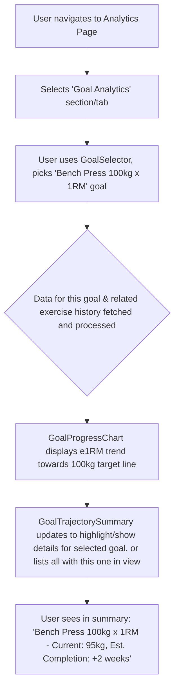

# UI/UX Addon for Story 6.7: Analytics - Goal Analytics Display

**Original Story Reference:** `ai/stories/epic6.6.7.story.md`

## 1. UI/UX Goal for this Story

To provide users with dedicated analytical views for their defined goals, including charts for lift target progress over time and simple trajectory estimations where applicable, offering deeper insights than the dashboard snapshot.

## 2. Key Screens/Views Involved in this Story

- **Analytics Page (`AnalyticsPage.tsx`):** Add a new section for "Goal Analytics".
- **Goal Selector Component (`GoalSelector.tsx`):** Allows user to choose which active goal to analyze.
- **Goal Progress Chart Component (`GoalProgressChart.tsx`):** Specifically for visualizing "Specific Lift Target" goal progress using Recharts.
- **Goal Trajectory Summary Component (`GoalTrajectorySummary.tsx`):** Displays a list of active goals with current status and estimated completion info.

## 3. Detailed UI Element Descriptions & Interactions for this Story

### 3.1. `AnalyticsPage.tsx` (Goal Analytics Section)

- **Layout:**
  - Section Title: "Goal Analytics" or "Track Your Goals".
  - `GoalSelector.tsx` component (if analysis is per-goal, especially for charts).
  - Display area for `GoalProgressChart.tsx` (for selected lift goal) and `GoalTrajectorySummary.tsx` (for a list of goals).

### 3.2. `GoalSelector.tsx` Component

- **Label:** "Select Goal to Analyze".
- **Control:** `shadcn/ui Select` or `Combobox` populated with user's active `UserGoal` names.
- **Behavior:** On selection (especially of a "Specific Lift Target" goal), updates the `GoalProgressChart.tsx`. The `GoalTrajectorySummary.tsx` might show all active goals or be filtered by this selection.

### 3.3. `GoalProgressChart.tsx` Component (for Lift Targets)

- **Library:** Implemented using **Recharts**.
- **Display:**
  - For a selected "Specific Lift Target" goal:
    - Line chart showing current performance (e.g., calculated e1RM trend for the target exercise, using data from `LoggedSet`s) over time.
    - A horizontal line indicating the goal target value (e.g., target weight for X reps, or target e1RM).
  - Title: "Progress for [Goal Name]" (e.g., "Squat 140kg 1RM Progress").
  - Clearly labeled axes (Date, Weight/e1RM). Tooltips on data points.
- **Data Source:** `UserGoal` (for target) and historical `LoggedSet` data (for current performance trend).

### 3.4. `GoalTrajectorySummary.tsx` Component

- **Layout:** A list or series of cards for active goals.
- **Content per Goal Item:**
  - Goal Name/Description.
  - Current Progress (textual and/or `ProgressBar` as in Story 5.4).
  - **Estimated Time to Completion / Trajectory (V1.0 Simple):**
    - Textual display: e.g., "Est. Completion: Aug 2025" or "On track to meet by [Target Date]".
    - Basis: Simple trend analysis of `UserGoal.currentValue` (e.g., recent rate of change).
    - If not calculable or goal type not applicable (e.g., program completion based on fixed sequence): "N/A" or hide.
  - Target Date (if set by user).
- **Data Source:** `UserGoal` records (including `currentValue` from FRZ updates).

- **Figma References:**
  - `{Figma_Frame_URL_for_AnalyticsPage_GoalAnalytics_Section}`
  - `{Figma_Frame_URL_for_GoalSelector_Analytics}`
  - `{Figma_Frame_URL_for_GoalProgressChart_LiftTarget_Style}`
  - `{Figma_Frame_URL_for_GoalTrajectorySummary_List_Item}`

## 4. Accessibility Notes for this Story

- `GoalSelector.tsx` must be accessible.
- `GoalProgressChart.tsx`: Adhere to chart accessibility guidelines. Provide data summaries.
- `GoalTrajectorySummary.tsx`: Ensure textual information is clear. If trajectory is very uncertain, phrase carefully to avoid misleading users.

## 5. User Flow Snippet (Viewing Lift Goal Progress Chart & Trajectory)

