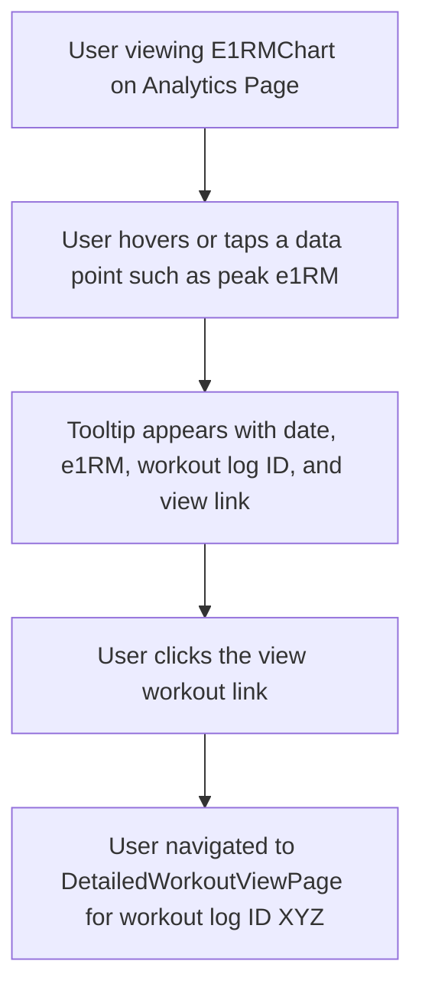

# UI/UX Addon for Story 6.9: Interactivity in Analytics Charts

**Original Story Reference:** `ai/stories/epic6.6.9.story.md`

## 1. UI/UX Goal for this Story

To enhance user experience with analytics charts by making data points interactive, allowing users to tap/click them to see more context or drill down directly to the source workout log for deeper exploration.

## 2. Key Screens/Views Involved in this Story

- **Chart Components (from Stories 6.5, 6.6, 6.7):**
  - `E1RMChart.tsx`
  - `VolumeChart.tsx`
  - `XRepMaxChart.tsx`
  - `ProgramAdherenceChart.tsx` (if data points correspond to specific workouts)
  - `GoalProgressChart.tsx` (if data points correspond to specific workouts/events)
- **Detailed Workout View Page (`DetailedWorkoutViewPage.tsx`):** Target for navigation drill-down.
  - _(Reference: `ai/ui-stories/epic6.6.4.story.md`)_

## 3. Detailed UI Element Descriptions & Interactions for this Story

### 3.1. Enhanced Recharts Chart Components

- **Event Handling:**
  - Charts will be configured with Recharts event handlers (e.g., `onClick` on series elements like bars or line points).
- **Interactive Data Points:**
  - **Visual Feedback on Hover/Focus:** Data points should provide visual feedback when hovered or focused via keyboard.
  - **Click/Tap Action:** 1. When a data point is clicked/tapped, display a **Custom Tooltip or Popover** if not already visible via hover. 2. This tooltip/popover shows contextual information: exact date, exact value, and the name/ID of the source `WorkoutLog` that generated this data point. The `workoutLogId` must be part of the data passed to the chart for each point. 3. The tooltip/popover includes a clear "View Workout" link/button.
- **Navigation on Click/Tap (Drill-Down):**
  - Clicking the "View Workout" link/button (or directly on the data point if design prefers) navigates the user to the `DetailedWorkoutViewPage.tsx` for the corresponding `workoutLogId`.

### 3.2. Data Structure for Chart Points

- The data objects supplied to Recharts for each point on a chart need to be augmented to include `workoutLogId` (or an array of `workoutLogId`s if the point aggregates multiple workouts, though simpler if one-to-one).

  - Example for e1RM chart data point: `{ date: timestamp, e1rm: value, workoutLogId: 'some-uuid' }`.

- **Figma References:**
  - `{Figma_Frame_URL_for_InteractiveChart_DataPoint_Hover_State}`
  - `{Figma_Frame_URL_for_InteractiveChart_CustomTooltip_With_ViewWorkoutLink}`
  - _(Chart styles themselves are defined in Figma refs for stories 6.5-6.7)_

## 4. Accessibility Notes for this Story

- Ensure that the interactive elements within charts (data points, custom tooltips) are keyboard accessible. Users should be able to tab to data points and trigger the contextual info/drill-down.
- The "View Workout" link within the tooltip/popover must be an accessible control.
- Information presented in custom tooltips must be accessible to screen readers. Recharts' built-in tooltip often has good accessibility, but custom ones need care.

## 5. User Flow Snippet (Drilling Down from e1RM Chart)

