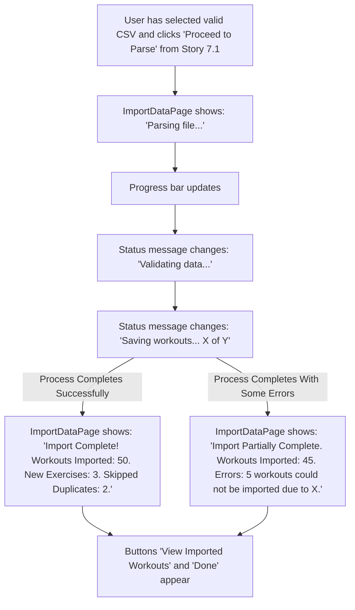

# UI/UX Addon for Story 7.3: StrongLifts Data Import - Feedback, Saving & Conflict Handling

**Original Story Reference:** `ai/stories/epic7.7.3.story.md`

## 1. UI/UX Goal for this Story

To provide clear, comprehensive feedback to the user throughout the StrongLifts data import process (parsing, validation, saving, conflict handling), building trust and keeping the user informed of the outcome.

## 2. Key Screens/Views Involved in this Story

- **Import Data Page (`ImportDataPage.tsx` or `StrongLiftsImportPage.tsx`):** This page, introduced in Story 7.1, will be enhanced to display dynamic feedback, progress, and a final summary.

## 3. Detailed UI Element Descriptions & Interactions for this Story

### 3.1. `ImportDataPage.tsx` Feedback Enhancements

- **In-Progress Feedback Area:**
  - **Element:** A dedicated section on the page that updates dynamically.
  - **Content during processing:**
    - `shadcn/ui Progress` bar component to show overall progress if feasible (e.g., based on file size or number of rows processed).
    - Textual status messages:
      - "Parsing file..."
      - "Validating data..."
      - "Checking for duplicate workouts..."
      - "Saving new exercises ([X] found)..."
      - "Saving workout logs ([Y] of [Total] processed)..."
- **Completion Summary Display:**
  - **Element:** Shown after the import process finishes.
  - **Content:**
    - **Success Message:** e.g., "Import Complete!"
    - **Summary Statistics:**
      - "Workouts Imported: [Number]"
      - "New Exercises Added: [Number]"
      - "Workouts Skipped (Duplicates): [Number]" (if applicable, as per AC4).
- **Error Reporting Area:**
  - **Element:** If errors occurred, display them clearly. Could be part of the summary or a separate section.
  - **Content:**
    - Overall error message: e.g., "[X] workouts could not be imported."
    - (Optional, if detailed logging is available) A brief list or summary of types of errors, e.g., "Issues found: Unrecognized date formats (2 workouts), Missing exercise names (1 workout)." Avoid overwhelming the user with individual row errors unless there's a "View Details" option.
- **Call to Action After Import:**

  - Button: "View Imported Workouts" (navigates to Workout History - Story 6.3).
  - Button: "Import Another File" or "Done" (navigates back to Settings or a relevant previous screen).

- **Figma References:**
  - `{Figma_Frame_URL_for_ImportDataPage_InProgress_Feedback}`
  - `{Figma_Frame_URL_for_ImportDataPage_Completion_Summary_Success}`
  - `{Figma_Frame_URL_for_ImportDataPage_Completion_Summary_WithErrors}`

## 4. Accessibility Notes for this Story

- Progress bar updates should be announced by assistive technologies if possible (e.g., using `aria-live` regions or `aria-valuenow` on the progress bar).
- Status messages and error reports must be clear, concise, and easily readable.
- Ensure good contrast for all feedback text.

## 5. User Flow Snippet (User Experiencing Full Import Feedback)

