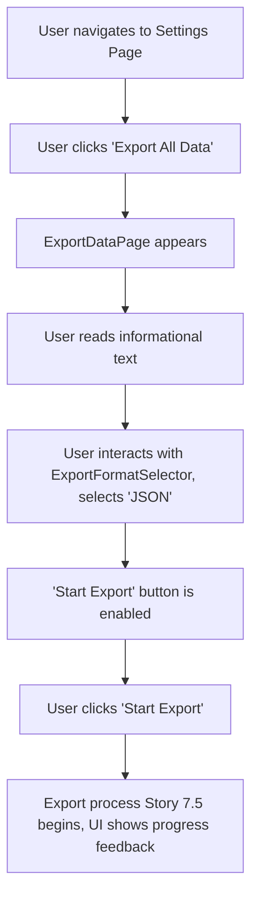

# UI/UX Addon for Story 7.4: Comprehensive V1.0 Data Export - Initiation & Format Selection

**Original Story Reference:** `ai/stories/epic7.7.4.story.md`

## 1. UI/UX Goal for this Story

To provide users with a clear and straightforward interface within the app settings to initiate the export of all their StrongLog V1.0 data and to select their preferred export format (CSV or JSON).

## 2. Key Screens/Views Involved in this Story

- **Settings Page (`SettingsPage.tsx`) or a dedicated `DataManagementPage.tsx`:** This page will host the entry point for the data export feature.
- **Export Data Section/Page (`ExportDataPage.tsx`):** A specific view for export options.
- **Export Format Selector Component (`ExportFormatSelector.tsx`):** Allows the user to choose CSV or JSON.

## 3. Detailed UI Element Descriptions & Interactions for this Story

### 3.1. Entry Point (e.g., within `SettingsPage.tsx`)

- **Element:** A list item or button.
- **Label:** "Export All Data" or "Data Export & Backup".
- **Action:** Navigates to the `ExportDataPage.tsx` or reveals export options inline.

### 3.2. `ExportDataPage.tsx` or Export Section

- **Title:** "Export Your Data".
- **Informational Text:** Briefly explain what data will be included in the export (all V1.0 data: workouts, exercises, rules, programs, goals, settings). Reassure user about data ownership.
- **`ExportFormatSelector.tsx` Component Area.**
- **"Start Export" Button.**

### 3.3. `ExportFormatSelector.tsx` Component

- **Label:** "Choose Export Format:".
- **Control:** `shadcn/ui RadioGroup` or `Select` component.
- **Options:**
  - "JSON (single file, recommended for backup and potential re-import to StrongLog-like systems)".
  - "CSV (multiple files, for use in spreadsheets)".
- **Default:** JSON might be a good default.
- **Behavior:** Stores the selected format in local component state.

### 3.4. "Start Export" Button

- **Label:** "Export Data".
- **State:** Enabled once a format is selected (if selection is a distinct step).
- **Action:** Retrieves the selected format and initiates the export process by calling the `exportService.ts` from Story 7.5. The UI should then transition to show progress feedback (defined in UI Story for 7.5).

- **Figma References:**
  - `{Figma_Frame_URL_for_SettingsPage_ExportData_Link}`
  - `{Figma_Frame_URL_for_ExportDataPage_Layout_And_FormatSelector}`

## 4. Accessibility Notes for this Story

- All options (format selection, start export button) must be keyboard accessible and clearly labeled.
- Informational text should be easy to read.
- Radio group for format selection must correctly announce selected state.

## 5. User Flow Snippet (Initiating Data Export)

