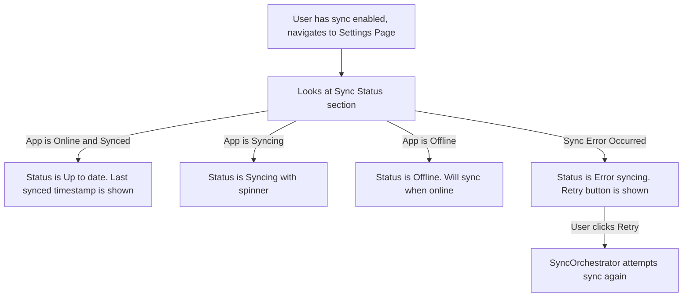

# UI/UX Addon for Story 7.7: Optional Cloud Sync - Synchronization Logic (Status Display)

**Original Story Reference:** `ai/stories/epic7.7.7.story.md`

## 1. UI/UX Goal for this Story

To provide users who have opted into cloud sync with clear, unobtrusive feedback about the synchronization status of their data, enhancing trust and transparency in the sync process.

## 2. Key Screens/Views Involved in this Story

- **Settings Page (`SettingsPage.tsx`):** A primary location to display detailed sync status and potentially offer a manual sync trigger.
- **Global UI Area (Subtle Indicator - Optional):** A very subtle, non-intrusive indicator in the app shell (e.g., in the header or near a status bar area if one exists) could show sync activity or error states.

## 3. Detailed UI Element Descriptions & Interactions for this Story

### 3.1. Sync Status Display in `SettingsPage.tsx`

- **Context:** Visible if user is logged in and `UserSettings.syncEnabled === true`.
- **Elements:**
  - **Status Text Line:**
    - Examples:
      - "Sync Status: Up to date (Last synced: May 30, 2025, 10:15 AM)"
      - "Sync Status: Syncing..." (with a small spinner icon)
      - "Sync Status: Offline, changes will sync when online."
      - "Sync Status: Error syncing. [Retry Button]" (if a persistent error occurs)
  - **Last Successful Sync Timestamp:** Displayed clearly.
  - **(Optional V1.0) "Sync Now" Button:**
    - **Control:** `shadcn/ui Button` (secondary).
    - **Action:** Manually triggers the `syncOrchestrator.ts` to attempt a sync cycle.
    - **State:** Disabled if already syncing or offline.
- **Behavior:** This information should update reactively based on the state of the `syncOrchestrator.ts`. A global state (e.g., Zustand store for sync status) might be needed for components to subscribe to.

### 3.2. Global Sync Indicator (Optional, Subtle)

- **Placement:** If implemented, could be a small icon in a persistent header or status area.
- **States:**
  - Default/Synced: Normal app appearance or a subtle "synced" check icon.
  - Syncing: A small animated spinner icon.
  - Error: A warning icon, possibly leading to settings for more details on tap.
  - Offline: An "offline" icon.
- **Purpose:** To give at-a-glance info without being distracting. For V1.0, focusing on clear status in Settings might be sufficient.

- **Figma References:**
  - `{Figma_Frame_URL_for_SettingsPage_SyncStatus_Display_States}`
  - `{Figma_Frame_URL_for_Global_Subtle_Sync_Indicator_Optional}`

## 4. Accessibility Notes for this Story

- Sync status text must be clear and easily readable.
- If icons are used for global sync indication, they must have accessible labels or be accompanied by text that updates for screen readers (e.g., via an `aria-live` region).
- "Retry" or "Sync Now" buttons must be keyboard accessible.

## 5. User Flow Snippet (Checking Sync Status in Settings)

