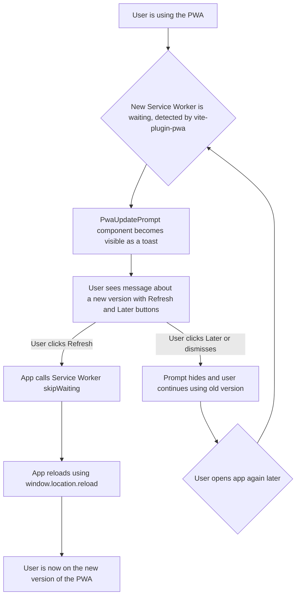

# UI/UX Addon for Story 8.2: Comprehensive UI/UX Review and Polish (PWA Update Prompt)

**Original Story Reference:** `ai/stories/epic8.8.2.story.md`

## 1. UI/UX Goal for this Story

To design a clear, user-friendly, and non-intrusive UI mechanism to inform users when a new version of the PWA is available (due to a service worker update) and provide them with a simple option to refresh and activate the new version. The broader UI/UX polish aspects will result in updates to existing UI documented in other UI stories.

## 2. Key Screens/Views Involved in this Story

- **Application Shell / Main Layout (`App.tsx` or main layout component):** The PWA Update Prompt will likely be displayed as an overlay or element within this shell, making it globally visible when triggered.
- **PWA Update Prompt Component (`PwaUpdatePrompt.tsx`):** The specific UI element for the notification and action.

## 3. Detailed UI Element Descriptions & Interactions for this Story

### 3.1. PWA Update Prompt Component (`PwaUpdatePrompt.tsx`)

- **Trigger:** This component becomes visible when `vite-plugin-pwa` (or the custom service worker logic) signals that a new version of the service worker has been installed and is waiting to activate.
- **Layout & Style:**
  - **Type:** A non-modal, unobtrusive UI element.
    - Option 1: A `shadcn/ui Toast` notification appearing at the top or bottom of the screen.
    - Option 2: A small, persistent banner at the top or bottom of the screen.
  - **Visuals:** Should align with the app's theme but be distinct enough to be noticed. Avoid overly alarming colors unless the update is critical (not typical for PWA updates).
- **Content:**
  - **Message Text:** Clear and concise, e.g., "A new version of StrongLog is available." or "App update ready."
  - **Action Button:**
    - **Label:** "Refresh to Update", "Update Now", or "Reload".
    - **Control:** `shadcn/ui Button` (likely with a prominent style for this action).
  - **Dismiss Button (Optional):**
    - **Label:** "Later" or "X" (close icon).
    - **Behavior:** Hides the prompt temporarily. The prompt might reappear on next app launch if the new SW is still waiting. The SW update mechanism might eventually force update on next full restart regardless.
- **Interaction:**

  - **"Refresh to Update" Button Click:** 1. Triggers the service worker to `skipWaiting()` (allowing the new SW to activate). 2. Reloads the page (`window.location.reload()`) to load the application with the new service worker active.
  - **Dismiss Action:** Prompt is hidden. User continues using the current version until next opportunity to update.

- **Figma References:**
  - `{Figma_Frame_URL_for_PWA_Update_Toast_Notification_Style}`
  - `{Figma_Frame_URL_for_PWA_Update_Banner_Style_Alternative}`

## 4. Accessibility Notes for this Story

- The PWA update prompt must be accessible to screen readers when it appears. If it's a toast, it should use an appropriate `aria-live` region.
- Buttons ("Refresh to Update", "Dismiss") must be keyboard accessible and have clear, accessible names.
- Ensure sufficient contrast for the prompt's text and buttons.

## 5. User Flow Snippet (PWA Update Prompt Interaction)

