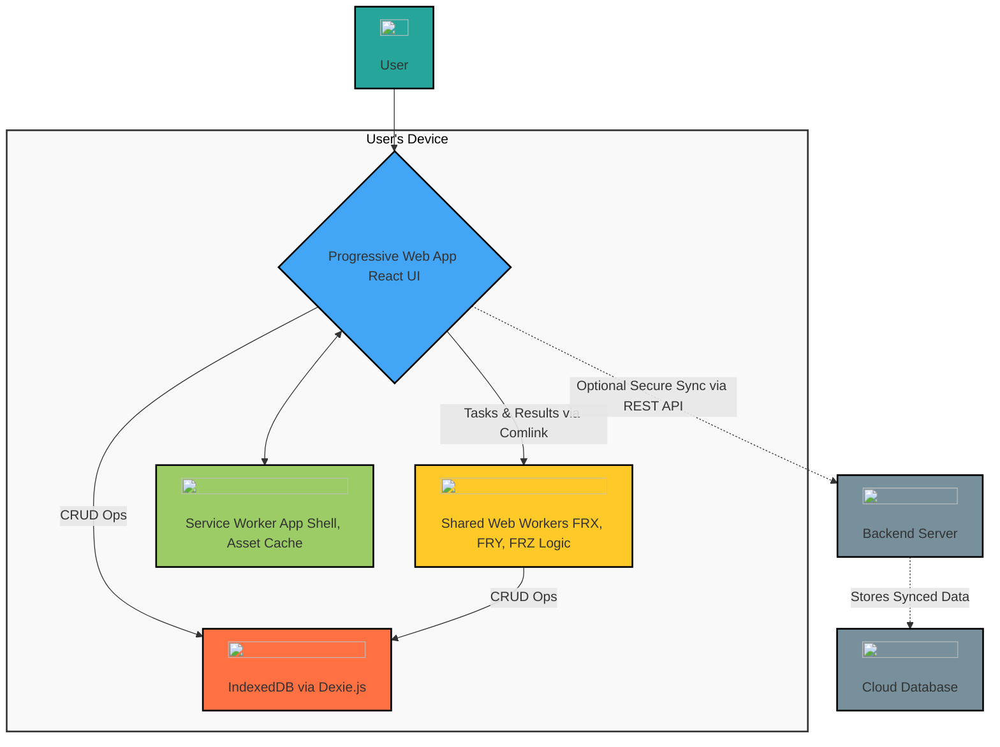
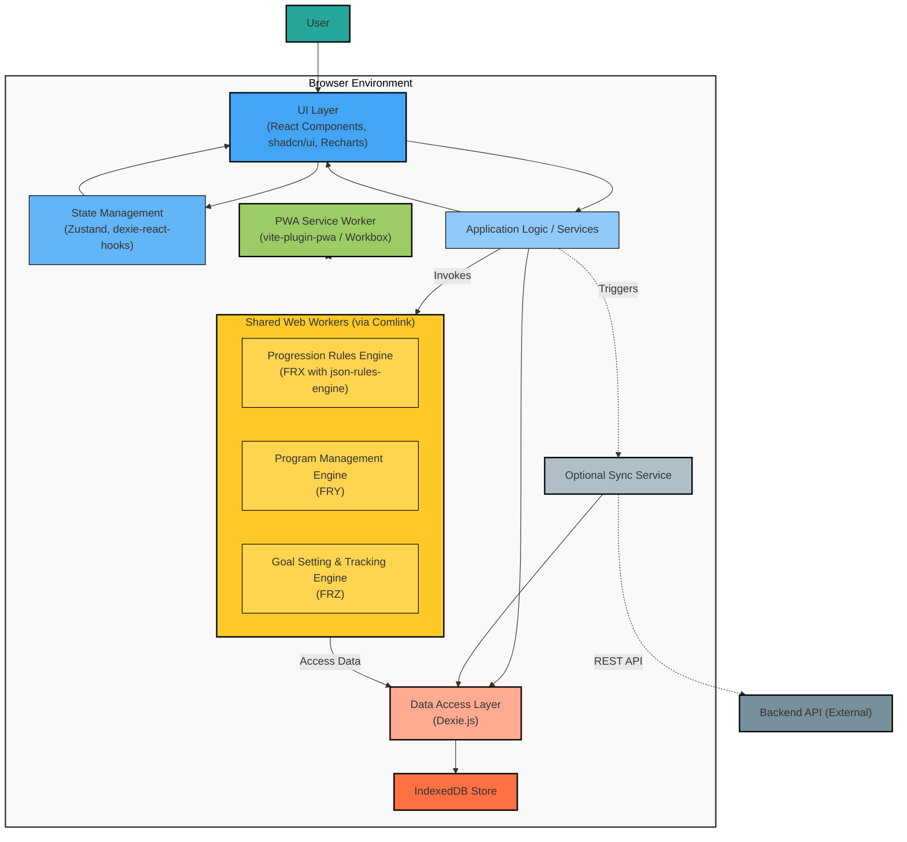
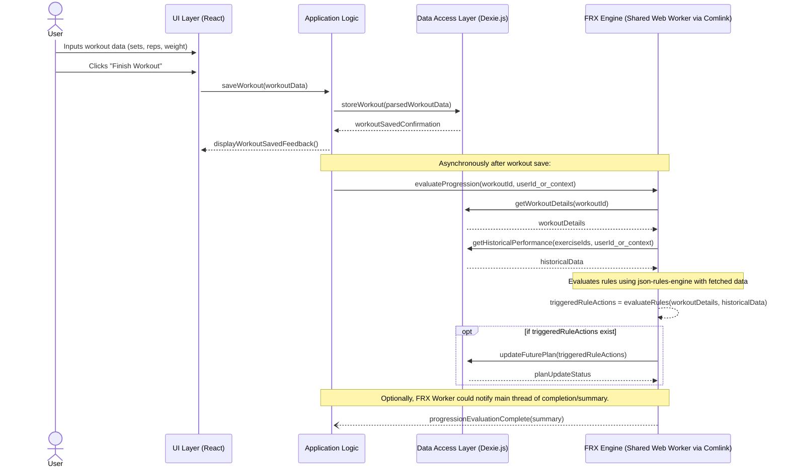
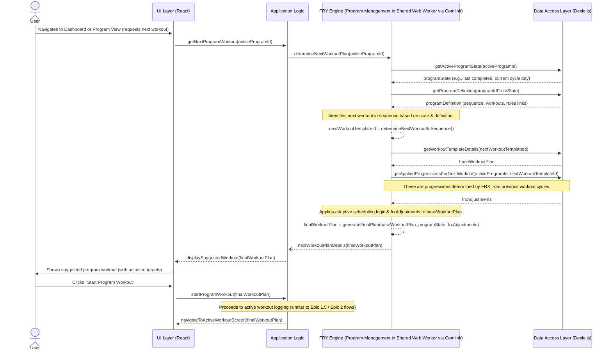

# StrongLog V1.0 Architecture Document

## Technical Summary

StrongLog V1.0 is architected as a client-first Progressive Web Application (PWA) designed for strength training tracking, with a strong emphasis on robust offline functionality, user data ownership, and client-side intelligence. The core of the application resides within the user's browser, leveraging **React** for the user interface, **IndexedDB (via Dexie.js)** as the primary local data store, and **Shared Web Workers (managed via Comlink)** to execute complex client-side engines for Progression Rules (FRX), Program Management (FRY), and Goal Setting (FRZ) without blocking the UI. The FRX will utilize **`json-rules-engine`**. Development will be based on **Vite** with **`vite-plugin-pwa`** for PWA capabilities and service worker management. An optional, secure REST API will be defined for data synchronization to a backend if the user opts-in. This architecture aims to fulfill the project's goals of empowering users with full control over their data, offering deep analytical insights through user-controlled mechanisms, and providing a seamless, high-performance PWA experience, fully functional even when offline.

## High-Level Overview

The main architectural style for StrongLog V1.0 is a **Client-Centric Progressive Web Application**. All core application logic, data storage, and feature processing (including the FRX, FRY, and FRZ engines) are handled directly within the client's browser environment to ensure full offline functionality and user data privacy. The optional backend synchronization is a supplementary feature and not required for core application use.

The primary user interaction flow is as follows:

1. The user interacts with the **React-based PWA User Interface**.
2. All user-generated data (workout logs, custom exercises, programs, rules, goals) and application settings are persisted in **IndexedDB** using **Dexie.js** as an abstraction layer.
3. Computationally intensive tasks for the **Progression Rules Engine (FRX)**, **Program Management & Adaptive Scheduling (FRY)**, and **Goal Setting & Tracking (FRZ)** are offloaded from the main UI thread to **Shared Web Workers**, communicating via **Comlink**. These workers read from and write to IndexedDB (Dexie.js).
4. A **Service Worker** (managed via `vite-plugin-pwa` and Workbox) handles caching of the application shell and static assets, enabling fast load times and offline availability of the core application.
5. If the user opts for data synchronization, the PWA will communicate with a **backend server** via a **REST API** to send and receive V1.0 data structures.

## Component View

This section describes the major logical components of the StrongLog V1.0 system and their primary responsibilities. These components work together to deliver the application's features.

* **UI Layer (React Components):**
  * **Description:** Responsible for rendering the user interface, capturing user input, and displaying data. Built using React, `shadcn/ui` components, and Tailwind CSS for styling. Includes all views defined in the epics (workout logging, dashboard, program management, rule editor, settings, etc.). The **Charting Module (Recharts)** is part of this layer, responsible for rendering analytics visualizations.
  * **Responsibilities:** Presentation logic, user interaction handling, invoking application logic/services, displaying data from state management.

* **State Management Layer:**
  * **Description:** Manages the application's state. It's a hybrid system:
    * **Zustand Store:** Manages global UI state (e.g., theme, loading states), transient application state (e.g., current selections not yet persisted), and user settings before they are saved to IndexedDB.
    * **Dexie.js with `dexie-react-hooks` (`useLiveQuery`):** Provides reactive data directly from IndexedDB to UI components, ensuring the UI reflects the persistent state accurately and efficiently.
  * **Responsibilities:** Centralized UI state management, reactive updates from persistent data, managing temporary application state.

* **Application Logic / Services:**
  * **Description:** Contains the core business logic and orchestrates actions within the application. This layer mediates between the UI and the data/engine layers. Implemented as TypeScript functions, custom React hooks, or potentially more formal service modules if complexity warrants.
  * **Responsibilities:** Handling user actions (e.g., saving a workout, creating a rule), coordinating with the Data Access Layer for data operations, invoking client-side engines, and managing workflows (e.g., workout session lifecycle).
  * **Zod:** Zod will be used for data validation.

* **Client-Side Engines (Shared Web Workers):**
  * **Description:** Hosted within Shared Web Workers managed via Comlink to perform computationally intensive tasks off the main UI thread.
    * **Progression Rules Engine (FRX):** Utilizes `json-rules-engine` to evaluate user-defined rules against workout data and suggest progressions.
    * **Program Management Engine (FRY):** Manages the state of active programs, generates workout plans based on program definitions and applied progressions, and handles adaptive scheduling logic.
    * **Goal Setting & Tracking Engine (FRZ):** Calculates progress towards user-defined goals (including e1RM using Epley formula) and may provide projections.
  * **Responsibilities:** Executing complex, potentially long-running calculations related to progression, program adaptation, and goal tracking. Interacts with the Data Access Layer (Dexie.js) to read and write necessary data.

* **Data Access Layer (DAL) - Dexie.js:**
  * **Description:** An abstraction layer over IndexedDB, implemented using Dexie.js.
  * **Responsibilities:** All CRUD (Create, Read, Update, Delete) operations on the IndexedDB store. Manages database schema definition, versioning, and migrations. Executes complex queries. Ensures data integrity through transactions.

* **IndexedDB Store:**
  * **Description:** The actual client-side database where all user data (workout logs, exercises, programs, rules, goals, settings) is persistently stored.
  * **Responsibilities:** Durable local storage of application data, enabling offline functionality.

* **PWA Service Worker:**
  * **Description:** Managed by `vite-plugin-pwa` (typically using Workbox). Runs in a separate browser thread.
  * **Responsibilities:** Caching the application shell and static assets for fast loading and offline availability. Intercepting network requests. Potential for advanced caching strategies if needed.

* **Optional Sync Service:**
  * **Description:** A client-side module responsible for managing the synchronization of local data (from Dexie.js/IndexedDB) with the backend server via the REST API, if the user has opted in.
  * **Responsibilities:** Detecting local data changes, preparing data for sync, communicating with the backend API, handling API responses, merging remote changes with local data (respecting the "last write wins" strategy for V1.0), and managing sync status/errors.

*(The detailed structure of the `src/` directory, including how these components are organized into files and folders, will be detailed in the `docs/project-structure.md` document.)*

## Key Architectural Decisions & Patterns

This section lists the significant architectural choices made for StrongLog V1.0 and the patterns employed, along with their justifications. These decisions are guided by the project's core requirements, research findings, and our technology selections.

* **Client-First Architecture with Full Offline Capability:**
  * **Decision:** The application is fundamentally designed to operate primarily on the client-side. All core V1.0 features, including workout logging, program management (FRY), progression rule evaluation (FRX), and goal tracking (FRZ), are fully functional without an internet connection.
  * **Justification:** This is a core project requirement aimed at providing a reliable user experience regardless of network status, ensuring user data control, and enhancing privacy.

* **Progressive Web App (PWA) as Delivery Model:**
  * **Decision:** StrongLog V1.0 is built and delivered as an installable PWA.
  * **Justification:** To offer a native-like application experience directly from the web, ensuring broad accessibility across devices, and leveraging PWA-specific features like Service Workers for offline support and app shell caching.

* **Client-Side Data Persistence with IndexedDB via Dexie.js:**
  * **Decision:** IndexedDB is the exclusive primary local data store for all V1.0 data. Interactions with IndexedDB will be managed through the Dexie.js wrapper library.
  * **Justification:** This supports the client-first and offline-first requirements. Dexie.js was chosen to simplify IndexedDB's complexities, improve developer experience, and provide robust querying, schema management, and transaction handling, as strongly recommended by research.

* **Offloading Complex Logic to Shared Web Workers with Comlink:**
  * **Decision:** Computationally intensive client-side engines (Progression Rules Engine FRX, Program Management Engine FRY, Goal Setting & Tracking Engine FRZ) will run in Shared Web Workers. Communication between the main thread and these workers will be managed using Comlink.
  * **Justification:** This pattern is crucial for preventing the main UI thread from blocking during complex calculations, ensuring application responsiveness and a smooth user experience (NFR1 Performance). Shared Workers allow these engines to act as centralized, stateful services, promoting data consistency across different parts of the application. Comlink simplifies worker communication significantly.

* **JSON-Based Client-Side Rules Engine (`json-rules-engine` for FRX):**
  * **Decision:** The Progression Rules Engine (FRX) will be implemented using the `json-rules-engine` library.
  * **Justification:** This library was specifically recommended by research. It supports rule definitions in JSON (which can be easily stored in Dexie.js and configured by the user) and, critically, offers asynchronous fact resolution, essential for fetching data from Dexie.js within a Web Worker during rule evaluation.

* **Hybrid State Management (Zustand + `dexie-react-hooks`):**
  * **Decision:** Global UI state and transient application state will be managed by Zustand. Reactive data binding from IndexedDB (via Dexie.js) to React components will be handled by `dexie-react-hooks` (specifically `useLiveQuery`).
  * **Justification:** This hybrid approach, recommended by research, balances simplicity for UI state management (Zustand) with efficient, direct reactivity for persistent data (Dexie.js hooks), minimizing redundant state and aligning with Dexie.js as the source of truth.

* **UI Development with React and `shadcn/ui`:**
  * **Decision:** The user interface will be built using React, with components sourced from `shadcn/ui`, styled using Tailwind CSS, and leveraging Radix UI primitives for accessibility.
  * **Justification:** React is the preferred framework. `shadcn/ui` provides a modern approach with customizable, accessible components where developers have full code ownership, and Tailwind CSS allows for efficient utility-first styling. This supports StrongLog's accessibility goals.

* **Build Tooling and PWA Management with Vite & `vite-plugin-pwa`:**
  * **Decision:** Vite will be used as the build tool and development server. PWA features (manifest, service worker) will be managed using `vite-plugin-pwa`, which incorporates Workbox.
  * **Justification:** Vite offers a superior developer experience with fast builds and HMR. `vite-plugin-pwa` simplifies the setup of robust PWA capabilities, including app shell caching critical for offline performance.

* **REST API for Optional Data Synchronization:**
  * **Decision:** If users opt-in for data synchronization, communication with the backend will use a RESTful API.
  * **Justification:** For V1.0, REST provides simplicity for syncing the defined data structures and aligns with the "last write wins" conflict resolution strategy. Detailed backend technology choices are deferred.

* **Anonymous Usage by Default:**
  * **Decision:** Users can access and use all core application features without needing to create an account. All data for anonymous users is stored locally.
  * **Justification:** This lowers the barrier to entry for new users, enhances privacy by default, and aligns with the client-first data ownership philosophy.

* **Comprehensive Local Data Export (CSV/JSON):**
  * **Decision:** Users will be able to export all their V1.0 data (logs, exercises, rules, programs, goals, settings) locally in CSV and JSON formats.
  * **Justification:** This empowers users with full ownership of their data and supports data portability rights (e.g., under GDPR). The export process itself will leverage Web Workers for performance with large datasets.

### PNPM as package mangager
# Justification for Using PNPM as the Package Manager

For the StrongLog V1.0 project, **PNPM (Performant NPM)** is recommended over NPM and Yarn (especially Yarn Classic v1) due to several key advantages that contribute to a more efficient, reliable, and resource-friendly development process:

1. **Significant Disk Space Efficiency:**
    * **How it works:** PNPM utilizes a content-addressable store (a global, on-disk storage) for all downloaded package versions. Instead of duplicating packages in each project's `node_modules` folder, PNPM creates hard links (or symlinks when hard links are not feasible) from this global store to your project's `node_modules` directory.
    * **Benefit for StrongLog:** This means if you have multiple projects (or even multiple checkouts/branches of StrongLog) on your machine, common dependencies are stored only once. This drastically reduces disk space consumption, which can be substantial for modern JavaScript projects with many dependencies.

2. **Faster Installation and Update Times:**
    * **How it works:** Due to its efficient storage strategy and optimized dependency resolution algorithm, PNPM often installs and updates dependencies significantly faster than NPM and Yarn Classic. It can leverage its global store effectively, avoiding redundant downloads and copying.
    * **Benefit for StrongLog:** Faster dependency installation translates to quicker project setup for new developers, faster CI/CD build times, and a more responsive development workflow when adding or updating packages.

3. **Strictness and Improved Reliability (Non-Flat `node_modules`):**
    * **How it works:** Unlike NPM and Yarn Classic which create a flat `node_modules` structure (hoisting dependencies), PNPM creates a unique, symlinked `node_modules` structure where your project can *only* access packages that are explicitly listed as dependencies in its `package.json`. Dependencies of your dependencies (transitive dependencies) are not directly accessible unless they are also direct dependencies of your project.
    * **Benefit for StrongLog:**
        * **Avoids "Phantom Dependencies":** This prevents your code from accidentally relying on packages that are not declared in your `package.json` but happen to be available due to hoisting by another dependency. This makes your project more robust and less prone to breaking when transitive dependencies change versions.
        * **More Deterministic Builds:** Ensures that the dependency tree is more explicit and reliable across different development machines and CI environments.
        * **Better Encapsulation:** Aligns well with modular design principles.

4. **Built-in Monorepo Support (Workspaces):**
    * **How it works:** PNPM has excellent, efficient built-in support for managing monorepos (workspaces), where multiple related projects or packages are managed within a single repository.
    * **Benefit for StrongLog:** While StrongLog V1.0 might start as a single PWA package, if future development involves creating separate related packages (e.g., a shared utility library, a separate component library if `shadcn/ui` customization becomes very extensive, or future backend services managed alongside), PNPM's robust workspace features will be highly beneficial and efficient.

5. **Compatibility and Ecosystem:**
    * PNPM is fully compatible with the Node.js ecosystem, uses the standard `package.json` file, and works with the same npm registry. Migrating existing projects or using existing npm packages is seamless.

**Comparison with Alternatives:**

* **NPM:** While being the default Node.js package manager and having improved significantly over the years (especially with caching and `package-lock.json`), it still typically results in larger `node_modules` folders per project and can be slower for installations compared to PNPM. Its flat `node_modules` structure can lead to phantom dependency issues.
* **Yarn Classic (v1):** Offered improvements over older NPM versions in terms of speed and determinism (via `yarn.lock`). However, it also creates a flat `node_modules` structure and doesn't offer the same disk space efficiency as PNPM.
* **Yarn Berry (v2+):** Implements a different strategy called Plug'n'Play (PnP), which avoids `node_modules` altogether by creating a file that maps dependencies to their locations in a cache. PnP can be very fast and efficient but sometimes introduces compatibility issues with tools or libraries that expect a traditional `node_modules` structure, often requiring workarounds or specific editor configurations. PNPM's symlink-based approach generally offers broader "out-of-the-box" compatibility with the existing ecosystem while still providing significant performance and efficiency gains.

**Conclusion for StrongLog:**
Given StrongLog's nature as a modern web application that will likely accumulate a fair number of dependencies, PNPM's advantages in **installation speed, disk space efficiency, and dependency strictness** make it the recommended choice for a smoother, more reliable, and resource-conscious development experience. Its excellent monorepo support also provides good future-proofing.

*(Note: Detailed coding patterns, error handling strategies, and specific conventions will be further defined in `docs/coding-standards.md`.)*

## Core Workflow / Sequence Diagrams (Optional)

### 1. Standard Workout Logging & Subsequent Progression Rule Application

This diagram shows the typical flow when a user completes and saves a workout, and how the Progression Rules Engine (FRX) evaluates rules based on this new data to update future workout plans.

**Explanation of the Diagram:**

1. **User Interaction:** The user inputs their workout details (exercises, sets, reps, weight) into the UI Layer and indicates they have finished the workout.
2. **Saving Workout:**
    * The UI Layer calls the Application Logic to save the workout data.
    * The Application Logic processes this data and instructs the Data Access Layer (DAL), implemented with Dexie.js, to store the workout log and its associated sets in IndexedDB.
    * The DAL confirms the save operation back to the Application Logic, which can then update the UI (e.g., show a "Workout Saved!" message).
3. **Triggering Progression Evaluation (Asynchronous):**
    * After the workout is successfully saved, the Application Logic asynchronously triggers the Progression Rules Engine (FRX), which resides in a Shared Web Worker. This is done via Comlink, sending a message with context like the `workoutId`.
4. **FRX Engine Processing (in Web Worker):**
    * The FRX Engine receives the request.
    * It calls the DAL (Dexie.js, accessible within the worker) to fetch the details of the just-completed workout and any relevant historical performance data needed for rule evaluation.
    * Using `json-rules-engine` and the fetched data, the FRX Engine evaluates all active progression rules applicable to the workout/exercises performed.
5. **Applying Actions:**
    * If any rules are triggered and result in actions (e.g., increase weight for the next session of an exercise), the FRX Engine instructs the DAL to update the planned parameters for future workouts or store these progression suggestions/adjustments in IndexedDB. These updates modify the state of the user's training plan.
6. **Optional Feedback:** The FRX Engine can optionally notify the Application Logic on the main thread about the completion of the evaluation or provide a summary of actions taken, though the primary feedback to the user will be seeing the adjusted plan for their next workout.

This flow ensures that the potentially intensive rule evaluation process occurs off the main thread, keeping the UI responsive.

### 2. Initiating the Next Program Workout (involving FRY & FRX)

This diagram outlines the sequence of events when a user initiates the next workout session within an active program. It highlights the roles of the Program Management Engine (FRY) and the influence of prior FRX evaluations.

**Explanation of the Diagram:**

1. **User Request:** The user navigates to a part of the UI (e.g., the dashboard's "Today's Focus" or a specific program view) that triggers a request for their next scheduled program workout.
2. **Initiating Plan Generation:**
    * The UI Layer requests the next workout plan from the Application Logic.
    * The Application Logic calls the Program Management Engine (FRY), located in a Shared Web Worker, via Comlink, to determine and construct this plan.
3. **FRY Engine Processing (in Web Worker):**
    * The FRY Engine fetches the current state of the active program (e.g., which workout was last completed, date of completion) and the program's overall definition (sequence of workouts, linked progression rules, target frequency) from the Data Access Layer (Dexie.js).
    * It identifies the next workout in the program's defined sequence.
    * It retrieves the base template for this upcoming workout.
    * Crucially, it also fetches any **pre-calculated progression adjustments** (determined by FRX after previous relevant workouts were completed and stored by the FRX as applicable to future sessions) from Dexie.js.
    * The FRY Engine then applies its adaptive scheduling logic (adjusting for actual user adherence against target frequency) and integrates the FRX-derived adjustments into the base workout plan to create the final, specific plan for the upcoming session (e.g., updated weights, reps for certain exercises).
4. **Displaying Plan to User:**
    * The FRY Engine returns the complete, adjusted `finalWorkoutPlan` to the Application Logic on the main thread.
    * The Application Logic passes this plan to the UI Layer.
    * The UI Layer displays the suggested program workout to the user, showing the specific exercises and their (potentially auto-adjusted) target parameters.
5. **Starting Workout:**
    * The user can then choose to start this suggested workout.
    * The UI Layer informs the Application Logic, which would then transition the user to the active workout logging screen, pre-filled with the `finalWorkoutPlan` details.

This workflow illustrates how the FRY engine centralizes program logic, incorporates adaptive scheduling, and applies progression outcomes (from FRX) to dynamically generate the user's next training session.

## Infrastructure and Deployment Overview

This section outlines the planned infrastructure for hosting the StrongLog V1.0 PWA, the high-level considerations for the optional backend sync service, and the deployment strategies.

* **Cloud Provider(s):**
  * **PWA Hosting:** The StrongLog PWA will be deployed to a standard static web hosting platform. Options include Netlify, Vercel, AWS S3 with CloudFront, Azure Static Web Apps, or GitHub Pages. The choice will prioritize ease of deployment, performance (CDN integration), HTTPS, and cost-effectiveness.
  * **Optional Backend Sync Hosting:** The specific cloud provider for the optional backend sync service is **To Be Determined (TBD)**. If a custom backend is developed, it will prioritize cost-effectiveness, scalability, and GDPR compliance. Examples of suitable providers include AWS, GCP, or Azure.

* **Core Services Used:**
  * **PWA:**
    * Static File Hosting (e.g., AWS S3, Azure Blob Storage, Netlify/Vercel platform storage).
    * Content Delivery Network (CDN) for fast global asset delivery (often included with modern static hosting platforms).
  * **Optional Backend Sync (High-Level Examples, TBD):**
    * Serverless Functions (e.g., AWS Lambda, Google Cloud Functions, Azure Functions) for API endpoints.
    * NoSQL Database (e.g., DynamoDB, Firestore, MongoDB Atlas) for storing synced user data.
    * Authentication Service (e.g., integrated with the cloud provider or a service like Auth0 if not custom).

* **Infrastructure as Code (IaC):**
  * **PWA:** If using a managed static hosting platform like Netlify or Vercel, IaC might be minimal as the platform handles much of the infrastructure. If self-hosting static assets on a major cloud provider (AWS, GCP, Azure), IaC tools (e.g., AWS CDK, Terraform, Pulumi) would be considered for defining and managing resources.
  * **Optional Backend Sync:** If a custom backend is developed, using IaC tools (e.g., Terraform, AWS CDK, Pulumi, ARM Templates) will be strongly recommended for provisioning and managing all backend cloud resources reproducibly and consistently.

* **Deployment Strategy:**
  * **PWA:**
    * A CI/CD pipeline (e.g., GitHub Actions, GitLab CI, Jenkins) will be implemented.
    * On every push to the main branch (or specific release branches), the pipeline will automatically build the React PWA using Vite, run tests, and deploy the resulting static assets to the chosen hosting platform.
  * **Optional Backend Sync:**
    * If a custom backend is developed, a separate CI/CD pipeline will be established for building, testing, and deploying the backend services (e.g., serverless functions, API endpoints).

* **Environments:**
  * **Development (Local):** Developers will use Vite's local development server for building and testing the PWA. Mocking of backend sync services will be necessary for local development.
  * **Staging:** A staging environment, mirroring production as closely as possible, will be used for testing new features and release candidates. This applies to both the PWA and any backend services for sync.
  * **Production:** The live environment for end-users.
  * The PRD mentions the need for separate dev, staging, and prod environments, particularly for the backend sync components. This will be maintained for the full application stack.

*(Note: Detailed environment configurations, including specific URLs and credentials, will be documented in `docs/environment-vars.md` - to be created).*

## Key Reference Documents

This section lists important documents that provide additional context, detailed requirements, research findings, or specifications related to the StrongLog V1.0 architecture.

**Core Project & Product Documents:**

* `docs/project-brief.md`: Provides the initial vision, goals, target audience, and problem statement for StrongLog.
* `docs/prd.md`: The Product Requirements Document for StrongLog V1.0, detailing functional and non-functional requirements, scope, and epics.

**Epic Specifications:**

* `docs/epic1.md`: Details for Core PWA setup, Data Foundation (IndexedDB), and Basic Logging.
* `docs/epic2.md`: Details for Advanced Workout Logging features and the Integrated Workout Timer.
* `docs/epic3.md`: Details for the Progression Rules Engine (FRX) implementation.
* `docs/epic4.md`: Details for Program Management and Adaptive Scheduling (FRY).
* `docs/epic5.md`: Details for Goal Setting and Achievement Tracking (FRZ).
* `docs/epic6.md`: Details for the V1.0 Dashboard, Comprehensive Analytics, and Reporting.
* `docs/epic7.md`: Details for V1.0 Data Management including Import/Export and Optional Sync.
* `docs/epic8.md`: Details for User Settings, UI Polish, and V1.0 Release Readiness.

**Supporting Research & Summaries:**

* `Architectural Blueprint for a High-Performance, Client-First Strength Training PWA.pdf`: Research document providing architectural recommendations for StrongLog.
* `Optimizing Complex Client Side Logic.pdf`: Research document focusing on strategies for client-side logic optimization.
* `Optimizing Complex Client-Side Logic in React PWA.pdf`: Research document evaluating technologies for optimizing client-side logic in React PWAs.
* `Summary of Key Architectural Recommendations from Research`: The consolidated summary of findings from the research reports, created during our architectural discussions.

**Forthcoming Detailed Architecture Documents:**
*(These will be created as part of the ongoing architectural work)*

* `docs/tech-stack.md`: Will provide a detailed specification of the selected technology stack, including specific versions.
* `docs/project-structure.md`: Will outline the recommended folder and file structure for the StrongLog PWA project.
* `docs/coding-standards.md`: Will define coding conventions, patterns, error handling strategies, and best practices to be followed.
* `docs/api-reference.md`: Will detail the API contract for the optional backend synchronization service (REST API).
* `docs/data-models.md`: Will provide detailed definitions of the IndexedDB schemas (for Dexie.js), data entities, interfaces, and their relationships.
* `docs/environment-vars.md`: Will document all necessary environment variables for different deployment environments (development, staging, production).
* `docs/testing-strategy.md`: Will elaborate on the overall testing approach, including unit, integration, E2E testing, tools, and specific areas of focus (as referenced in the PRD).
* `docs/ui-ux-spec.md`: Will contain detailed UI/UX specifications, wireframes, component designs, and user flows (as referenced in the PRD).

## Change Log

| Change        | Date         | Version | Description                                                                                                | Author            |
|---------------|--------------|---------|------------------------------------------------------------------------------------------------------------|-------------------|
| Initial draft | 2025-05-22   | 0.1     | Initial draft of the High-Level Architecture Overview, including Technical Summary, High-Level Overview, Component View, Key Architectural Decisions & Patterns, Infrastructure & Deployment Overview, and Key Reference Documents, based on PRD, Epics, and initial research synthesis. | 3 Arkitekten (AI) |
